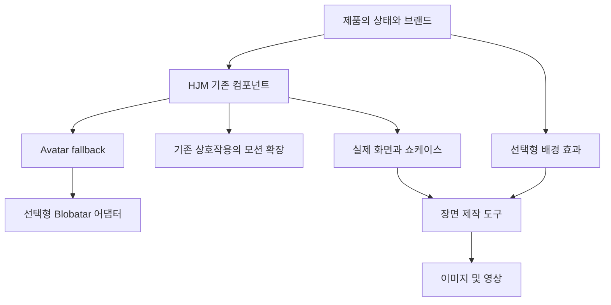

# HJM 시각 표현과 모션 통합 설계

작성: 2026-10-01 · 상태: 구현 및 기기 검증 진행 · 범위: React Web, React Native, 홍보물 제작

## 목적과 결정

Rare UI, Blobatar, 그리고 사용자가 공유한 Instagram 릴의 Shaders.com·LS.graphics·ContentCore에서 얻은 기능을 HJM의 기존 계약에 연결한다. 추가로 사용자가 공유한 사진의 Mobbin·SaaSFrame·Land-book·Godly·Realtime Colors·Fontshare·shadcn/ui·21st.dev·Magic UI·Lucide까지 총 15개 출처를 설계 범위에 포함한다. 결과는 **기존 컴포넌트의 표현 확장**, **선택형 시각 효과**, **실제 제품 화면을 활용하는 홍보물 제작 도구**로 나눈다.

중복 컴포넌트 점검 후 다시 유사한 컴포넌트를 늘리는 일을 피하기 위해, 같은 의미·상태·접근성을 가진 기능은 기존 컴포넌트가 소유한다. 새로운 이름은 독립적인 사용자 문제와 계약이 확인될 때만 추가한다. 아래 설계 절의 제안 API는 초기 검토 기록이다. 현재 API는 연결된 계약 문서와 [구현 추적표](visual-integration-progress.md)를 따른다.

기존 로그인 계약은 유지한다. 소셜 버튼에는 제공자 이름만 표시하고, 인증 중에는 버튼을 숨기고 카드 크기를 유지한 채 중앙 로딩 하나를 표시한다. 로딩 아래 가시 문구는 없고 접근성 안내만 제공한다. Blobatar나 ThinkingOrb를 인증 로딩에 자동으로 넣지 않는다.

## 1. 다섯 출처의 역할

| 출처 | 가져올 가치 | HJM에서의 위치 | 도입 방식 |
| --- | --- | --- | --- |
| Blobatar | 같은 식별자로 유지되는 개성 있는 얼굴 | 기존 Avatar의 선택형 fallback, Asset의 장식 표현 | MIT 고지 보존, 버전을 고정한 선택형 어댑터 |
| Rare UI | 선택·확인·전환·피드백을 이해하기 쉽게 만드는 움직임 | 기존 Sidebar, Sheet, Tabs, OtpField, Statistic 등의 확장 | 일반적인 동작 요구를 HJM 계약으로 독립 구현. 원본 코드 편입은 별도 허가 확인 후 |
| Shaders.com | 색·질감·빛을 조합하는 배경 제작 방식 | 선택형 EffectSurface 제안 | 독자적인 단순 효과부터 구현. 해당 서비스 엔진·프리셋을 패키지에 넣는 것은 별도 계약 대상 |
| LS.graphics | 화면을 제품처럼 보여 주는 목업 구성 | 쇼케이스 기반 제작 도구 | 직접 만든 기본 프레임과 사용자가 권리를 확보한 외부 에셋 사용 |
| ContentCore | 하나의 장면에서 이미지와 영상을 만드는 작업 흐름 | 제작 도구의 Scene 및 timeline | 실제 제품 캡처와 장면 설정을 재사용. 편집기나 템플릿 원본 복제는 범위 밖 |

Rare UI는 현재 LICENSE에 Commons Clause와 표시 의무, 컴포넌트 자체 재배포 제한이 있다. 이름이나 일부 코드만 바꾸는 방식으로 해결된다고 보지 않는다. Shaders의 프레임워크 편입과 LS.graphics의 원본 에셋 재배포도 일반적인 결과물 사용권과 구분한다. ContentCore의 결과물 이용 안내를 편집기·소스 재배포 허가로 해석하지 않는다. 실제 편입 시점에 해당 버전의 조건을 다시 확인한다.

## 2. 구조와 소유권



- 공통 계약은 상태·접근성·취소·오류·모션 정책을 소유한다. Web과 Native는 각 환경에 맞게 그린다.
- 제품은 계정 식별자, 번역 문구, 권한, API, 실제 작업 상태를 소유한다. 디자인 시스템이 사용자 데이터를 조회하거나 보관하지 않는다.
- 외부 엔진은 선택형 진입점에서만 연결한다. 루트 import가 SVG·GPU·물리 엔진이나 Native 링크를 강제하지 않게 한다. 근거는 기존 [선택형 어댑터 계약](../../packages/design-contracts/docs/optional-adapters.md)이다.
- 기존 [컴포넌트 지도](../generated/public-component-map.md), [상호작용 어댑터](../interaction-adapters.md), [Asset 계약](../../packages/design-contracts/docs/asset.md), [ThinkingOrb 계약](../../packages/design-contracts/docs/thinking-orb.md)을 확장한다. 표현만 다른 컴포넌트를 별도 canonical 항목으로 등록하지 않는다.

## 3. Blobatar: Avatar 안에 넣는다

### 표시 우선순위

사진 → 제품이 선택한 생성형 얼굴 → 기존 이니셜 순서로 처리한다. 기존 소비 앱의 기본값은 이니셜 그대로이며, 생성형 얼굴은 명시적으로 연결한 곳에서만 나타난다.

현재 Web Avatar에는 fallback 슬롯이 있고 Native Avatar는 이니셜 중심이다. 양쪽에 같은 의미의 `renderFallback` 계약을 추가하되 기존 Web fallback과 Native initials는 유지한다. 새 슬롯이 null을 반환하면 기존 fallback을 사용한다. 사진 주소나 source가 바뀌면 이전 이미지 실패 상태를 초기화해야 한다. 이는 사진 변경 후에도 실패 표시가 남는 문제를 막기 위한 것이다.

### 제안 API

```tsx
// 제안 API: 구현 및 export 전에는 사용할 수 없다.
import { Avatar } from '@hjmds/react/display';
import { createBlobatarFallback } from '@hjmds/react/avatar-blobatar';

const renderFallback = createBlobatarFallback({
  seed: account.avatarSeed,
  expression: 'idle',
  motion: 'none',
});

<Avatar
  name={account.displayName}
  src={account.photoUrl}
  renderFallback={renderFallback}
/>;
```

Native도 `/avatar-blobatar`에서 같은 생성 설정을 받고 기존 source·접근성 속성을 유지한다. Avatar가 계산한 실제 크기와 장식 여부를 fallback에 전달한다. 얼굴 안쪽은 장식으로 처리하고 바깥 Avatar에서 이름을 한 번만 읽는다. 생성 결과와 fallback 함수는 seed 및 설정 단위로 재사용한다.

`avatarSeed`는 제품 안에서 안정적인 공개 식별자를 우선 사용한다. 표시 이름이 바뀌어도 얼굴은 바뀌지 않는다. 이메일·비공개 식별자를 기본 seed로 쓰지 않으며 해시했다고 자동으로 비공개가 된다고 가정하지 않는다. 새 서버 필드가 필요하면 해당 제품의 데이터 변경으로 별도 다룬다.

로컬 생성으로 구현하고 얼굴을 만들기 위한 외부 요청은 보내지 않는다. Web과 Native는 같은 생성기 버전·seed·팔레트를 사용한다. 서로 다른 렌더러의 픽셀 일치보다 얼굴의 형태와 정체성 일치를 검증한다. 생성기 업데이트로 기존 얼굴이 바뀌는 경우 명시적인 호환성 변경으로 기록한다.

### 정적 표현과 모션

- 목록·댓글·프로필: 정적인 얼굴이 기본이다.
- 반응 완료·온보딩: 제품이 명시한 이벤트에만 표정을 바꾼다. 사용자 감정이나 AI 작업 상태를 추정하지 않는다.
- 큰 장식 얼굴: Avatar 크기를 무리하게 늘리기보다 기존 Asset 슬롯에 연결한다.
- 모션: 정적 어댑터를 먼저 완성한 후 `/avatar-blobatar-motion` 같은 별도 진입점을 검토한다. Web hover뿐 아니라 focus와 Native 이벤트로도 의미가 전달되어야 한다.
- 화면 밖·앱 백그라운드·동작 줄이기 설정에서는 정지한다. 모션을 꺼도 정보와 조작 가능성은 유지한다.

Blobatar 2.7 계열에는 Native animated 진입점도 있다. 다만 이를 정적 어댑터에 함께 묶지 않고 SVG·Reanimated·Worklets peer 조건과 소비 앱 호환성을 구현 전에 확인한다.

## 4. Rare UI: 22개 항목의 연결 계획

현재 registry의 UI 항목 22개를 아래처럼 정리한다. utils는 독립 UI가 아니므로 개수에서 제외한다. 표의 새 패턴 이름은 후보이며, 모두 새 공개 컴포넌트로 만들겠다는 뜻은 아니다.

| Rare UI 항목 | 연결 대상 | 설계 경계 |
| --- | --- | --- |
| folder-component | Card + Asset + Button | 묶음 미리보기 패턴. 열림 상태는 제품이 제어 |
| bounce-sidebar | 기존 Web Sidebar | 선택·열림 전환 모션 옵션 |
| hook-sidebar | 기존 Web Sidebar | 같은 탐색 의미를 유지하는 표현 옵션 |
| family-drawer | Sheet / GestureSheet | 한 Sheet 안의 단계 전환. overlay를 중복 쌓지 않음 |
| proximity-sidebar | 기존 Web Sidebar | 포인터 근접 효과만 선택형. 클릭 영역과 키보드 탐색은 고정 |
| duration-picker | NumberField + 단위 선택 | DurationField 후보. 값은 정수 초, 범위·단위 변환 계약 우선 |
| fluid-orb | 배경 효과 또는 ThinkingOrb | 장식과 실제 작업 상태를 구분 |
| scroll-progress | Progress + 문서 탐색 | 스크롤 컨테이너를 호스트가 명시 |
| code-block | 코드 미리보기 패턴 + Button | 복사 피드백 재사용. 구문 강조는 선택형 |
| otp-input | OtpField | 붙여넣기·자동완성·오류 의미를 유지하고 표현만 확장 |
| gravity-letters | 홍보용 장식 | 필수 안내·입력·본문에는 적용하지 않음 |
| github-activity | ActivityHeatmap 후보 | 날짜·값을 받는 일반 계약. GitHub 조회는 제품 책임 |
| emoji-reaction | Popover/Menu + Button + Celebration | 선택·취소·진행 상태는 제품이 소유. 에셋 권리 별도 확인 |
| notification-bell | 아이콘 Button + CounterBadge | 읽음 상태·알림 조회는 제품 책임 |
| step-player | Steps + Progress | 재생·정지·다시 보기와 현재 단계를 외부 제어 |
| grid-reveal | Image / Asset | 이미지 로딩 전환. 크기·실패·재시도 동작 유지 |
| gooey-nav | Tabs / SegmentedControl | 선택 표시만 확장하고 기존 탐색 의미 유지 |
| delete-button | Button 기반 인라인 확인 패턴 | 확인·취소·진행·실패·중복 실행 방지. 제품의 위험 작업 정책 유지 |
| animated-counter | 기존 AnimatedStatistic | 기존 숫자 엔진과 어댑터 재사용 |
| matrix-orb | 기존 ThinkingOrb 표현 후보 | 실제 상태 계약 유지, 별도 로딩 컴포넌트로 복제하지 않음 |
| task-list | List + Checkbox + Sortable | 상태·순서 제품 소유. 포커스와 읽기 순서 유지 |
| voice-note | Asset + Slider + Button | 음성 재생 패턴. 녹음·파일·재생 엔진은 제품 책임 |

Web Sidebar는 현재 Native 지원 대상이 아니다. Native까지 같은 형태로 복제한다고 약속하지 않고 목록·탭·Sheet에 맞는 피드백을 적용한다. 각 항목의 표면 지원 범위를 공개 지도에 정확히 표시한다.

우선순위는 선택 표시, 이미지 등장, 반응 피드백, 인라인 확인, Sheet 내부 단계 전환이다. 별도 데이터 계약이 필요한 DurationField·ActivityHeatmap 등은 실제 소비 화면이 확인된 후 설계한다.

## 5. Shaders: 선택형 배경 표현

`EffectSurface`를 기존 Surface와 조합하는 선택형 표현 후보로 둔다. 처음에는 mesh gradient, grain, soft glow 정도의 독립 구현으로 제한한다. 색상 토큰·강도·속도·seed·active·정적 fallback을 입력으로 받고 제품 콘텐츠는 별도 레이어에 둔다.

Web은 CSS/Canvas 기반으로 시작하고 Native는 호환되는 선택형 렌더러를 검토한다. WebGPU 화면을 WebView로 넣는 것을 기본 경로로 삼지 않는다. 플랫폼별로 같은 색·분위기·중단 동작을 보장하고 픽셀 동일성을 약속하지 않는다.

히어로·빈 상태·완료 장면·홍보물에서 선택적으로 사용한다. 입력 폼·긴 본문·밀집 목록에는 정적 배경을 기본으로 둔다. 이는 애니메이션이 읽기와 조작을 방해하고 반복 화면에서 비용을 누적시키는 것을 피하기 위한 선택이다.

기존 환경·모션 정책을 재사용하고 별도 MotionProvider를 만들지 않는다. 동작 줄이기, 탭 비활성화, Native AppState, 화면 밖 상태에서 정지한다. GPU 미지원이나 렌더링 오류에도 콘텐츠는 정적 fallback 위에 남는다. 대비는 한 프레임만 보지 않고 변화 구간에서 확인하며 성능 예산은 실제 기기 측정 후 정한다.

## 6. LS.graphics + ContentCore: 제작 도구로 연결

런타임 컴포넌트와 분리하여 HJM Web 쇼케이스의 내부 제작 화면에서 먼저 실험한다. 기본 흐름은 **실제 화면 캡처 입력 → Scene 구성 → 이미지 출력 → 같은 Scene의 영상 출력**이다.

Scene은 화면 비율, 직접 만든 기본 기기 프레임, 각도, 배경, 그림자, 여백, 브랜드 문구를 표현한다. 입력 화면은 실제 앱·웹 캡처를 사용한다. 유료 목업은 사용자가 확보한 권리 범위에서 외부 입력으로 받고 원본 에셋을 npm 패키지에 넣지 않는다. 에셋 출처와 허용 사용 범위는 제작 프로젝트에 기록한다.

1. 먼저 정적인 PNG 목업과 몇 가지 배치 프리셋을 만든다.
2. 다음으로 같은 Scene에 timeline과 poster를 추가한다. 시간과 seed를 고정해 다시 출력해도 같은 결과를 얻도록 한다.
3. 이후 랜딩 페이지·세로 홍보 영상·스토어 이미지용 제품별 구성을 만든다. 스토어 규격과 실제 화면 일치 여부는 제출 시점에 별도 검증한다.

브라우저별 영상 출력 지원을 확인한 뒤 형식을 결정한다. MP4가 필요하면 별도 인코딩 도구의 필요성과 실행 위치를 정한다. 인코더나 전체 3D 편집기를 HJM 안정 API에 먼저 넣지 않는다.

## 7. 구현 순서와 완료 조건

| 순서 | 결과물 | 완료 조건 |
| --- | --- | --- |
| 1 | Avatar 정적 Blobatar 어댑터, Web·Native 예제 | 같은 seed의 정체성, 사진 실패·교체, 계정 전환, 접근성 이름 1회, 외부 요청 없음 |
| 2 | 기존 컴포넌트의 핵심 상호작용 확장 | 키보드·접근성·큰 글자·RTL·동작 줄이기, 취소·오류·중복 실행 검증 |
| 3 | Blobatar 모션 및 배경 효과 실험 | 정지·정적 fallback·실제 렌더링 비용 검증. ThinkingOrb 변경은 기존 상태별 회귀 확인 |
| 4 | Scene 기반 정적 목업 → 영상 출력 | 실제 화면, 출력 크기·폰트·프레임 확인, 에셋 출처와 사용권 확인 |
| 5 | 나머지 패턴의 제품별 채택 | 실제 소비 화면과 데이터 계약 확인 후 필요한 범위만 구현 |

각 구현에서는 계약·렌더러·export·쇼케이스·접근성·생성 문서·공개 지도·Changeset을 함께 갱신한다. 새 의존성은 중앙 라이브러리 정책과 소비 저장소 정책에 등록하고, 각 진입점의 번들·peer 영향과 영향 범위에 맞는 검사를 수행한다. 모든 엔진을 미리 설치하지 않는다.

Web 실제 화면과 Native 개발 화면 검증을 소스 검사와 구분한다. Native는 기존 개발 환경과 기존 시뮬레이터를 사용한다. 이 설계 문서의 작성이나 정적 검사 통과는 기기 검증·릴리스 완료를 의미하지 않는다.

## 8. 소비 앱 적용과 남은 결정

패키지 업데이트만으로 선택형 얼굴·배경·새 상호작용이 모든 앱에 나타나지는 않는다. HJM 릴리스 후 소비 앱의 dependency·lockfile·contract를 갱신하고 해당 기능을 연결해야 한다. 웹·앱 동시 운영 제품은 기능을 제공하는 양쪽 표면을 같은 작업 범위에 넣는다. 코드 반영, 개발 화면 확인, npm 게시, 소비 앱 반영, 서비스 배포를 각각 보고한다.

제품 적용 후보는 프로필·댓글의 생성형 얼굴, 저장·반응의 피드백, 여러 단계를 가진 Sheet, 소개 화면의 제한적인 배경 효과, 실제 화면을 활용한 홍보물이다. 특정 제품에 자동 이관하는 결정은 아직 하지 않는다.

구현 시작 시 확인할 것은 제품별 안정적인 seed 유무, Native peer 호환성, Rare 원본 편입 허가를 별도로 추진할지 여부, 영상 출력 형식이다. 이 결정이 정적 Blobatar 연결 설계나 일반적인 상호작용의 독립 구현을 막지는 않는다. 이번 변경은 설계 문서이며 코드 구현·구매·외부 연락·게시·배포는 포함하지 않는다.

## 9. 추가 사진의 10개 출처 통합

2026-10-01 사용자 추가 요청에 따라 화면 패턴·테마·타이포그래피·아이콘까지 범위를 확장한다. 단순히 라이브러리를 더 설치하면 기존 컴포넌트와 브랜드 규칙이 갈라지므로, 참고 자료가 어떤 HJM 산출물로 전환되는지 먼저 정한다. 아래는 통합 제안이며 개별 예제의 채택이나 패키지 설치 완료를 의미하지 않는다.

| 출처 | 흡수할 관점 | HJM 산출물 및 적용 위치 | 중복·지원 경계 |
| --- | --- | --- | --- |
| [Mobbin](https://mobbin.com/) | 실제 앱의 연속된 사용자 흐름 | 온보딩·검색/필터·프로필/설정의 화면 조합과 상태별 쇼케이스 | 한 장의 모양보다 진입→행동→결과를 비교. 제품 화면·브랜드 에셋을 그대로 배포하지 않음 |
| [SaaSFrame](https://www.saasframe.io/) | 웹 서비스의 정보 구조와 기능별 화면 구성 | Layout·Sidebar·Table·Form 등을 조합한 대시보드·설정·요금 안내 예제 | 실제 결제·권한·데이터 조회는 제품 소유. Native는 정보 구조를 유지하며 화면을 재구성 |
| [Land-book](https://land-book.com/) | 랜딩 페이지의 섹션 순서·여백·타이포그래피 | Hero→기능→실제 제품 화면→FAQ→CTA의 재사용 가능한 페이지 조합 | 고정 마케팅 문구 대신 제품의 번역 문구 슬롯 사용 |
| Godly | 시각적 위계·큰 타이포그래피·스크롤 연출 | 소개 화면과 랜딩 페이지의 선택형 표현 후보 | 원래 godly.website는 이번 조회에서 리다이렉트 후 접근 실패. 특정 사례 채택은 실제 페이지 확인 후 진행 |
| [Realtime Colors](https://www.realtimecolors.com/) | 색상을 실제 UI 위에서 비교하는 작업 방식 | 쇼케이스의 테마 미리보기: 같은 화면에서 light/dark·상태·대비 비교 | 별도 색상 체계 대신 기존 semantic token과 palette 계약으로 변환 |
| [Fontshare](https://www.fontshare.com/) | 브랜드에 맞는 서체 탐색과 조합 | 제품별 heading/body 서체 후보를 기존 type scale 위에서 비교 | 한글 지원·숫자·줄바꿈·굵기·fallback 확인. 무료 소개를 폰트 파일의 재배포 허가로 간주하지 않음 |
| [shadcn/ui](https://ui.shadcn.com/docs) | 조합 가능한 UI 코드와 실용적인 화면 패턴 | 기존 Button·Field·Dialog·Menu·Table과 비교해 부족한 상태·조합만 보강 | 별도의 기본 UI 계층을 만들지 않음. DOM/Tailwind 코드를 Native에 그대로 넣지 않음 |
| [21st.dev](https://21st.dev/) | 여러 제작자의 컴포넌트·페이지 구성 탐색 | 출처별 후보 목록을 만든 뒤 기존 계약에 매핑 | shadcn/ui·Magic UI 등 중복 출처는 원저장소와 버전으로 식별. 항목별 권리·의존성 확인 |
| [Magic UI](https://magicui.design/) | 강조·등장·텍스트·배경의 모션 표현 | 기존 content/text transition·AnimatedStatistic·EffectSurface 후보에 분배 | 숫자·전환 엔진을 중복 도입하지 않음. 정보 전달은 정지 상태에서도 유지 |
| [Lucide](https://lucide.dev/) | 일관된 선형 아이콘과 Web/Native 렌더러 | 기존 Icon의 제품 어댑터에 선택한 glyph를 매핑 | 공개 API는 HJM semantic name 유지. 전체 아이콘 사전을 기본 번들에 포함하지 않음 |

### A. 화면 패턴을 쌓는 방식

Mobbin·SaaSFrame·Land-book·Godly는 참고 단계에서 사용한다. 한 화면을 그대로 복제하는 대신 사용자 과제, 정보 우선순위, 주 행동, 보조 행동, 전환 및 복구 방법을 추출한다. 후보 기록에는 원문 URL·관찰일·해결할 문제·HJM 조합·Web/Native 지원·채택 이유를 남긴다. 접근하지 못한 유료 화면이나 동작을 확인했다고 기록하지 않는다.

첫 패턴은 **온보딩, 검색/필터와 결과, 프로필/설정, 데이터 대시보드, 제품 랜딩**으로 제안한다. 기본·로딩·빈 결과·오류·권한 제한 중 실제로 해당하는 상태를 같은 조합으로 보여 준다. 로그인 예시는 기존 AuthScreenLayout과 사용자 지정 정책을 그대로 사용한다. 임의의 후기·사용자 수·실적을 실제 제품 근거처럼 넣지 않는다.

처음에는 쇼케이스의 조합 예제로 둔다. 제품 간 반복 사용과 공통 계약이 확인된 조합만 공개 패턴으로 승격한다. 이렇게 해야 화면 참고를 받을 때마다 비슷한 Card·Button·Layout을 새 이름으로 늘리는 일을 피할 수 있다.

### B. 테마·서체·아이콘을 한 화면에서 검토

[브랜드 경계](../../packages/design-contracts/docs/brand-boundary.md), [테마 팔레트](../../packages/design-contracts/docs/theme-palette.md), [Icon 계약](../../packages/design-contracts/docs/icon.md)을 기준으로 쇼케이스에 테마 비교 화면을 제안한다. 새 테마 엔진을 만들지 않고 기존 provider와 토큰을 사용한다.

입력은 브랜드 색과 서체 후보이며, 출력은 의미별 색상 매핑 및 제품의 서체 설정이다. Button·입력·Card·알림·표를 같은 화면에 놓고 light/dark, hover/focus/disabled/error, 텍스트와 아이콘 대비를 확인한다. 실제 대비 수치를 표시하고 색만으로 상태를 전달하지 않는지도 검토한다. 선택한 팔레트를 모든 제품의 기본값으로 일괄 덮어쓰지 않는다.

Fontshare의 서체는 후보별 문자 범위와 라이선스를 확인한다. 한글·영문·숫자가 섞인 문장, 긴 제목, 글자 확대, 앱 로딩 실패 시 fallback을 함께 비교한다. Latin 서체에 한글이 있다고 가정하지 않는다. 서체 파일 배포·앱 임베딩 조건이 확인되기 전에는 HJM 공통 패키지에 폰트를 번들하지 않는다.

Lucide는 `search`, `back` 같은 기존 의미 이름에 glyph를 연결하는 방식으로 사용한다. 크기·색·stroke·RTL·접근성은 HJM이 소유하고 제품 어댑터가 Web/Native 렌더러를 선택한다. 기존 Icon 계약이 이미 외부 glyph를 제품 어댑터로 번역하도록 정하므로 새 Lucide 전용 공개 Icon을 만들지 않는다. 제공자 로그인 로고는 계속 별도 공식 자산 경로를 사용한다.

### C. 외부 코드가 HJM에 들어오는 경로

shadcn/ui와 Magic UI의 확인한 공개 저장소 라이선스는 MIT이다. 실제 편입할 파일·버전의 고지와 외부 의존성을 보존하고, 유료 템플릿·사진·폰트까지 같은 조건이라고 확장 해석하지 않는다. 구현 시 원본 URL·commit·license·변경 이유를 남기고 HJM의 상태·토큰·번역·접근성 계약에 맞춘다.

21st.dev는 하나의 동일 라이선스 라이브러리가 아니다. 현재 약관은 컴포넌트 코드와 데모·미디어 권리를 구분하고 재배포·출처 링크 조건을 둔다. 따라서 후보 탐색 후 권리가 확인된 원저장소에서 도입하는 경로를 우선 검토하고, 마켓플레이스에서 얻은 자료에는 해당 조건을 적용한다. 데모 이미지나 설명 목록을 HJM 쇼케이스로 일괄 복제하지 않는다. 원저장소를 찾았다는 이유만으로 별도의 원본 저작권 문제까지 해결되었다고 간주하지 않는다.

Magic UI·Rare UI·21st.dev에서 같은 숫자 증가나 등장 효과를 발견하면 한 후보로 묶는다. 기존 AnimatedStatistic, content/text transition, ThinkingOrb, 선택형 EffectSurface 중 한 곳이 그 역할을 소유한다. 여러 사이트를 흡수한다는 이유로 같은 모션을 다른 엔진으로 중복 구현하지 않는다.

### D. 통합 실행 순서 보완

기존 1~5단계는 유지하되, **첫 단계와 함께 테마·서체·아이콘 기준을 비교**한다. 다음으로 핵심 상호작용을 구현하면서 화면 조합 예제에 적용하고, 배경 효과와 목업 제작 단계에서는 같은 브랜드 설정을 재사용한다. 별도 테마 작업에서 Blobatar나 핵심 기능 구현을 불필요하게 기다리게 하지 않는다.

추가 완료 기준은 다음과 같다.

- 10개 출처의 후보마다 참고·코드·에셋 중 사용 방식과 실제 확인 범위를 구분한다.
- 테마: light/dark와 행동 상태에서 대비 및 의미별 매핑 확인.
- 서체: 한글 혼용·글자 확대·줄바꿈·로딩 실패 fallback 확인.
- 아이콘: 의미 매핑·RTL·접근성·선택 import와 Native peer 영향 확인.
- 화면 조합: 기본 상태뿐 아니라 해당되는 로딩·빈 상태·오류·복구 흐름을 실제로 확인.
- 새 공개 컴포넌트 없이 해결되는 것은 기존 계약·예제·선택형 어댑터에 반영.

이번 추가 조사는 사이트 역할과 공개 문서 확인을 바탕으로 한 통합 설계이다. 전체 유료 카탈로그나 모든 샘플의 코드·접근성·실행 성능을 전수 검증한 결과는 아니다.

## 근거와 참조

- 사용자 공유 릴: <https://www.instagram.com/reel/Dc09UoeOz0x/> — 화면에서 Shaders.com, LS.graphics, ContentCore 확인.
- Rare UI registry: <https://github.com/swamimalode07/rare-ui/blob/main/registry.json>
- Rare UI LICENSE: <https://github.com/swamimalode07/rare-ui/blob/main/LICENSE>
- Blobatar 문서: <https://blobatar.dev/docs>
- Blobatar 소스 및 라이선스: <https://github.com/Alain00/blobatar>
- Blobatar Native: <https://github.com/Alain00/blobatar/tree/main/packages/react-native>
- Shaders 구성 방식: <https://shaders.com/docs/guide/composing-effects>
- Shaders 라이선스: <https://shaders.com/license>
- LS.graphics: <https://www.ls.graphics/>, <https://www.ls.graphics/terms-of-service>
- ContentCore: <https://contentcore.xyz/>

외부 문서 확인 기준일은 2026-10-01이다. 사이트의 사용 예시와 라이선스 허용 범위를 구분하며, 원본 편입 때는 변경 가능한 main 링크 대신 실제 도입 버전의 라이선스 증거를 남긴다.

추가 사진 출처의 확인 자료:

- Mobbin: <https://mobbin.com/>
- SaaSFrame: <https://www.saasframe.io/>
- Land-book: <https://land-book.com/>
- Godly: <https://godly.website/> — 이번 조회에서는 실제 상세 페이지 접근을 완료하지 못함.
- Realtime Colors: <https://www.realtimecolors.com/>
- Fontshare: <https://www.fontshare.com/about>, <https://www.fontshare.com/licenses> — 라이선스 본문 추출 불가, 후보 폰트별 원문 확인 필요.
- shadcn/ui: <https://ui.shadcn.com/docs>, <https://github.com/shadcn-ui/ui/blob/main/LICENSE.md>
- 21st.dev: <https://21st.dev/>, <https://docs.21st.dev/terms>
- Magic UI: <https://magicui.design/>, <https://github.com/magicuidesign/magicui/blob/main/LICENSE.md>
- Lucide: <https://lucide.dev/license>, <https://lucide.dev/guide/react-native>

## 구현 진행 — 2026-10-01

정적·동적 Blobatar, 선택형 효과·아이콘, 상호작용 컴포넌트, 다섯 화면 패턴과 테마·서체 스튜디오의 Web/Native 구현 및 역할별 스토리를 추가했다. 목업·타임라인 제작은 설계대로 Web 스튜디오에 구현했다. 초기 제안의 API 형태와 실제 구현은 다를 수 있으므로 각 계약 문서를 우선한다.

개별 컴포넌트는 컴포넌트의 역할별 한글 하위 메뉴에 Default·Dark·LargeText로 등록하고, 화면은 패턴, 비교 묶음은 갤러리, 제작·편집 도구는 디자인 기초에 배치한다. Liquid Toast는 컴포넌트/피드백/Liquid Toast에서 찾는다.

항목별 소스·행동·기기 검증 범위와 남은 작업은 [구현 추적표](visual-integration-progress.md)에서 유지한다. 로컬 구현과 검사 통과는 npm 게시·소비 앱 배포 완료를 뜻하지 않는다.
