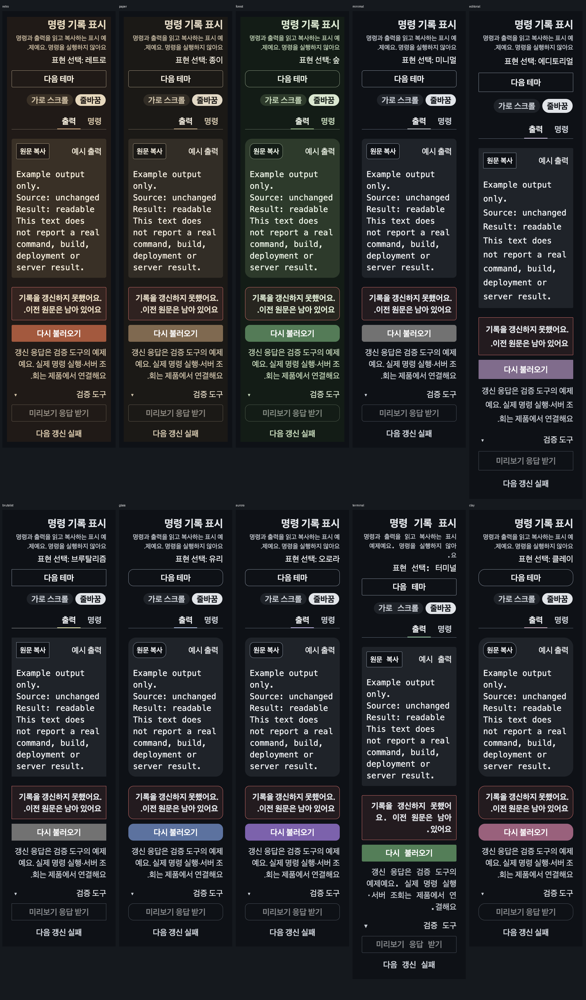
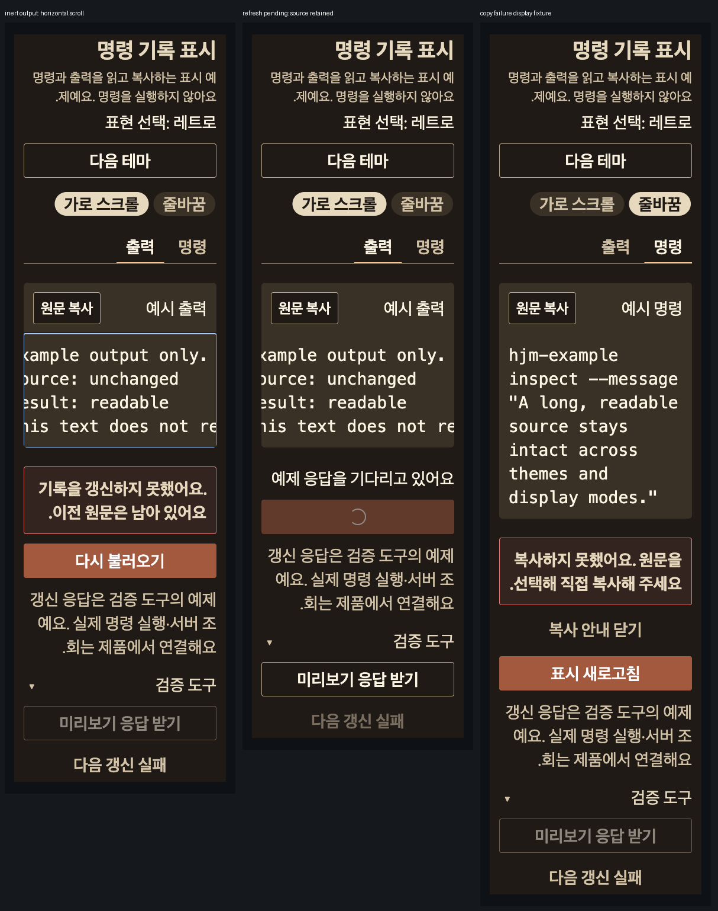

# 명령 기록 표시와 복사 수명 검증

2026-10-07 · 실험 등록/미게시 ClipboardButton 보완. 전체 사이트 조사·승급·npm 게시·소비 앱 적용 아님.

최신 사용자 지침으로 최대 OS 접근성 글자/최대값 모사 확대는 이후 설계·검증·후속/완료 조건에서
제외한다. 아래 textScale2 등 이미 수행한 확대 검증은 과거 증거로만 보존하고 반복하지 않는다.

## 출처와 기존 API 판단

[Magic Terminal](https://magicui.design/docs/components/terminal)의 공개 본문/예제와 B의 전체 Manual
검토를 대조했다. 명령/출력과 시각적인 순차 표현은 실제 명령 실행·CI 성공 근거가 아니다.
[Aceternity Code Block](https://ui.aceternity.com/components/code-block)의 전체 Manual을 B가 읽고
root는 공개 문서를 대조했다. 탭/복사 표시를 기존 Tabs/TabPanel/CodeBlock/ClipboardButton에
합성하고 원문·라벨·실패 응답을 유지한다. 하이라이터/typing timer/terminal engine은 복제하지 않는다.
다른 Aceternity Terminal/block의 아직 읽지 않은 숨은 구현을 읽었다고 확대하지 않는다.

`실험/구성/정보 표시/명령 기록 표시`: 양 플랫폼 Default/Pending/Failed/CopyFailed/Dark/LargeText/
ReducedMotion/Rtl 8스토리. 명령/출력·줄바꿈/코드 자체 가로 스크롤·10개 테마·이전 원문을 유지한
갱신 실패/복구를 공개 API로 구성했다. 원문은 자체 inert fixture이며 실행하지 않는다.
Native는 선택 가능한 원문과 시스템 메뉴 사용 안내이고 Web ClipboardButton을 제공한다고
안내하지 않는다. Native CopyFailed는 제품 host 오류 표시 fixture이며 OS 거부 실행 증거가 아니다.

## 실제 공통 복사 결함과 보완

기존 source에서 deferred OS Promise를 사용한 Chromium 회귀4개가 모두 실패했다.
동일 tick 두 클릭→writeText2회, 원문 변경 뒤 이전 resolve/reject→제품 callback 호출,
언마운트 뒤 resolve→제품 callback 호출을 각각 재현했다.

원문 변경/언마운트 세대로 이전 성공 표시·오류/성공 callback을 무시한다. OS 쓰기는 취소가
불가능하므로 값이 바뀌더라도 이전 쓰기 완료까지 새로운 쓰기를 막는다. 각 값별로 바로 새 쓰기를
허용하는 방안은 이전 쓰기가 나중에 clipboard를 덮을 수 있어 채택하지 않았다.
Button의 기존 loading/aria-disabled를 사용하고 physical disabled를 새로 걸지 않아 포커스를
유지한다. callback 전에 feedback timer를 만들고 cleanup이 이를 정리한다.
Props/export 변화 없음, React patch Changeset 추가. 이 후속 동작은 아직 게시되지 않았다.

## 검증 범위

표시/복사/갱신은 별도 상태이며 갱신 진행 동안 원문을 읽고 복사할 수 있다. 실패 후 원문은
유지한다. Web 응답 도구가 비활성화되면 주 갱신 행동으로 포커스를 돌린다.
양 Showcase 타입/등록·사용 지침·문서 링크·토큰 검사를 기록하며 Native 실제 기기/시스템 선택/
VoiceOver/TalkBack·두 번째 제품 팔레트·성능·실제 서버 스트림은 후속 범위다.
다른 세션 댓글 source/dist/문서는 보존한다. 원격 CI·버전 상승·릴리스는 실행하지 않는다.

## 실제 Web 흐름

기존 로컬 Storybook/IAB83 사용, 임시 tab 종료와 viewport/media override 해제.

1. Desktop 기본: 복사 버튼의 copied label/live status를 확인했다. 이어 원문 탭 ArrowRight는
   출력에 포커스만 옮기고 명령 선택을 유지, Enter 후 출력 패널 하나로 바뀌고 copied 표시를 지웠다.
   IAB clipboard.readText는 빈 문자열을 반환해 OS readback/원문 일치는 실제 검증으로 세지 않는다.
   source 정확한 전달은 mock writeText 회귀로 확인하며 UI 성공과 도구의 clipboard bridge를 구분한다.
2. 출력 선택→다음 갱신 실패→새로고침→응답 후 danger Notice와 같은134자 출력 유지.
   같은 재시도→응답 후 오류 제거, 표시 새로고침으로 포커스 복귀.
3. 390×844/dark/textScale2/RTL/reduced, 10개 테마에서 출력 탭·줄바꿈·원문134자·실패 Notice 유지.
   document.scrollWidth390, pre client/scrollWidth326, 코드 dir=ltr. 테마 변경은 상태를 초기화하지 않았다.
4. 가로 스크롤 선택 후 원문 동일, pre scrollWidth1330/client326/document390. pre에서 실제ArrowRight
   입력 후 scrollLeft0→0.5를 관찰했다. 전체 끝까지 읽었거나 모든 키를 검증한 결과로 확대하지 않는다.
5. CopyFailed 표시 fixture의 안내 닫기 후 오류가 제거되고 원문 복사에 포커스 복귀.
   실제 OS 권한 거부는 mock 회귀에서만 검사했다.

코드 HMR로 fixture가 초기화된 도중 비활성 응답 버튼을 클릭하려던 시도는 도구 deadline이었다.
새 DOM에서 초기화 상태를 확인해 실제 흐름을 다시 실행했다. 이 시도를 실패 상태 검증에 합산하지 않는다.

## 대상 회귀와 산출물

- Chromium 복사 lifecycle5 + 기존 복사/CodeBlock 포함3파일11검사 통과. 순차 OS 쓰기·거부 뒤
  복구·value 변경/A→B→A·언마운트 뒤 callback 차단·진행 중 keyboard focus 유지.
- 양 Showcase typecheck 통과, Native story 등록 생성 완료. 전체 기기 검증 아님.
- 첫 usage 검사에서 필수 배치/상태 표 형식3건을 거부해 규격의 정확한 열·실패 행으로 고쳤다.
- 공개 renderer build, 전체 로컬 검사 결과는 아래 후속 실행 기록에 보존한다.

## 후속 로컬 검사와 실패 재확인

최초 전체 `pnpm check`에서 contracts 98파일/1021검사, Native 111파일/1242검사,
React SSR 18파일/278검사 및 해당 타입 검사가 통과했다. React browser는 113파일/1141검사 중
메뉴바 키보드 검사1개가 종료 대신 새 문서를 가리켜 실패했다. 따라서 이 실행 자체는 실패이며
뒤쪽 root gate는 실행되지 않았다. 메뉴바 source는 변경하지 않았다. 같은 검사와 복사 lifecycle,
기존 CodeBlock을 지정한 재실행은 3파일/7검사 통과했다. 단독 통과만으로 전체 통과라고 바꾸지 않고
React browser 전체를 별도로 다시 실행한다.

Web Showcase는 타입·15파일/48검사·70개 토큰/307파일 검사가 통과했다.
Native Showcase는 신규 ReducedMotion의 표시 이름이 `움직임 줄이기`여서 탐색 규격 검사가
거부했다. 양 플랫폼 이름을 canonical `동작 줄이기`로 수정한 뒤 Native story 생성·타입·
6파일/21검사가 모두 통과했다.

React build 및 root 나머지 gate를 별도로 실행했다: renderer bundle, workspace, evidence,
docs, governance, public API map, usage, storybook 모두 통과. Web 정적 build와 verify:static도
통과했으며 canonical 103컴포넌트와 navigation 13페이지를 검사했다. 정적 생성 성공은
전체950스토리의 실제 사용자 흐름 검증이나 공개 Storybook 게시 증거가 아니다.

후보 등록부의 세 항목은 양 플랫폼 Storybook/usage/QA 파일 존재·같은 4마디 제목·선언한
변형 export 연결을 확인했다. 이는 지금 등록한 세 후보의 검사이며 전체 조사 후보 등록 완료를
주장하지 않는다. 다른 세션의 댓글 source/dist/문서는 별도 변경으로 보존했다.

## 메뉴 입력 충돌의 재현과 개선

React browser 전체 재실행도 113파일/1141검사 중1개 실패했다. 이번에는 메뉴바가 통과하고
ContextMenu의 ArrowDown 뒤 활성 항목이 `삭제` 대신 `이름 변경`이었다. 초기 포커스 지연을
원인으로 추정했으나 실제 source에는 해당 두 메뉴의 지연 초기화가 없었다. 항목의 mouseenter가
활성 항목을 변경하는 코드를 대조했다. 팝업 배치 때문에 발생할 수 있는 늦은 mouseover를
키보드 선택 뒤 dispatch하는 결정적인 회귀를 작성했으며 두 기존 source 모두 정확히 해당
이벤트 뒤 선택이 되돌아가 실패했다. 원래 전체 실행 두 번의 이벤트 발생 순서를 계측한 증거는
없으므로 이 재현을 그 실행의 유일한 원인으로 단정하지 않는다.

Menubar·ContextMenu 항목 선택을 mousemove로 연결했다. 이후 두 새 회귀는 늦은 경계 이벤트를
무시하고 실제 Playwright mouse hover 이동으로 첫 항목을 선택하는 것까지 통과했다.
동일 패턴의 CommandPalette도 별도로 같은 회귀를 작성해 기존 source에서 실패를 확인한 뒤
mousemove로 수정했다. 새 회귀3개와 기존 keyboard/activation/disabled/filter/stale-result 및
Clipboard lifecycle을 포함한 4파일/22검사가 통과했다. Menubar 라벨의 메뉴 hover 전환은
그대로이고 Native OS 어댑터·공개 props·클릭 실행·키보드 활성화는 변경하지 않았다.
고정 sleep이나 테스트 재시도 추가 없이 입력 의도를 구분했다. React patch Changeset과
세 컴포넌트 사용 지침을 갱신했다. CommandPalette 안내의 옛 source/queryState 참조 초기화
경고도 실제 query-only effect와 기존 부모 재렌더 회귀에 맞게 정정했다.

### 수정 후 최종 결과

`pnpm --filter @hjmds/react check` 최종 실행은 타입 검사, SSR 18파일/278검사,
Chromium 113파일/1144검사, 공개 renderer build 모두 통과했다. 전체 실행의 기존 act 경고는
남아 있으며 경고가 없다고 주장하지 않는다. 최초 `pnpm check` 실패 기록을 지우지 않고
수정한 renderer와 뒤쪽 gate를 다시 실행한 결과를 구분한다.

마지막 생성물 기준 renderer bundle/workspace/evidence/governance/public API map과 Web
Showcase 타입·15파일/48검사·토큰 검사, Web 정적 build/verify:static을 다시 통과했다.
docs links587·usage 12토큰/139컴포넌트/57구성/22화면·storybook 427파일/950 Web ID도
통과했다. Vite의 기존 큰 chunk 안내는 남아 있다. 세 package 버전은 1.14.0으로 유지하고
두 patch Changeset만 추가했다. 원격 CI·버전 상승·스토리북 배포·npm 게시·소비 제품 반영은
실행하지 않았다. Native 실제 기기·OS 복사·AT 범위는 위 미확인 상태 그대로다.





원본 CSS clip 픽셀을 나란히 배치하고 상태 라벨만 추가했다. 자체 fixture만 사용하며 원본 사이트
bitmap이나 코드를 복제하지 않았다. QA·최종 그림을 보존한 뒤 root 소유 raw PNG/JSON은 정리한다.
- themes PNG2018×3438 SHA256: cc848964c615b36bfd642ddfe17c57af0775a135ecb05eea3d2f2be02c4f03e4
- states PNG1214×1537 SHA256: 82b213a4b5c176c8accf6b11388a3bb85d090d70dad28cc2efe197ba8f564612

### 원시 산출물 정리

결과·재현·수정 전후·미확인 범위와 최종 두 PNG를 위에 보존한 뒤 root 소유 raw만 정리했다.
다른 세션 원본·연구 데이터·재사용 fixture·정적 Storybook은 보존했다. 삭제 대상 26개/총 1693345 bytes의 경로·해시는 다음과 같다.

```json
[
  {
    "path": "/tmp/hjm-command-records-browser-20261007.log",
    "bytes": 119673,
    "sha256": "c1065a166bab759c8bd31750effe00cd16e7877c9915c1e36de7ccd193b6c89f"
  },
  {
    "path": "/tmp/hjm-command-records-final-react-20261007.log",
    "bytes": 118625,
    "sha256": "3384f9a24f48d21875ba73ac50f0d20327025d23e8b27f4bf3f57a8db04b294b"
  },
  {
    "path": "/tmp/hjm-command-records-final-gates-20261007.log",
    "bytes": 94639,
    "sha256": "cc24e8aa854df1d47c289e7e22a458d81dd459f3cd804248fc6a92e614809ce7"
  },
  {
    "path": "/tmp/hjm-command-records-20261007/8.png",
    "bytes": 102248,
    "sha256": "a517f58352c11f10ce373d6936dff0eeaca27df846ab15dea2c0db5a5140102e"
  },
  {
    "path": "/tmp/hjm-command-records-20261007/9.png",
    "bytes": 106192,
    "sha256": "36613fd9079594e87004dbc9457a3b52ce5bbb49a2ab1f10f594ad144f68dccc"
  },
  {
    "path": "/tmp/hjm-command-records-20261007/observations.json",
    "bytes": 4236,
    "sha256": "e9a597dd74ff7c9e3c4916828d8499142d7b381a70c7a5864bced6997865ce64"
  },
  {
    "path": "/tmp/hjm-command-records-20261007/4.png",
    "bytes": 102717,
    "sha256": "01d49ff9180d2cd4e044f5b62fd1eafba43b9ec36fec6a11da48b9430b442125"
  },
  {
    "path": "/tmp/hjm-command-records-20261007/copy-failed.png",
    "bytes": 98449,
    "sha256": "f5415947d29a777142f6bed81ce817bfcc1287dd18a10f855ea04cb3cffb14f4"
  },
  {
    "path": "/tmp/hjm-command-records-20261007/5.png",
    "bytes": 100436,
    "sha256": "8f910accda886bc781a304ff4cea816e29822fead753e6c7acef81a294c31a9e"
  },
  {
    "path": "/tmp/hjm-command-records-20261007/7.png",
    "bytes": 103843,
    "sha256": "a37947f5aad32038126846d0e94f3fd50189660213235c421d2ff57bf3655791"
  },
  {
    "path": "/tmp/hjm-command-records-20261007/6.png",
    "bytes": 104493,
    "sha256": "8f4cd665d26dc5ef6a2a82c17960d0f97bfb51dffb76cef744007c02cf0ac1b4"
  },
  {
    "path": "/tmp/hjm-command-records-20261007/scroll.png",
    "bytes": 86238,
    "sha256": "d022699f48ea21988e5613c7873ce25140e836befc5c6c7c0a06b75c9720abb6"
  },
  {
    "path": "/tmp/hjm-command-records-20261007/2.png",
    "bytes": 104946,
    "sha256": "3564e47b66951d31bda7b54cd780922dc8f08ecb850208a6c91c81129846b327"
  },
  {
    "path": "/tmp/hjm-command-records-20261007/3.png",
    "bytes": 101408,
    "sha256": "a9d60f3b5cb292c48c027082b7cdbf6e74e3a2b3d94c95307916ce185d80039f"
  },
  {
    "path": "/tmp/hjm-command-records-20261007/1.png",
    "bytes": 102859,
    "sha256": "6f55c91edf77290afe61462056cc4396db87190f4ca919de41ad148bf2f5bd2f"
  },
  {
    "path": "/tmp/hjm-command-records-20261007/pending.png",
    "bytes": 78852,
    "sha256": "90b578061f00231e86290ceb4f67026d215aeac4a7d35865819823e03a379e33"
  },
  {
    "path": "/tmp/hjm-command-records-20261007/0.png",
    "bytes": 100873,
    "sha256": "1c9d9e4ac6a60d3d6fbede75c93f4ee66cb2b2a45012997bef7399d1842debc4"
  },
  {
    "path": "packages/react/test/__screenshots__/context-menu.interactions.browser.test.tsx/opens-from-the-keyboard--tracks-the-active-item--and-restores-focus-after-dismissal-or-action-1.png",
    "bytes": 9532,
    "sha256": "fb78eadcbba577d2f03d355cd5769d72a8a83c9f96f6c3100f532b8ae429dd58"
  },
  {
    "path": "packages/react/test/__screenshots__/context-menu.interactions.browser.test.tsx/keeps-the-keyboard-item-after-a-late-mouse-enter-until-the-user-moves-the-mouse-1.png",
    "bytes": 9532,
    "sha256": "fb78eadcbba577d2f03d355cd5769d72a8a83c9f96f6c3100f532b8ae429dd58"
  },
  {
    "path": "packages/react/test/__screenshots__/menubar.keyboard.browser.test.tsx/supports-browser-keyboard-focus--menu-navigation--disabled-state--and-action-activation-1.png",
    "bytes": 7628,
    "sha256": "27d480e209eb5f40aed6434a758295ebde0bd1a719b9b99ced647a827fdcfb52"
  },
  {
    "path": "packages/react/test/__screenshots__/menubar.keyboard.browser.test.tsx/keeps-the-keyboard-item-when-layout-causes-a-late-mouse-enter--then-follows-actual-mouse-movement-1.png",
    "bytes": 7628,
    "sha256": "27d480e209eb5f40aed6434a758295ebde0bd1a719b9b99ced647a827fdcfb52"
  },
  {
    "path": "packages/react/test/__screenshots__/command-palette.browser.test.tsx/preserves-the-keyboard-result-after-a-layout-driven-mouse-enter-until-the-mouse-moves-1.png",
    "bytes": 14906,
    "sha256": "0f96fafcc7a9ed9b9c002c3a1a99f03fd85f5f1caa9add66426c5f89fb6a2f2b"
  },
  {
    "path": "packages/react/test/__screenshots__/clipboard-lifecycle.browser.test.tsx/ignores-an-obsolete-reject-while-a-new-source-has-its-own-request-1.png",
    "bytes": 3140,
    "sha256": "8853889386b24cfdc5efe9612f4cbfee7597b9455dda7bc8009e8408fcac15f0"
  },
  {
    "path": "packages/react/test/__screenshots__/clipboard-lifecycle.browser.test.tsx/does-not-call-product-callbacks-after-unmount--even-if-the-OS-finishes-copying-1.png",
    "bytes": 2082,
    "sha256": "0a157c250dcc942cb0f7ff7b76b82b83ead2517b136b5e9ec2ca4f08242cf3dd"
  },
  {
    "path": "packages/react/test/__screenshots__/clipboard-lifecycle.browser.test.tsx/ignores-an-obsolete-resolve-while-a-new-source-has-its-own-request-1.png",
    "bytes": 5030,
    "sha256": "45248f8a466f19f4795a40226f0db2bf2f126cfbdc1f573ff7df858bff4abca6"
  },
  {
    "path": "packages/react/test/__screenshots__/clipboard-lifecycle.browser.test.tsx/makes-a-clipboard-request-single-flight-and-clears-its-busy-state-after-denial-1.png",
    "bytes": 3140,
    "sha256": "8853889386b24cfdc5efe9612f4cbfee7597b9455dda7bc8009e8408fcac15f0"
  }
]
```


## 선택 Native 흐름 후속

긴 줄 touch·10테마 원문 유지·실패/재시도를 실제 iOS에서 확인했다. 시스템 Copy가 합성 원문 bytes 및 마지막 줄바꿈과 일치했고 이전 simulator clipboard를 복원했다.
선택 dark/RTL 화면도 확인했다. 상세 재현·제약·source SHA·원시 보관 처리는
[동일 작업 Native 검수 기록](2026-10-07-native-reference-validation.md#8-내용-전환날짜시각명령-기록-후속-검수)에 보존했다.
Android·VoiceOver·실물/Release 성능·모든 상태/환경 검수·승급·npm 게시 완료는 아니다.
