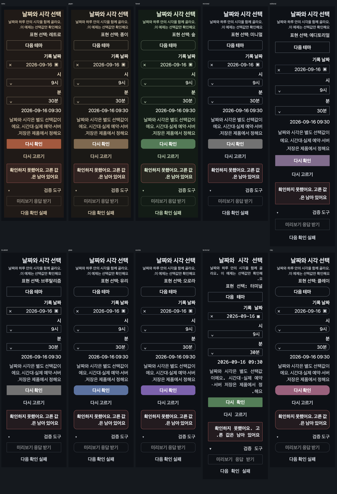
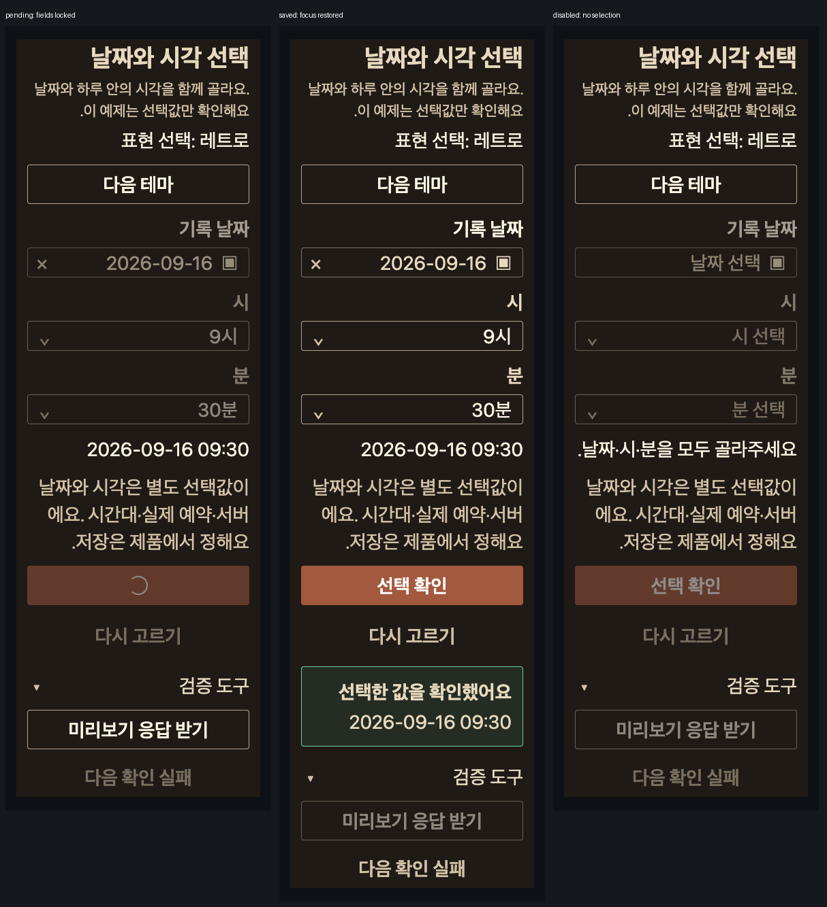

# 날짜와 시각 선택 등록·검증과 Form 안내 정정

2026-10-07 · Web·Native 실험 등록 / 로컬 검증. 전체 조사·승급·npm 게시·소비 제품 반영 아님.

## 조사와 채택

[Magic time-and-date-picker](https://magicui.design/blog/time-and-date-picker)의 전체 공개 본문을
B가 독해하고 root도 live 문서를 직접 대조했다. 제공 코드는 DatePickerProps interface이며
실제 달력/time/keyboard 구현은 설명이다. 광고 오류 감소율·Native 동등성·완성된 picker를
검증된 근거로 쓰지 않는다. 단일 Date를 바꿔 쓰자는 설명과 새 Date 설명의 불일치, pointer-events
비활성 안내는 기존 controlled ISO date·시·분·disabled API를 대체하지 않는다.

기존 DatePicker, Select, Section, Container, Stack, Button, Notice, Collapsible를 합성해
`실험/구성/선택과 필터/날짜와 시각 선택`에 양 플랫폼 7스토리를 등록했다.
날짜와 시각은 문자열 선택값이다. 시간대·DST·예약 허용·locale·실제 server transport는 제품 소유.
Storybook 검증 도구의 응답은 로컬 fixture이며 실제 예약/저장으로 안내하지 않는다.
공개 API나 날짜 라이브러리를 새로 추가하지 않고 기존 배포 시간 선택도 유지한다.

[사용 지침](../../packages/design-contracts/docs/usage/compositions/date-time-selection.md)에는
구성/배치/상태/공개 import/제품 책임/플랫폼 차이를 연결했다. Default, Pending, Failed,
Disabled, Dark, LargeText, Rtl. 환경 globals는 양쪽 동일. Web id `composition-selection-date-time`.
Native requires는 생성 도구의 gitignore된 로컬 결과다.

## 실제 Web 검증

로컬 기존 Storybook 사용, 임시 IAB81/82 종료, viewport/media override 해제.

1. 기본 desktop/light: 세 선택이 비어 확인 비활성. 달력 open→9/16 Enter 선택→시9/분30 실제
   listbox 선택. 날짜 선택/달력 Escape 후 필드 트리거로 포커스 복귀.
2. 표시 달9월→10월로 실제 이동한 뒤 날짜9/16·시9·분30 유지. 표시 달은 선택값과 독립이다.
3. 다음 확인 실패 예약→확인 중. 날짜/지우기/두 Select/확인/재설정/실패 예약 모두 실제 disabled,
   확인 버튼 aria-busy=true. 응답 받기만 활성. 응답→danger alert와 같은 값→재시도→success.
4. 390×844, dark/textScale2/RTL/reduced의 양 provider 실제 속성 확인. 실패 상태에서10개 테마
   retro/paper/forest/minimal/editorial/brutalist/glass/aurora/terminal/clay 실제 순회.
   모든 상태는2026-09-16 09:30/같은 alert 유지, document.scrollWidth390.
5. 같은 큰 글자 상태의 달력은 dialog x16..374/폭358/높이414, grid폭324, 자체 scrollWidth324.
   실제 Calendar ArrowDown16→23, RTL ArrowRight23→22. 선택은9/16 유지.
6. 실패→확인→응답 후 확인 버튼에 포커스 복귀. 분45로 바꾸면 이전 success Notice 제거,
   상태09:45. 다시 고르기로 날짜·시·분·결과를 모두 비움.
7. Disabled 스토리에서 날짜/두 Select/확인/재설정/서비스 도구의 disabled를 실제 확인.

선택 불가9/20는 role=gridcell aria-disabled=true를 확인했다. Locator Enter는 도구가 비활성
대상을 수행하지 못해 deadline을 반환했고, 새 AX 관찰은 선택 변화 없음/9/16 focus였다.
이는 원본/HJM 결함이나 실제 disabled-cell keydown 실행 증거로 세지 않는다. 강제 이벤트·
DOM 주입은 하지 않았다. 원래 Calendar의 모든 키/달 경계/날짜 범위·실제 AT는 후속 범위다.

## RTL 표시 후속 대조

원래 civil 문자열은 날짜→시각이었지만 실제 RTL 화면에서 두 숫자 묶음이 시각→날짜로
표시됐다. 표시 문자열에만 Unicode LRI/PDI를 적용하고 저장·요청 snapshot은 그대로 두었다.
양 플랫폼 같은 표시 helper를 쓰며 화면의 dir=rtl은 유지한다. 제품은 자신의 locale display를
공급하며 제어 문자를 서버 값에 섞지 않는다. 후속 IAB82 실제390×844/dark/textScale2/RTL/reduced에서
10테마 실패 상태의 날짜→시각·선택값·Notice·폭390을 재확인했다. 실패→진행→확인 결과도
다시 실행해 표시 순서와 확인 버튼 포커스 복귀를 확인했고 비활성 화면을 새로 캡처했다.
Native는 타입/공통 fixture 회귀이며 실제 기기 표시를 확인한 결과는 아니다.

## 한 장 비교 증거

실제 CDP CSS clip 원본 픽셀을 나란히 묶고 영문 상태 라벨만 붙였다. 이미지 재생성/참고 사이트
bitmap 복사는 없다. 각 원시 PNG/JSON은 이 QA와 최종 묶음을 보존한 뒤 삭제한다.

## Form 지침 수정 근거

B 폼 조사에서 Form usage 초기 선택 표는 "Native 내장 버튼 숨김/외부 제출 불가"라고 했지만
같은 문서 배치와 현재 source에는 actions={null}, FormHandle.submit()이 있었다.
Root가 npm @hjmds/react-native/1.14.0 tarball을 설치 없이 읽어 dist/forms.d.ts의 FormHandle,
actions/ref/onStatusChange를 직접 확인했다. tarball SHA-256
`54b1e145dea61eb820d9ffc01cb5e6081e02cc4b0ee514ef892c6563e887dbf6`.

[Form usage](../../packages/design-contracts/docs/usage/components/form.md)의 오래된 금지 행2개를
제거하고 동일 제출 경로/내장 행동 숨김·버전1.14.0·공개 FormHandle 타입을 안내했다.
게시 API를 제품에 복제하게 하던 모순 정정이며 Form runtime 변경이나 새 게시가 아니다.

## 검사·수정과 범위

- 양 Showcase typecheck 통과. 첫 시도 shared React import는 renderer-neutral 폴더에 React
  의존성이 없어 거부됐다. shared는 순수 fixture reducer로 바꾸고 각 Showcase가 자기 useState를 소유한다.
- Web Button에 없는 loadingLabel도 타입에서 거부돼 실제 Button label+loading으로 정정했다.
- fixture 의미 회귀5개: 불완전/중복 확인 차단, 진행 중 모든 값/표시달/재설정 불변, 요청값snapshot,
  실패/재시도/이전 결과 제거, 외부 disabled, 표시 전용 LTR isolate와 원본 값 분리. 관련 Web 경계 포함3파일7검사 통과.
- Native 등록/스토리:2파일7검사 통과. Native 기기/keyboard/VoiceOver/TalkBack 검증은 아니다.
- 사용 지침/Storybook 고정 분류/같은 환경 키/문서 링크 검사 통과.
- verify:tokens의 첫 실패는 이전 내용 전환 실험의 미리보기 minHeight360이었다. 기존 geometry
  exception 형식에 그 selector/property/value만 기록하고 source·사용 지침·해당 QA에 이유를
  남겼다. 실제 화면 값은 바뀌지 않는다. 토큰 검사 재실행 통과.

두 번째 실제 제품 팔레트·10테마 모든 달력/listbox 열림 상태·Native 실제 기기·AT·성능·예약 서버
검증은 남는다. 공개 source를 바꾸지 않아 source Changeset 없음. 원격 CI·버전 상승·게시 안 함.
다른 세션의 댓글 source/dist/문서는 수정·stage하지 않는다.

최종 증거 SHA-256:
- 2026-10-07-date-time-themes.png: `9c6d84e0f4554b97821400dd00926ede288726074efb3e23a998b0da5d501b66`
- 2026-10-07-date-time-recovery.png: `64d83ae03430071bc1dac020a4bd99ac755b67462e10562458b69b82c5a0db99`

## 선택 Native 흐름 후속

달력·시·분 선택, 처리 중 잠금, 실패 후 입력 유지·재시도·초기화를 실제 iOS에서 확인했다.
선택 dark/RTL 화면도 확인했다. 상세 재현·제약·source SHA·원시 보관 처리는
[동일 작업 Native 검수 기록](2026-10-07-native-reference-validation.md#8-내용-전환날짜시각명령-기록-후속-검수)에 보존했다.
Android·VoiceOver·실물/Release 성능·모든 상태/환경 검수·승급·npm 게시 완료는 아니다.
