# 디자인 프로필 10종 조사와 구현

검토일: 2026-10-07 · 상태: 10종 실험 구현·로컬 검사 완료, 미게시 · 시작 SHA: `1482bea`

## 요구와 조사 범위

사용자 요청: 최소 10개 테마를 여러 참고 사이트에서 조사하고, 표현뿐 아니라 같은 기능의 상호작용·구성·화면 배치도 함께 선택한다. `neutral`은 기존 기본값이므로 10개에 포함하지 않는다.

2026-10-07 공개 문서·예제 설명을 직접 읽은 근거다. Refero의 측정·역할 설명은 사이트 자체가 해석/재구성이라고 고지한다. 아래 HJM 조합은 이를 참고한 독립 설계이며 원제품과 동등한 동작·모든 페이지 검수·폰트/자산 재배포를 뜻하지 않는다. 11개 사이트의 전체 페이지 검토는 별도 [계획](../plans/reference-release-utilverse-2026-10-07.md)에서 계속 추적한다.

## 출처와 채택 판단

| HJM 테마 | 직접 읽은 출처 | 확인한 표현/구조 | HJM에서 선택한 조합 |
| --- | --- | --- | --- |
| 레트로 | [Magic UI Retro Grid](https://magicui.design/docs/components/retro-grid) | 격자 배경, 기울기·셀 크기·밝음/어두움 선 색 옵션 | 따뜻한 잉크/작은 모서리/정적 noise + slide 전환/격자/가로 헤더. 원본의 3D 격자 애니메이션은 복제하지 않았다 |
| 종이 | [Refero Cursor](https://styles.refero.design/style/4e3b4717-84c8-4599-baaf-a343c3d619b6), [Magic UI Noise Texture](https://magicui.design/docs/components/noise-texture) | 크림 바탕, 작은 모서리, 절제된 표면, 질감 레이어 | 따뜻한 종이/정적 grain + fade/행/접이식 도구/문서형 헤더 |
| 숲 | [Refero Wise](https://styles.refero.design/style/367c0c6e-73a7-441c-a8ff-91d139ac60dc) | 녹색과 밝은 강조색, 둥근 행동/카드, 어두운 구역 | 자체 녹색 팔레트/넓은 곡률/mesh + rise/슬라이드 선택/카드/중앙 헤더. Wise 자산·폰트·색을 그대로 이식하지 않았다 |
| 미니멀 | [Refero Rows](https://styles.refero.design/style/8d4a4e15-31f1-4509-8d13-7746f85c20d7), [Refero shadcn/ui](https://styles.refero.design/style/0fd67ec5-7e9c-4ca9-b368-5d9c7388477a) | 제한된 색, 정렬과 여백, 얇은 경계 | 무채색/낮은 그림자 + fade/행/항상 펼친 도구/가로 헤더. 원본의 10px 글자는 기본값으로 채택하지 않았다 |
| 에디토리얼 | [Refero 자체 제품](https://styles.refero.design/style/3f296d6e-6a1c-45db-829b-afb078d49ab4) | 큰 제목, 넉넉한 세로 리듬, 문서형 제품 소개 | 낮은 곡률/28px 제목과 24px 본문 행간 + rise/행/접이식 도구/720px 읽기 폭. 별도 상용 serif는 번들하지 않는다 |
| 브루탈리즘 | [Refero Dayos](https://styles.refero.design/style/ee403055-480e-4bd4-9216-07c9ae2dde2e) | 강한 제목 대비·평평한 표면·큰 형태 | 사각 모서리/30px 강한 제목/짧고 단단한 그림자 + slide/카드/항상 펼친 도구/문서형 헤더. 사각 모서리는 HJM의 해석이며 원제품의 둥근 카드를 복제한 것이 아니다 |
| 유리 | [Uiverse Neon Corners Glass Card](https://uiverse.io/vishalmet/selfish-earwig-66), [Aceternity Background Gradient](https://ui.aceternity.com/components/background-gradient) | 반투명·blur·그라디언트 모서리/hover, 정적 배경 옵션 | 차가운 표면/넓은 모서리/정적 빛 + fade/슬라이드 선택/카드/중앙 헤더. 현재 실제 backdrop blur는 미구현이며 단색 표면 fallback이다 |
| 오로라 | [Aceternity Aurora Background](https://ui.aceternity.com/components/aurora-background), [Magic UI Bento Grid](https://magicui.design/docs/components/bento-grid) | 느린 빛 배경, 기능 카드 격자 | 자체 보라 팔레트/30초 mesh·glow + scale/슬라이드 선택/격자/접이식 도구/중앙 헤더. reduced motion과 화면 비활성 시 정지 |
| 터미널 | [Magic UI Terminal](https://magicui.design/docs/components/terminal) | 명령/로그 줄의 순차 표시, 지연 옵션 | 일반 monospace fallback/낮은 모서리/그림자 없음 + fade/행/접이식 도구/가로 헤더. 실제 제품 데이터는 타이핑 연출 때문에 늦추지 않는다 |
| 클레이 | [Uiverse adamgiebl Card](https://uiverse.io/adamgiebl/horrible-rabbit-39), [claymorphism 모음](https://uiverse.io/tags/claymorphism?theme=all) | 둥근·shadow·elevated 카드 분류 | 넓은 모서리/부드러운 바깥 그림자/낮은 grain + scale/슬라이드 선택/카드/접이식 도구/가로 헤더. 원본 CSS/실제 호버 동작은 아직 검증하지 않았고 inset shadow는 미구현 |

4개 참고 도메인에서 위 개별 문서/상세 페이지를 확인했다. Minimal Gallery 분류·목록도 열었지만 개별 원제품의 표현을 이 표의 확정 근거로 사용하지 않았다. 라이선스 표기 확인은 코드 복제 허가 전체 검토를 대신하지 않는다. 이 변경은 원본 코드·브랜드 이미지·폰트를 복사하지 않았다.

## 구현 경로

- `@hjmds/design-contracts/design-profile`: 10개 참조 팩과 neutral, 불변 결과, 앱 부분 수정, 양 테마 대비/값 검증.
- `HjmProvider.designProfile` / `HjmNativeProvider.designProfile`: 가장 가까운 프로필 상속. `brandPalette`는 선택된 프로필 팔레트 위에 적용된다. 기존 완성 `value`는 계속 지원한다.
- Web CSS 변수와 Native theme tokens: radius/typography/shadow/font family 전달. 기존의 정적 숫자 경로는 소비 API별로 조사해야 한다.
- `ContentTransition`/`SegmentedControl`: 생략한 prop만 프로필 기본값 사용. 명시적 prop, 방향, reduced motion을 유지한다.
- `ScreenLayout.presentation`: 명시적 값 → 프로필 화면 표현 → 기존 골격. 본문 상태·스크롤 엔진은 그대로 사용한다.
- optional `@hjmds/react/design-profile` / `@hjmds/react-native/design-profile`의 `OverviewScreen`: 공유 ScreenLayout·Grid·Surface·Collapsible·EffectSurface를 조합한다. 같은 stable id와 동일한 부모를 유지한다.
- `Collapsible.presentation="inline"` / `keepMounted`: 도구 표현을 바꿔도 입력 상태를 보존한다. 닫힌 DOM은 hidden, Native는 display:none + 접근성 제외. 기존 기본 닫힘 동작은 unmount로 유지한다.
- Storybook 양쪽 `실험/구성/비교와 검증/테마 조합`: 선택 전환과 10개 전체 비교, 실패 후 재시도 fixture. 실패·저장은 미리보기 상태이며 서버 저장을 뜻하지 않는다.

## 검증 기록

- 환경: Node 24.20.0, pnpm 11.18.0, 로컬 Chromium, 브라우저 기본 1280×720와 임시 390×844. viewport는 종료 전에 복원했다. 네이티브 기기·바이너리 빌드는 실행하지 않았다.
- 생성: `pnpm contracts:sync`, `pnpm build`, `pnpm evidence:sync`, `pnpm api-map:sync`, `pnpm usage:sync` 통과.
- `pnpm ci:check` **exit 0**: 공통 계약 98 files/1009 tests, Native 105/1219, Web SSR 18/278, Web browser 108/1123, Native Showcase 6/21, Web Showcase 14/43. Metro 기본 진입점·renderer 그래프·생성 drift·문서·governance·API 대응표·사용 지침·Storybook 규격, 웹 정적 빌드/검증 통과.
- 최종 Web Provider 미사용 호환 수정은 전체 browser 실행 뒤 들어갔으므로 별도 `vitest run --config vitest.browser.config.ts test/design-profile.browser.test.tsx test/screens.browser.test.tsx test/collapsible.browser.test.tsx`로 실제 매칭된 2 files/17 tests를 재검증했다. 이 최종 source는 뒤의 Web 빌드·Showcase 검사를 통과했다. 실행하지 않은 파일을 3 files로 세지 않는다.
- 신규 Native Overview 회귀 + 기존 화면 검사 2 files/18 tests 통과. SVG host만 mock하며 실제 프로필/화면/Grid/Surface/접기 및 로컬 상태 엔진을 실행했다. 이후 전체 Native 1219개 검사에도 포함됐다.
- 브라우저 실제 조작: 초안 `테마 전환 초안`·`이번 주` 선택 → 숲 → 저장 실패 → 재시도 성공 → 종이에서 도구 접기 → 미니멀로 전환. 초안·기간·성공 상태 보존, 같은 입력 id 유지, 닫힌 도구의 접근성 트리 제외를 확인했다. 10종 전환에서도 초안 유지.
- 실제 화면: 10종 light/dark 각 전체 화면을 보고 아래 한 장으로 비교했다. 좁은 폭 390px + textScale=2 + RTL + motion=reduced의 10종 모두 grid 326px 한 열, 문서 scrollWidth=390px로 가로 넘침 없음. 환경은 실제 Provider DOM의 `dir`, `data-text-scale`, `data-motion`으로 확인했다. 숲·브루탈리즘·클레이의 큰 글자 전체 화면은 별도 한 장에서 헤더부터 저장 행동까지 확인했다.
- 초기 검사가 잡은 문제: 새 export 목록 누락, literal 글자 굵기의 foundation 정책 위반, optional SVG 화면의 Metro 기본 fixture 혼입. 공개 경로 목록·foundation fontWeight 사용·기존 optional 경계 분류로 수정했다. 기존 바이트/모듈 상한을 올려 통과시키지 않았다.
- 구현 검토에서 수정한 문제: Web Surface의 정적 radius, Native Provider tokens spread 누락, 닫힌 Web 도구의 display:flex, 세로 헤더의 flex-basis 공백, Native 무그림자 프로필의 Android elevation, Web ScreenLayout의 Provider 필수화. 각각 토큰 소비/상태/호환 경로로 수정했다.
- 경고: 기존 일부 browser fixture의 React act 경고와 Storybook third-party `use client`/chunk 크기 경고가 남지만 검사는 통과했다. 경고를 기기 동작 또는 제품 성능 증거로 해석하지 않는다.

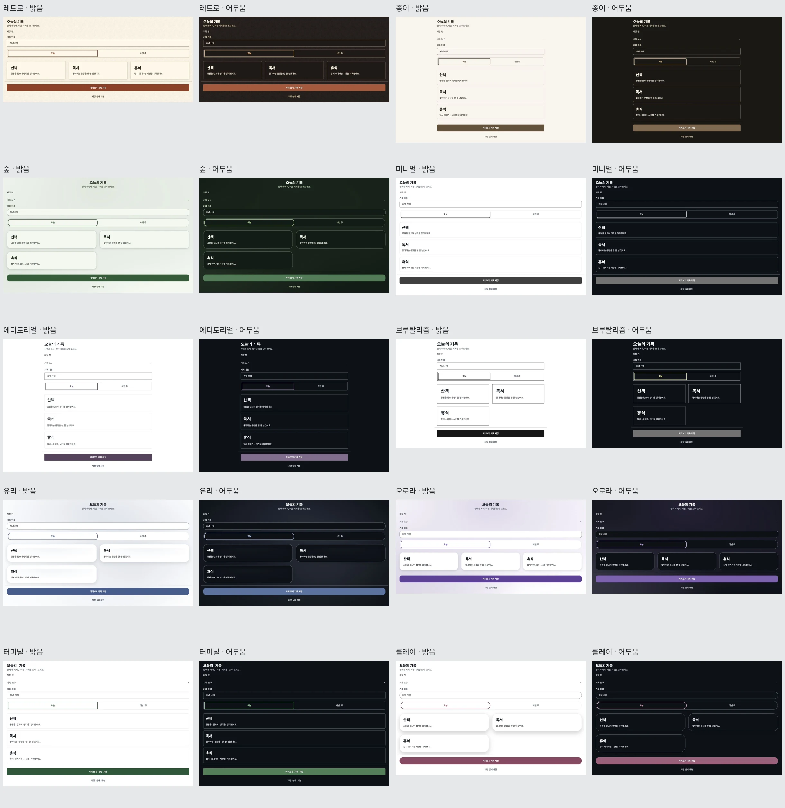

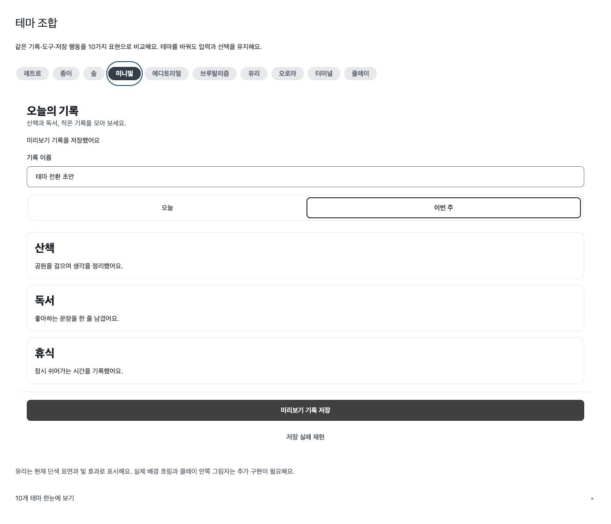

### 미확인과 판정 경계

10종은 실제 공개 subpath·Provider·양쪽 Storybook에 **실험**으로 제공한다. 유리의 실제 backdrop blur, 클레이 inset shadow, 전체 기존 recipe의 프로필 토큰 소비 감사, iOS/Android 기기 시각·접근성·성능 검증, 모든 11개 사이트 전수 검토는 미완료다. Native Android 그림자는 플랫폼 elevation으로 근사하며 웹 blur 모양과의 픽셀 동등성을 주장하지 않는다. 이 변경의 Storybook 승격·npm 게시·소비 앱 설치/적용은 수행하지 않았다.

### 보존 처리

위 최종 비교·복구 그림은 전달용 결과물로 보존한다. 테마·환경별 원시 이미지 30개와 복구 원시 화면·임시 비교 이미지·DOM 검사 JSON·검사 로그는 SHA-256을 기록하고 리포트 확정 후 제거한다. 11개 사이트의 별도 진행 중 전수 조사 원본은 이 작업의 원시 출력과 구분해 계속 보존한다.


<details>
<summary>제거 대상 원시 출력 지문</summary>

| 파일 | SHA-256 |
| --- | --- |
| `theme-ci-check.log` | `b35d6bb9247dda76444bef2ba2e3f17c2e66b8b4fe98e27e83d80c32957621a4` |
| `theme-contract-budgets.log` | `3415b97db13bd7400fce8e96840eabd61f447b69846cd068fb100e6b7f1547e0` |
| `theme-native-overview-tests.log` | `3dc64e95540f43c0f1282bd129580c8b512192f65f3abff5d2e5d8803f4506ad` |
| `theme-native-tests.log` | `b80854b8b43ccc5dd1883e290554cd7ecd55b30fd259418c7814288e7305ae3b` |
| `theme-renderer-budgets.log` | `f0905b983d5c89d0197c95b13916613b3a4eaeef6bf7735a9eed76aba3453931` |
| `aurora-dark.png` | `362b219faa28bab34a81dea4ceb2dae3a2d933af8ebfbf2a1b55130609df268c` |
| `aurora-light.png` | `262570f42d083ba3e7530fa117195025030c429acaf146f4a84cb1461a68d074` |
| `aurora-narrow-large-rtl.png` | `b4848b28d8cec43a7c74ffbd1049cf4ae9b2f9e60b762c326df556727916a41b` |
| `brutalist-dark.png` | `74310b0d11db0b6c759d050de49a655a6c773f2f9fa3a2f2a444a61f9d8c4487` |
| `brutalist-light.png` | `4c02307fff080d06021d0a024d216857a8108d04184b17e6dc545604da03fa80` |
| `brutalist-narrow-large-rtl.png` | `7b267cd6f41735897adba8fc30a10ab557535ba2c43da387a77d09abd20a843d` |
| `clay-dark.png` | `2dcfe399580e1e955f5f5b50a80e329fc975b17ef1cb9350b413bb4c4d7c11cf` |
| `clay-light.png` | `ec14666ae8da24ed04b78113915112e4d51533023f17d5f5fd18fc20e6d5ee8f` |
| `clay-narrow-large-rtl.png` | `c1ebbb2e240083c23ca35afd8cbe48e98895c27c46ede460c679f8004ee15e26` |
| `editorial-dark.png` | `21642c2ff991807447a4d5262fd909fb49946e951769497e194e8523f11ffd84` |
| `editorial-light.png` | `75d6cf0cafa33c8448344239de63a67274e5b66cadf76ae41f5104d24d5c3542` |
| `editorial-narrow-large-rtl.png` | `0da436de772154ef4f85215fc13799b10df76c085c0a1c087905f888b395057c` |
| `forest-dark.png` | `875680f49c067b5d9d804034d71443f1d20466fda52034e38ed6a78f17b848c5` |
| `forest-light.png` | `e6f915dfd7ebb87e730b7cf3394de8198642f33ee86358a0c09814d1aa4861b0` |
| `forest-narrow-large-rtl.png` | `f024b5c065859277a13e66e1995f88bb73d8e130b1fc57310849f0e79b08ef98` |
| `glass-dark.png` | `9bd1f1e19caf4a082e57c3e6352ff0e188ce694be372e71561ccdd756982fa15` |
| `glass-light.png` | `443995317d037bd0eb4800b6db41745085dcfc5726090dda3475e7e673b6e973` |
| `glass-narrow-large-rtl.png` | `37ae09f77f865da7e68e089a7a3d6099747595c5f0aa435514281eab22373fa2` |
| `light-contact-sheet.jpg` | `a373f6e79059184990b5fdc18597026c5d45648970305e56142c1e1fae1deefa` |
| `minimal-dark.png` | `fe56403a8a7da797a99f1e69233f62f558da0b9094653995730e7410b1fcb68f` |
| `minimal-light.png` | `83193b7df455f0946c59201f9b323065b08b9710959f32bf284725d8bb0a8c9f` |
| `minimal-narrow-large-rtl.png` | `2c351be480e2f5de340db674c353258c14e405912a971d793183086f417061a0` |
| `narrow-checks.json` | `085a21e28a2861da9d56030831230e54b6d537b40cfed1975927c05d26ee7004` |
| `narrow-contact.jpg` | `dbaa471e6953a6ea9ff5eef50b474837e892e6697acacecfbafa2df4eca3be3f` |
| `paper-dark.png` | `a10bf0b2995078a26b9d18af53e53bea0e46ac8b6519930eca1710d3fe7236df` |
| `paper-light.png` | `65e782e3124b0907f34fdd09d6c42f45524fc5addc15e2a59e01640c8cf8027b` |
| `paper-narrow-large-rtl.png` | `7ef5c9a86eb7596b695ced210943a053469dbd398582f909d805719d58f8ed8b` |
| `regions.json` | `de317e12e2b2c09a2cc4de7f079ff7d666264c9ef73cb87b444222e728073d11` |
| `retro-dark.png` | `65fabb8a5bd624b471efeb18fd526b254380067ec0c28c177896bec3ee4492f7` |
| `retro-light.png` | `fc035ae1ef08e7b345d042f3803a6888f471cb5075e8c6f7b250738968d4ad8e` |
| `retro-narrow-large-rtl.png` | `dd86fb851b9873b63252d8bbe96702e518d3159d36a056303d354e55804f04d6` |
| `state-retention.png` | `c1b2849eee5adc429e1d431f0f4de272ff5dc05a25dec6992d18f591f93106db` |
| `terminal-dark.png` | `9600e63c6d6ae083b0e646614e12aed28280002a49b404bc4e8b5be5581cfc48` |
| `terminal-light.png` | `0bfceee868f011cc304984e45898c17bcf58cf9fd23c1030b01aa1b09d47eca4` |
| `terminal-narrow-large-rtl.png` | `da3630f4a020db63af20eb104c3dd8cd783b6734993b6a296653b52af1180f54` |
| `theme-web-final-tests.log` | `2f0a3abfff8b86f25d06b5741a2bd552f7b25d889c27e73a90a90bec7ab98348` |

</details>

## 후속: Native Card의 테마 모서리

2026-10-07 KST, `ef9ae77491b29b740486925db26bb7e71ef42717` 위 작업 변경을 검증했다.
Component Gallery Card 77개를 비교하면서 바깥 Surface는 `tokens.radius[role]`, 내부 media
clip은 `surfaceGeometry.radii[role]`을 사용한 누락을 발견했다. 예를 들어 Clay의 `lg`는 44인데
내부는 foundation 16을 유지했다. 내부 clip도 같은 Provider token을 사용하도록 수정했다.
독립 clip 구조와 바깥 raised shadow, 공개 props와 테마가 없는 foundation 값은 유지한다.

| 검사 | 실제 결과·범위 |
| --- | --- |
| Native design-profile + deprecated-style-data-display | 2 files / 28 tests 통과. 새 Card 회귀는 10개 분위기+neutral+프로필 없음 × light/dark × sm/lg의 48조합에서 frame과 media clip의 같은 radius 및 바깥 overflow=visible을 확인 |
| Native typecheck·build | 통과, 생성 dist 갱신 |
| Native Metro Android production baseline | 66 families / 697 modules, raw 1477.8 KiB, gzip 363.9 KiB, 기존 상한 통과 |

이 후속은 실제 Native renderer와 mock host의 구조/스타일 검사다. iOS/Android 화면·이미지
raster clip·외곽 그림자의 시각 동등성은 기기에서 미확인이다. Web 소스는 변경하지 않았다.
원시 로그/이미지를 새로 저장하지 않았고 테스트 fixture·생성 dist는 재사용 소스로 보존한다.
전체 recipe의 프로필 token 소비 감사, 실제 glass blur와 clay inset shadow, 11개 사이트의
전수 검토 및 릴리스·소비 앱 반영은 계속 남아 있다.


## 후속: 테마의 다섯 제목 단계

기준 SHA: `06daaa5` → 같은 main 후속 작업. 2026-10-07 Component Gallery의
[Heading 29개 사례](https://component.gallery/components/heading/) 기본 갤러리를 비교한
뒤 기존 공개 HeadingDescriptor/recipe·공개 API 대응표·양 renderer를 직접 읽었다.
기존 코드는 프로필 typography를 level3~5에만 연결해 level1/2를 앱 테마에서 지정할 수
없었다. 새 Heading 엔진을 복제하지 않고 optional design-profile 토큰을 확장한다.
원본 링크 29개의 실제 행동·접근성 검토 완료로 세지 않는다.

| 항목 | 수정 전 | 수정 후 |
| --- | --- | --- |
| 큰 제목 level1/2 | 항상 foundation 40/32, 사용자 프로필로 변경할 경로 없음 | `tokens.heading.level1/level2`의 크기·행간·굵기를 양 renderer가 읽음 |
| level3/4/5 | typography heading/titleLarge/title alias만 사용 | 기존 alias 병합 유지, 명시 heading override가 우선 |
| 문서 순서 | semanticLevel로 따로 지정 | Web 실제 h1~h6, Native header/aria-level 유지 |
| 기존 소비 | 프로필 없으면 foundation | 동일 기본값 유지. 프로필은 앱 helper에서 완전한 데이터로 정규화 |
| 실험 비교 | 같은 화면과 상태만 비교 | 선택한 프로필 아래 제목 5단계 추가, 문서 단계는 모두 h3로 고정해 시각 크기와 분리 |

에디토리얼 level1/2 44/34px·행간 54/44px·굵기 500, 브루탈리즘 48/38px·행간
56/46px·굵기 800은 HJM의 실험 선택이다. 외부 사이트 수치·코드·폰트 자산 복제가 아니다.
나머지 프로필의 기본 display scale은 유지한다. `defineHjmDesignProfile`에서 역할별
부분 병합·immutable copy·범위 검사와 잘못된 persisted level 거부를 수행한다.

로컬 검증(Node 24.20.0):

- contracts design-profile: 6 tests 통과. 부분 상속·alias 우선순위·deep freeze·잘못된 치수/단계 거부.
- Native design-profile + deprecated-style-core: 39 tests 통과. OS host를 mock한 Node 검사다.
  Heading 5단계 × 프로필 없는 경로/neutral/10종/custom × light/dark = 130 host 조합에서
  최종 크기·행간·굵기·aria-level과 textScale 2의 한 번 적용을 확인했다. 실기기 proof 아님.
- Web design-profile + p1a: 8 browser tests 통과. 같은 130 조합을 실제 Chromium CSS에서
  390×844·RTL·2배 글자로 확인하고 가로 넘침을 검사했다. 별도 profile 상태 보존 회귀도 포함.
- Web composition-style SSR 회귀 102 tests 통과. 기존 Heading placement/style 병합을 포함한다.
- 세 package typecheck/build, 양 Showcase typecheck/test(Web 43·Native 21), token boundary,
  contracts projection/workspace/evidence/public API map/Storybook 규격과 renderer import graph 검사 통과.
- 공개 이름 추가 없음. 새 토큰은 optional profile subpath 안에 있고 원래 Heading import를 유지한다.

실제 로컬 Storybook 브라우저에서도 10종 × light/dark의 제목 100개와 스타일 값을 확인했다.
1280×720 viewport에서 제목 영역을 캡처해 아래 모음으로 남겼다. 전체 화면 재배치 증거는
앞선 화면 비교 모음과 구분한다. 390×844·dark·RTL·2배 글자·reduced motion에서 10종
모두 가로 넘침이 없었으며, 브루탈리즘의 큰 제목 96px와 하단 작은 제목까지 스크롤해 읽었다.

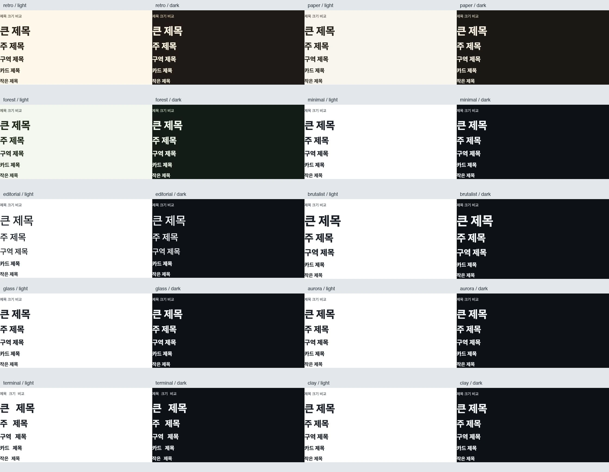

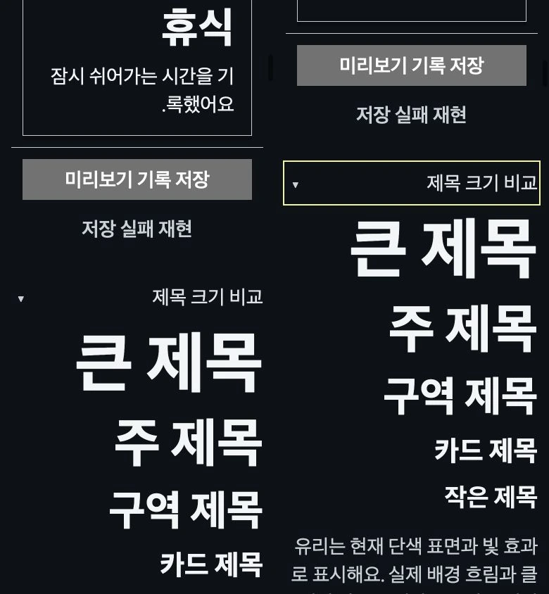

Web 실제 브라우저와 Native Node host 검증을 구분한다. Native 실기기·전체 recipe 토큰
감사·원본 linked 구현·11사이트 전수·유리 실제 blur/클레이 inset은 미완료다.
원격 CI·버전업·npm 게시·소비 앱 갱신을 실행하지 않았다.

### 제목 검토 산출물 보관

유효한 viewport PNG 22개와 DOM 관찰 JSON 2개는 아래 SHA-256과 영구 모음에 필요한
수치/재현/미확인 범위를 이 보고서에 남긴 후 제거한다. 앞선 HMR 재빌드 중 캡처는
다시 찍어 덮어썼으며 검증 증거로 쓰지 않는다. 사이트 전수조사 원본은 조사 미완료라 보존한다.

| 원시 작업 파일 | SHA-256 |
| --- | --- |
| `aurora-dark.png` | `3614f1a66ef1e95dbe234917984633056c7bc403429bc8bbc6073b51984db2c1` |
| `aurora-light.png` | `d99ea5699e3f9c7bd37ebcb248e8398e56a257d07eebf97c5043ef0ffc5968cd` |
| `brutalist-dark-rtl-2x-lower.png` | `be674f655e376c9aff5fca12b5547570334fc08da93761508febf126810c544c` |
| `brutalist-dark-rtl-2x.png` | `cf96a9edd5b1f15a1a81794a32478c4103b3dbd2ed8cbe979e62d865a47ba077` |
| `brutalist-dark.png` | `4b6ff8f3fb51ceebadcf2c2d37345194fb1d1422a0a155f7f9a7d28323a5e790` |
| `brutalist-light.png` | `6ce248b7312376cbec383a1f45a901348b66e8fe21675343acf5a7ec66916dec` |
| `clay-dark.png` | `1a1b67835fb6ba28b4ed248a9acad5cd2f84652d438a2e8d90dc9cf585a0bd1a` |
| `clay-light.png` | `36f50985d6580b112e3a707cee487e5e061c3ccf606db39cc832cbbeed69f3ef` |
| `editorial-dark.png` | `b5f972651fc5f22f146695a23729f72048efcd9d231464e4043d87d696a6eccc` |
| `editorial-light.png` | `17a3f08ea7c77a135a2d512f6a8a9aa5b080e4ce16f4965ce966d88a17d46531` |
| `forest-dark.png` | `0b6d6001a24ba9cf23c37a9362ff37b84cfce45e9e07afa92f8b4b0642959e8f` |
| `forest-light.png` | `2332305dae86bde53430cfba0c72ba292f2bdca729248719992c8db6fe3af24f` |
| `glass-dark.png` | `6fb72f95f949c460295aa4d40fc74d1416b5e7d1831611a34861e63d2eecd226` |
| `glass-light.png` | `9ba68282c29ec149a8e013171df665f8e15199b5893829f57ee1901d04101356` |
| `minimal-dark.png` | `6693f12c592cca8e7b9e2866002a2403f308fdb260901a326fe7c9971f4c684a` |
| `minimal-light.png` | `d48ec7797b69e784dbd8537fce182e837e9bd32053b9491f1fb318392e060ef6` |
| `narrow-observations.json` | `25835a0274fc65d1cc50bd84c35342d73592fe1280d2fe72e0ac83a4b030e99b` |
| `observations.json` | `a019285e0e3c829c3f83ec00e2061e36c31eaf69fc0e4a2e709fb433303e4893` |
| `paper-dark.png` | `394e52a5f6a908a04e8ebc4c0c76fcf488b72ea4fa50f3fb8f27eaebc20f2b57` |
| `paper-light.png` | `98b0c3c9cdff1e0428a6e4e645de35b504588ff52cacce3cf0f6c953a75f799d` |
| `retro-dark.png` | `3f7f472ec38cbb5f49403db0c79aae341273e0a40e24568dde828b5081211484` |
| `retro-light.png` | `aabd8ce06743a66ef1f297a6f796629162f77afa26428bd142d6400e119ce6f9` |
| `terminal-dark.png` | `976a8225617bf89a79707eff0d16604427e0fcabb85ede696af8e873688af095` |
| `terminal-light.png` | `c61a0179108e467cdf5797ce9653a2dc1f9bdfac623952178701cd235d674fda` |

### 이번 변경의 로컬 검사 종료 기록

- 첫 `pnpm check`는 contracts 1,011개 중 이전 PR CI 트리거를 요구한 회귀 1개가 실패했다.
  사용자 결정대로 버전 의도 정책을 유지하고 해당 테스트를 고쳤다.
- 재실행에서 contracts **98파일/1,011개**, Native **105파일/1,221개**, Web SSR
  **18파일/278개**는 통과했다. Native Metro Android production bundle은 697 modules,
  raw 1,477.7 KiB·gzip 363.8 KiB다. 기기 실행이나 성능 증거는 아니다.
- Web 전체 Chromium은 **1,124 통과/1 실패(108파일/1,125개)**다. 기존 ContextMenu의
  키보드 재개방 직후 ArrowDown 시 삭제 대신 이름 변경이 남았다. 테마 제목 파일의 실패가 아니다.
  같은 메뉴 파일의 단독 재실행은 **2개 통과**했으나 전체 안정성 확인을 대신하지 않는다.
  실패 원인 확정·전체 재실행 통과는 미확인으로 남긴다. 메뉴 source를 임의 수정하지 않았다.
- 변경 범위의 profile/Heading 검사·양 Showcase 검사는 위 기록대로 통과했다.
  `pnpm showcase:web:build`도 exit 0, 103개 canonical Web story와 탐색 13페이지 정적 검증을 통과했다.
- 원격 CI는 실행하지 않았다. 버전 상승·게시·소비 앱 반영도 하지 않았다. 일반 개발 검증은
  변경 범위의 로컬 검사로 진행하며, 이미 실패한 전체 검사 결과를 녹색으로 표현하지 않는다.

### 로컬 검사 원시 산출물 보관

명령·수치·실패와 재실행 범위를 위에 보존했다. 아래 원시 파일은 digest 확인 후 제거한다.
기본 Gallery 전수조사의 raw 자료는 linked 원본과 환경 검토가 남아 계속 보존한다.

| 원시 파일 | SHA-256 |
| --- | --- |
| `profile-heading-local-check.log` | `d331954cf9a65bf25e994deb773732909c65d51690ce7065745b27dc3ea6b38d` |
| `profile-heading-local-recheck.log` | `a2ef9798bc16f9453c8a5a4a5d25d884b81c1e5f47e97bd254b290d5119d4991` |
| `context-menu-isolated-recheck.log` | `c4c8bfb9e05c44070e52b0a1528eb18fda2bd5536e2a2113faee317288e5dbf3` |
| `profile-heading-showcase-build.log` | `b4d99ed82bcefab7ec3e1c4e35693f1d66f92ed1989a9e7e0857fa3b6a2f61f0` |
| `opens-from-the-keyboard--tracks-the-active-item--and-restores-focus-after-dismissal-or-action-1.png` | `fb78eadcbba577d2f03d355cd5769d72a8a83c9f96f6c3100f532b8ae429dd58` |

### 후속 리서치: 질감 원본 구현과 재사용 경계

Magic UI의 [Noise Texture 문서](https://magicui.design/docs/components/noise-texture)는
기본 예제와 newsletter/button/input source, usage와 props를 읽었다.
[원본 구현](https://raw.githubusercontent.com/magicuidesign/magicui/cdb348cb4c72a9b54b554d8617801e479fbc8714/apps/www/registry/magicui/noise-texture.tsx) 전체 73행도 commit `cdb348cb4c72a9b54b554d8617801e479fbc8714`에
고정해 확인했다(body SHA-256 `90cad110cf368c95bd40edcdfe64d52c6aacb0656996e20867562787f4ca4c1c`).
fractalNoise·desaturation·channel slope와 root/rect opacity를 쓰며 HJM의 독립적인
periodic value-noise mask와 픽셀이 같은 구현은 아니다. 기존 noise 실험의 시각/입력 기록은
[질감 QA](2026-10-07-noise-experiment.md)에 있고, 이 source 독해를 새 기기 QA로 세지 않는다.

Aceternity [Noise Background](https://ui.aceternity.com/components/noise-background)의
props/두 demo 설명과 HJM resolver·Web/Native renderer를 대조했다. 기존
EffectSurface에 mesh/glow/noise·intensity·period·active와 semantic color·장식 접근성 분리,
reduced motion·화면 가시성/AppState 중지가 있다. 실제 backdrop blur는 없는 범위로 유지한다.
원본 Manual implementation·실제 데모 시각/모션·성능 검증은 아직 pending이다.

[공식 AI reference](https://ui.aceternity.com/llms-full.txt)의 서문과
[Licence](https://ui.aceternity.com/licence)의 제품 사용/재배포 범위를 읽었다. 제공된 licence와
개별 파일의 조건을 함께 확인하기 전 HJM package에 해당 원본을 복제해 배포하는 결정을
내리지 않는다. 이번 대조에서 Aceternity 코드를 HJM source에 복사하지 않았다. 독립적인
기존 HJM 표현을 개선하는 후보로 관리하며, 특정 파일 재사용 허용 여부는 별도 확인 대상이다.

Magic UI 257·Aceternity 501개 공개 URL의 본문 수집을 각 host 순차/2초 간격으로
시작했다. robots의 비공개 경로와 rate limit 중지 규칙을 유지한다. 수집·본문 독해·시각·
동작 검토는 각각 따로 기록하고 원격 CI·설치·npm 게시를 시작한 작업이 아니다.

## 후속 검토: 오버레이·선택 입력의 테마 소비 경로

기준: main `bd41c5a2ab0abbc6458bf985851865ccb8747f9c`에서 시작한 미게시 변경.
Provider에 새 토큰을 추가하는 대신 현재 공개 소비자의 직접 foundation/recipe 참조를 보완했다.
Web 전용 Dialog/Sheet/Toast 그림자 변수와 Native Dialog/AlertDialog/Sheet의 chrome, Select/Combobox의
option/trigger/sheet 모서리, Notice/Progress/Skeleton/일반 Toast가 대상이다. Surface의 기존 Android
shadow 근사를 내부 helper로 공유한다. Modal 상태 엔진·액션/선택·safe area·키보드 동작은 유지한다.
유리 실제 blur·클레이 inset 구현, 전체 11개 사이트 원본 검토, npm 게시·소비 앱 반영은 아직 미완료다.

### 실제 화면과 보존

- Web local Storybook 1280×720: 같은 열린 Dialog에서 10종 light 순회. 입력 값과 id 동일, aria-modal=true,
  모서리/그림자 변화 확인. terminal은 투명 shadow, brutalist는 radius=0/blur=0, clay는 외부 shadow 28/12/0.18.
- 같은 열린 Sheet에서 dark/RTL/textScale=2/reduced-motion 10종 순회. 입력 값/id 동일,
  각 scrollWidth=clientWidth=638. 390×844에서도 10종 scrollWidth=clientWidth=356, 닫기 target 44×44.
- Sheet 닫기→Dialog 열기로 같은 제어 초안 유지. 이때 새 입력 host id는 바뀌므로 이 흐름을 DOM node 보존으로 세지 않는다.
- Native는 실제 renderer를 mock host에서 검사했다. Dialog/Sheet 초안 subtree의 mount=1 유지,
  AlertDialog 역할/액션, 11개 preset+미지정+custom floating/color/radius 값, 무그림자 elevation=0,
  Select/Combobox 선택, Skeleton 명시 radius=13, Toast/Liquid presentation 회귀를 확인한다.
  Native의 기기 표시·VoiceOver·TalkBack·성능은 이번 검사 범위 밖이다.

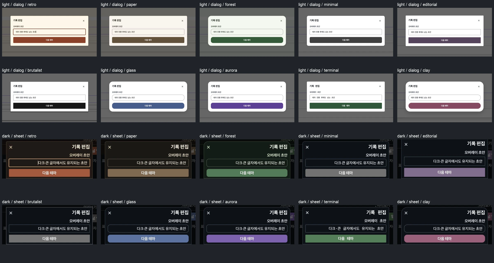

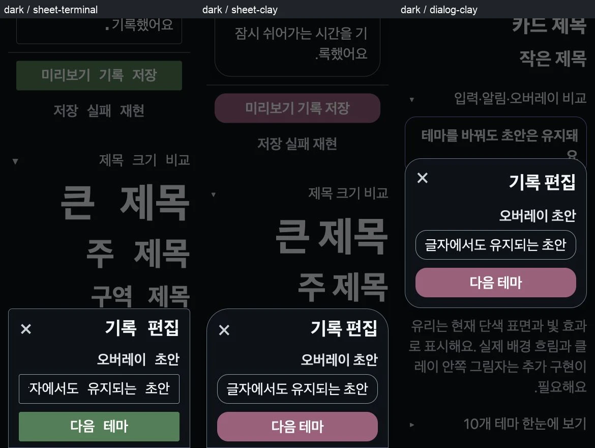

최종 그림은 실제 viewport 캡처에서 오버레이 주변을 모아 보존한 비교이며 새 렌더나 참조 이미지 합성물이 아니다.
원시 PNG 23개와 DOM 결과 JSON 2개는 아래 digest로 검증 후 제거한다. 중간 실패는 이번 새 테스트 fixture의
필수 localized props/recipe 역할과 host 선택을 잘못 지정한 것이었고, 실제 Props 타입과 recipe에 맞춰 고쳤다.
기존 전체 브라우저 검사 ContextMenu 1건 실패/단독 통과 기록은 해소한 것으로 바꾸지 않는다.

### 직접 foundation 참조의 잔여 감사

TypeScript checker가 두 renderer src 전체에서 명시적 `@hjmds/design-contracts/foundations` import의
실제 symbol 참조를 추적했다. 타입/import만의 참조는 제외한다. 결과 18파일·50 runtime 참조다.
이 숫자는 결함 수가 아니다. Web 4개와 Native Text 1개는 프로필 미지정 fallback, FixedGlyph 3개와
Checkbox/Chip의 고정 selection mark는 글자 확대와 분리한 아이콘 슬롯이다. full radius는 계약상 고정이다.
나머지 일반 shape/type 역할·optional host 표현은 다음 변경의 실제 소비 경로 대조 대상이다.
이 감사는 recipe 내 숫자/객체, CSS literal, 다른 import 경로를 검사하지 않으므로 전체 테마 반영 완료 증거로 쓰지 않는다.

| 파일 | runtime 참조 수 | 토큰/당시 행 |
| --- | --- | --- |
| `packages/react/src/theme.ts` | 4 | radius:84, typography:87, fontFamily:103, shadow:148 |
| `packages/react-native/src/primitives.tsx` | 1 | fontFamily:203 |
| `packages/react-native/src/internal/fixed-glyph.tsx` | 3 | typography:12, typography:12, typography:12 |
| `packages/react-native/src/inputs.tsx` | 4 | typography:734, typography:735, typography:1181, typography:2307 |
| `packages/react-native/src/calendar.tsx` | 1 | typography:98 |
| `packages/react-native/src/date-picker.tsx` | 1 | radius:115 |
| `packages/react-native/src/navigation.tsx` | 12 | radius:452, radius:571, radius:829, radius:862, radius:908, radius:908, radius:943, radius:994, radius:1846, radius:1952, radius:2128, radius:2176 |
| `packages/react-native/src/data-display.tsx` | 10 | radius:165, radius:263, radius:498, radius:740, radius:1377, radius:1399, radius:1459, radius:1523, radius:1680, radius:1985 |
| `packages/react-native/src/agreement.tsx` | 2 | radius:95, radius:131 |
| `packages/react-native/src/tags-input.tsx` | 1 | radius:100 |
| `packages/react-native/src/mentions.tsx` | 1 | radius:113 |
| `packages/react-native/src/activity-heatmap.tsx` | 1 | radius:5 |
| `packages/react-native/src/code-block.tsx` | 2 | typography:10, radius:11 |
| `packages/react-native/src/folder-preview.tsx` | 2 | radius:4, radius:4 |
| `packages/react-native/src/navigation-bar.tsx` | 1 | radius:19 |
| `packages/react-native/src/saved-items.tsx` | 1 | radius:34 |
| `packages/react-native/src/sheet-gesture.tsx` | 2 | typography:20, radius:25 |
| `packages/react-native/src/toast-liquid.tsx` | 1 | shadow:16 |

### 원시 증거 digest

| 파일 | SHA-256 |
| --- | --- |
| `dark-sheet-aurora.png` | `026b8026d685da36bdcb18398140f8b316bc816d7b0f174523fd732e4a091903` |
| `dark-sheet-brutalist.png` | `bd5ef26f8e3b0046477bf07192395b296ca1da71f5a72a62d298769279aae2e2` |
| `dark-sheet-clay.png` | `ab01375f5869ec2cd463b104738fefc87b655ecd54fc533dfe8f0cd28a8b61ad` |
| `dark-sheet-editorial.png` | `920a986908d783d75cadb1c9f806e20b410379982db6cae4d7f90baa45095aec` |
| `dark-sheet-forest.png` | `5aba09c8d14efcf9425fab3d8079f52a37c7b58ac88be78d9d087fe956732af5` |
| `dark-sheet-glass.png` | `88e15df4cc376f560d4c11d9770aef27b91ed714deb0cc1b880f8e27fa881041` |
| `dark-sheet-minimal.png` | `4f8265553bb9958e19cbe747d97fb533d44c7b47c2d85d731709e156bf6165fb` |
| `dark-sheet-paper.png` | `1f9c525e27d7e6cdbcdd461cd19ea3971c5de34a9f189c687b15f625e5aaf1ad` |
| `dark-sheet-retro.png` | `4ce49b7f2d2c77bc0a7dddd28265e2e13d7575c203305dcfeef4318976fadfa0` |
| `dark-sheet-terminal.png` | `9e81987278803d330bd803d2b995dc8bc2dcef3f804d6ac44320b78786fae5f7` |
| `light-dialog-aurora.png` | `4ffe539edb8c49eeb777aef1f3ca6359bfccf26ef460daf6f5b9b823763486ba` |
| `light-dialog-brutalist.png` | `c69098163857c92d2a9dbda6768b5bbd1f3f09f63fa8845ac80b5051e4b48f8f` |
| `light-dialog-clay.png` | `6aaaa5d998505cd378c16dbb83fab0e65b542d99661fc457b87808c28e7ac5d2` |
| `light-dialog-editorial.png` | `1dd6e0bab711f7a3c5e31b4df232f4bf478f07e6a9d7402e91f40f3e8fd40a16` |
| `light-dialog-forest.png` | `f638e39e06e12e7f152cfd50a09b41880f6785f778a258d8470dcbf7147de8be` |
| `light-dialog-glass.png` | `9e860e28f3feba91a0898939d163665482121607b2023953ad21765bca7c7ad7` |
| `light-dialog-minimal.png` | `4597f7fc4a0583523178b38609ec0d36cbf395d56bed3f5ddd05c2be035290a5` |
| `light-dialog-paper.png` | `96f220ff7377e935b34fa92b881b394f28ae2bbf242ed3ff96cb7ca4ca4134cc` |
| `light-dialog-retro.png` | `80a0f6b123afa8ab6d0171be8585c038360a440329f98636f90c0e2b124e8fc2` |
| `light-dialog-terminal.png` | `dff13fec0af624dbe48e20a575eafe5530a92ff2886ec00662434e9a2a5e6d4d` |
| `narrow-dark-dialog-clay.png` | `9bd15fc0a79631d809a1f4a161f03135cef5ba750fc5489d4e323ab49ad5a1ff` |
| `narrow-dark-sheet-clay.png` | `266179cc7e770d0b986247dfcc93b742799f37b58c1b2b0d6e63af7fd87e9e04` |
| `narrow-dark-sheet-terminal.png` | `725b98fa8f47e428acac1777fd78ffdb76043db35aa0bfccd2b9996a0454f1c9` |
| `checks.json` | `91d43b5ab6e6e196b8cae3b1bfacc258f3d98c6987666e8d54be6ac8e443070a` |
| `narrow-checks.json` | `2b54a4370b284e150ee18f766cb836920c7e445d4818e580f632f4cad45e2a18` |
| `foundation-import-audit.json` | `bea210e1a81c87186357ecc25ac8b1db06017bc802ff05e2c3f7551ea3d664d6` |
| `audit-foundation-imports.mjs` | `26003380c165f963bbe995bdb1b69cfa571b30011a5d985c058d4d58e8f33827` |

### 대상 검사 실행

- Native: `pnpm --filter @hjmds/react-native exec vitest run test/design-profile.test.tsx test/dialog-actions.test.tsx test/alert-dialog-actions.test.tsx test/sheet-viewport.test.tsx test/deprecated-style-feedback.test.tsx test/toast-liquid.test.tsx` → 6파일/56검사 통과.
- Web: `pnpm --filter @hjmds/react exec vitest run --config vitest.browser.config.ts test/design-profile.browser.test.tsx test/sheet-layout.browser.test.tsx test/toast-layout.browser.test.tsx` → 3파일/18검사 통과.
- 두 renderer typecheck/build, Web Showcase 14파일/43검사 + token boundary 301소스/69선언,
  Native Showcase 6파일/21검사 + generate/typecheck 통과.
- usage 12토큰/139컴포넌트/54구성/22화면, docs 565 Markdown, API 308이름,
  Storybook 421파일/929Web id의 정적 검사 통과. 전체 runtime/원격 CI/기기/게시 결과를 뜻하지 않는다.
- 원격 workflow 실행·버전 변경·npm 게시 없음. 버전 상승 시 원격 CI를 실행한다.

원시 검사 로그 digest:
- `hjm-profile-overlay-native.log` SHA-256 `2be965e53adbd0ba6fc23e8f79fe58547e3b469e5a1cd63c0eb43111f06a3b36`
- `hjm-profile-overlay-web.log` SHA-256 `fc2f8305048e910cefd2ff5b84066b94c94bd23e5a35405613077613bcf9d7e3`

- `pnpm showcase:web:build` → exit=0, Storybook static build 및 103 canonical Web story/13 navigation page 검증 통과.
- `hjm-profile-overlay-showcase-build.log` SHA-256 `3602048b536db8f02d6624c14454e92d1048392696848a8a8ddb4e137f550150`


## 후속 검토: 실제 유리·클레이 Surface 질감

기준: main `6bd405ec49b83df9949ddb072b51a20b34af529f` 이후 미게시 변경. 기존 Surface/Card와
EffectSurface/ProgressiveBlur의 export·공개 API 대응표·두 renderer를 대조했다. 새 wrapper 대신
`material.surface`와 선택형 Native Provider host에 연결했다. 원격 workflow dispatch·버전 변경·npm 게시 없음.

### 원본과 채택

- Uiverse 공식 블로그의 [유리 카드](https://uiverse.io/SteveBloX/dangerous-warthog-85) 상세에서
  실제 기본 화면·CSS 전체·HTML을 읽었다. 반투명 채움과 backdrop blur를 사용하지만 HTML은 클릭을 안내하는
  div여서 버튼 의미/키보드 계약이 없다. 표현 개념만 참고하고 HJM의 Card와 입력/행동 계약을 유지한다.
- 같은 블로그의 [젤리 버튼](https://uiverse.io/vinodjangid07/horrible-husky-70)은 실제 기본 화면·CSS 전체·
  HTML button을 읽었다. 안쪽 빛과 음영, 바깥 그림자로 깊이를 표현한다. 고정 치수·브랜드 색·hover keyframes를
  복제하지 않고 HJM의 정적인 inset token을 독립적으로 정했다. 이 버튼을 clay 카드의 직접 구현으로 세지 않는다.
- 두 상세의 MIT 고지 확인. 원본 코드·자산은 HJM source에 복사하지 않았다. 참조의 모든 hover/active·keyboard·
  모션 축소·환경 검토가 끝난 것은 아니다. 발견된 variation 2개는 inventory에 추가했고 아직 검토하지 않았다.
- [RN 0.81 boxShadow](https://reactnative.dev/docs/0.81/view-style-props#boxshadow),
  [AccessibilityInfo](https://reactnative.dev/docs/0.81/accessibilityinfo),
  [Expo BlurView](https://docs.expo.dev/versions/latest/sdk/blur-view/)를 직접 읽고 peer 최소 버전/설치 버전과 대조했다.
  Native inset은 New Architecture/Android API29 조건을 확인한 host만 opt-in, blur는 제품의 실제 backdrop host다.
  Showcase의 Android API31 미만은 opaque로 유지한다. core에 Expo/Skia/blur peer를 추가하지 않았다.

### 변경과 실제 화면

- glass 요청 strength=0.75/fill=0.88 → Web blur 24px, 최종 light/dark 팔레트에서 fill=0.9.
  중립 weak/subtle 색을 그대로 쓴 첫 비교는 light fill=1을 요구했다. 대비 기준을 낮추지 않고 glass light의
  textSub/textWeak를 짙게 바꿔 보완했다. Native는 대비 해석을 Provider에서 한 번 하고 각 Surface가 읽는다.
- clay는 실제 inset 2개와 기존 floating shadow를 합성한다. CSS helper 확장 중 nonzero x offset의 px 누락이
  실제 비교에서 shadow=none으로 드러나 수정했다. 최종 실제 계산값은 3/4/10px 및 -3/-4/12px inset이다.
- 기존 ‘테마 조합’의 공개 Card에 무늬 배경·같은 초안·다음 테마를 추가했다. 장식만 pointer/접근성에서 제외한다.
  Native host가 null/throw해도 opaque 대체와 같은 본문을 유지하고 host 교체 때만 장식을 재시도한다.
- 실제 IAB: 10종 light, 10종 dark/RTL/textScale=2/reduced-motion에서 같은 입력 id와 초안 유지.
  전부 Card scrollWidth=clientWidth=1166. Glass 실제 blur(24px)/fill alpha0.9, clay inset2개, 다른 테마 blur=none.
- 390×844 실제 viewport의 glass/clay dark/RTL/2배에서 pageWidth=390, Card scrollWidth=clientWidth=308,
  초안/id 유지. 입력은 편집 가능한 한 줄 영역이라 긴 값은 내부에서 가로 스크롤하며 문서 폭은 넘치지 않는다.
- `prefers-reduced-transparency: reduce`를 임시 에뮬레이션해 glass blur=none/fill=opaque와 초안 유지 확인.
  종료 전에 media와 viewport override를 복원했다. 지원하지 않는 브라우저의 CSS feature fallback은 코드 경로이며
  실제 오래된 브라우저 검증으로 세지 않는다.

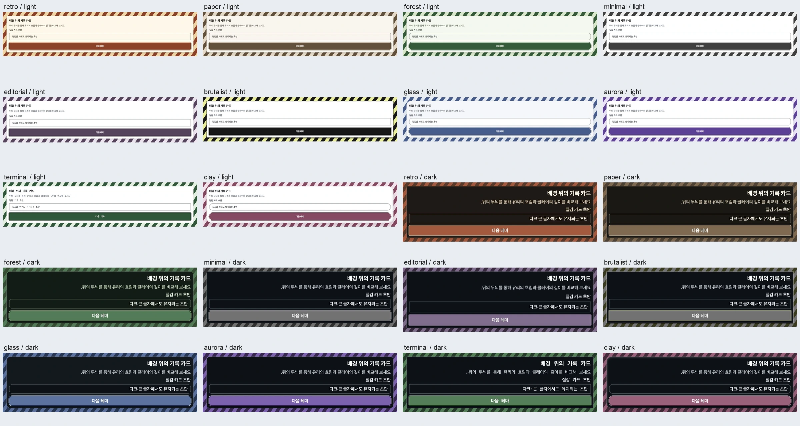

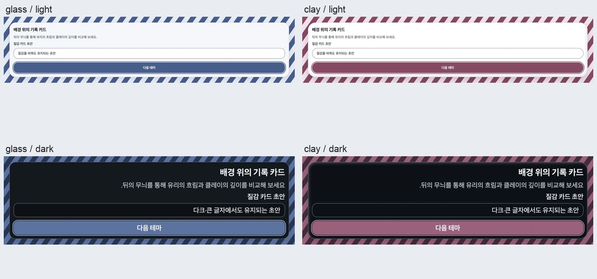

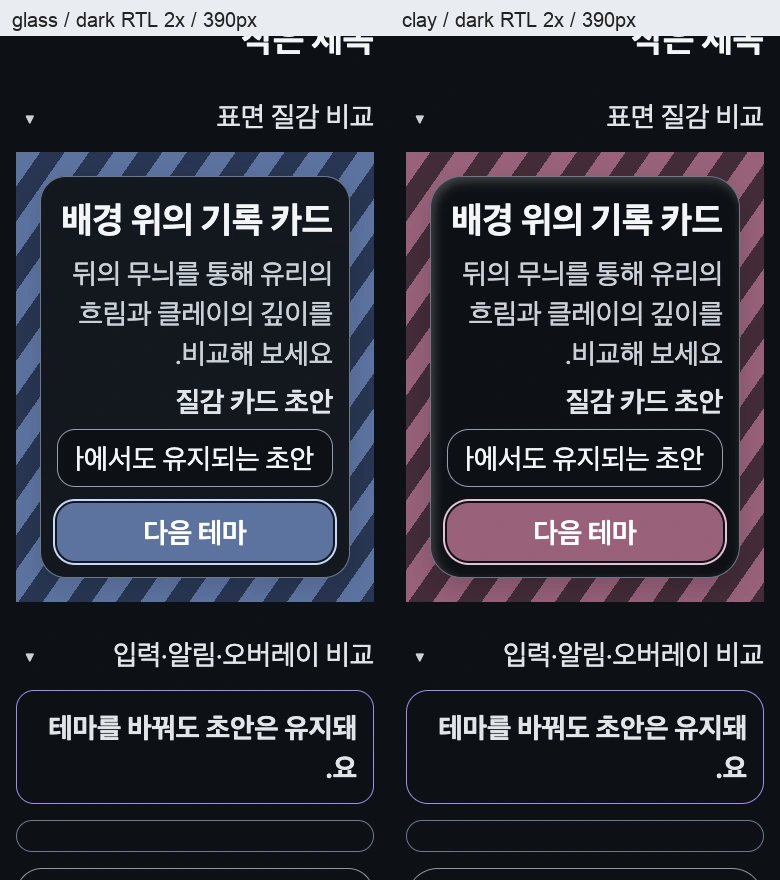

이미지는 실제 viewport 캡처에서 표면 영역을 모은 비교다. 새 이미지를 생성하거나 원본 레퍼런스를 합성하지 않았다.
좁은 화면 첫 캡처는 DOM viewport와 backing metrics가 달라 기본 캡처 API가 390×219 thumbnail 또는 확대된
부분 영역을 반환했다. 이를 기기 검증으로 채택하지 않고 CSS page 좌표를 지정한 CDP clip으로 390×844를
재캡처해 실제 이미지와 좌표/폰트 크기를 대조했다. 좁은 화면 표에는 교정한 최종 캡처만 사용한다.

### 로컬 검증과 미확인 범위

- contracts profile/contrast 2파일 14검사 통과. 불변 복사, partial 상속/null 해제, 잘못된 JSON,
  최종 팔레트의 검정/흰색/유채색 합성 대비, stock glass 양 테마의 실제 투명 fill을 확인한다.
- Web profile/Sheet/Toast browser 3파일 19검사 통과. 실제 CSS blur/inset·중첩 neutral 해제·입력/포커스 보존과
  기존 오버레이 행동을 확인한다. 전체 browser 검사 ContextMenu의 과거 실패는 이번 작업에서 해결한 것으로 바꾸지 않는다.
- Native profile/Provider/EffectSurface mock-host 4파일 19검사 통과: host 없음/null/throw/교체, 장식 AX 제외,
  inset capability opt-in, iOS unknown/live event가 초기 응답보다 우선함, rejected query, 같은 본문 유지.
  실제 Native 기기 표시·VoiceOver/TalkBack·스크롤/GPU 성능·제품별 host 보정은 아직 미확인이다.
- Web CSS variable SSR 1파일 2검사 통과. 두 renderer build/typecheck와 두 Showcase typecheck, Native storybook:generate와 6파일 21검사,
  Web Showcase 14파일 중 13파일 42검사 + 새 wrapper 수정 후 style-boundary 1검사 통과.
  Showcase의 public Card selector를 덮던 새 CSS를 자체 장식 wrapper로 옮겼고, 배경 stripe 길이는 existing token을 쓴다.
- Web token boundary 301소스/69선언, renderer import graph/optional peer 경계, usage 12토큰/139컴포넌트/
  54구성/22화면, API 308이름, Storybook 421파일/929Web id, docs 대상 검사 통과. 전체 원격 CI 결과가 아니다.

- `pnpm showcase:web:build` → exit=0, Storybook static build 및 103 canonical Web story/13 navigation page 검증 통과.
- 로컬 원시 로그: `hjm-material-showcase-build.log` SHA-256 `40159013cab031693818790864b734bc9a7845be4d501ce63121a9a428031533`,
  `hjm-material-bundle.log` SHA-256 `02cb7784467e418a8f4c5f8bc76d108077db87b2ac877fed28648331a4569ee4`.

11개 사이트의 전수 source·시각·상태/인터랙션 검토, 남은 foundation/recipe 소비자, Surface를 쓰지 않는 별도
표면의 material 적용 판단, 실기기 성능/접근성, 실험 승급·npm 게시·소비 앱 반영은 계속 남아 있다.
Aceternity known queue 501개는 기존 crawler session exit0과 501 HTTP200을 확인했다. 이는 본문 독해 완료가 아니다.

### 원시 증거 보존과 정리

최종 비교 WebP 3개와 재사용하는 캡처 정리 script를 보존했다. 원시 PNG 24개/JSON 1개와 위 로컬 로그 2개는 digest를 검증한 후 제거했다.
미완료 reference source crawl의 자료와 재사용 fixture·제품 소스는 제거하지 않는다.

| 파일 | SHA-256 |
| --- | --- |
| `dark-aurora.png` | `fb2cac85cfc3dbead93b67f37dc00aa26a5de66bd7dcacd3cb778d46a387dd7f` |
| `dark-brutalist.png` | `b3a71ccac01e31523749ed4641dba476a564eb19b1b853975897caa49e54e6ed` |
| `dark-clay.png` | `ab9b85bdfb5a80372179b7f7f66c7f3cd50a538fbd533da2b32c4d5bbfdb8105` |
| `dark-editorial.png` | `a42f613ca638015fad36ba0f0ee24c7adb2bcf61f6fc0c704e8e2feeeb72c583` |
| `dark-forest.png` | `86d08a6d80f85612ea76ca2eeb29da2893c8afe01206161e166d81292b093db7` |
| `dark-glass.png` | `fcab1959b711ca285a5684d05c59bef3bcad61bb6110ff836b6a5bfe54574e42` |
| `dark-minimal.png` | `9c9c60591c958e13c0373e8bf640ed931f331d5731f3214bd5fa1ccd61153b60` |
| `dark-paper.png` | `3a5b60f8996a8b04d0b5c75333771bf6b8e0878a622d685b97e370bea0bb43fd` |
| `dark-retro.png` | `56dc6765f039c5c7ff6f7164ce0095c41ad91e8ddbc738e5fb64e3b76e3c1d3e` |
| `dark-terminal.png` | `df76a75099ff699f188bdd95bfc58477d61258321cc56134424e774e791963e6` |
| `light-aurora.png` | `fd8742425e783170437198c7399e37eb5b6872a6a1c9f768ee28c60e803e9b8f` |
| `light-brutalist.png` | `3dcb3cf309b9ebf511a06bb806b7953f435e8e1a5d2383a8019fb2d6ac58f3ab` |
| `light-clay.png` | `acc8260fa29497e81486433a891f4687d88605a2b2e56cf709748fa20e0265c8` |
| `light-editorial.png` | `aa658617730e07360842bc148536141db15d03c4a24e61804adb9ec7cc191aeb` |
| `light-forest.png` | `a28fe817d57138e5f132c39e4df787e23fdc256633826a880e5b269f85677ddb` |
| `light-glass.png` | `7be6801bc72c6d07f61fb4491844f057ad50d8be9482a43aabad49448e024aa1` |
| `light-minimal.png` | `d123d65cec75003ad15906a2781ad239cc3ece5f0da6c006427fdac1e37c4dc7` |
| `light-paper.png` | `482ce7780e6beaf30226332a151de30689b4feec1c2dda2c9743e25caf507501` |
| `light-retro.png` | `63b3aee9d1fd499b1074b9fd0f06517a70549289e8b193df3431ce8905523b76` |
| `light-terminal.png` | `f3e0d1d62bfbdfb2ccfa871cfc206bed00de1b474d175a4bd33d5a768750eebe` |
| `narrow-clay.png` | `3e6cb8c7e1d2ec0206d13b6150c716d218742af8bf4aff91c78782ba6857bb99` |
| `narrow-glass-cdp.png` | `794bb232118463c4419db1789bf14767dbd771f676995f25720d3768e2fb4d0a` |
| `narrow-glass-clip.png` | `567a9cd160d8867b6c08a9521d572614d6036e081c92dfe9df982b0890399037` |
| `narrow-glass.png` | `567a9cd160d8867b6c08a9521d572614d6036e081c92dfe9df982b0890399037` |
| `checks.json` | `e5c9f84c001039248d79b5a284cb0027bf0951ec47e5e7554c54a3156676b794` |
| `make-review-sheet.py` | `cc479d23035d0fb0dd87a535b9a2c34bd587b92bb908c8a2f90596a82e772bec` |


## 후속 적용: 모서리·서체의 실제 소비 경로

기준: main `e6a9ab42ebb0ee3fcc1a698fb8bd45087f3cd20f` 이후 미게시 변경. 기존 공개 API를 유지하며
Native의 14개 source 파일에서 프로필을 놓치던 읽기를 Provider token에 연결했다. 버전/원격 CI/npm 변경 없음.

### 추가 원본 리서치와 선택

- [Tailwind theme 변수](https://tailwindcss.com/docs/theme)의 token namespace와 소비 utility 연결을 읽었다.
  색 이외 서체·모서리의 정의도 실제 소비 경로가 필요하다는 구조를 비교했다. Tailwind 도입/코드 복사 없음.
- [shadcn theming](https://ui.shadcn.com/docs/theming)의 semantic 쌍과 radius scale을 읽었다.
  역할을 유지하고 값을 공유하는 원리를 기존 HJM recipe/Provider에 적용했다. 단일 비율 radius로 기존 프로필의
  독립 sm/md/lg/xl를 바꾸거나 CSS 전용 구조를 Native에 복사하지 않는다. 두 사이트 전체 검토가 아니다.

### 실제 변경과 상태

- Agreement, TagsInput, Mentions, DatePicker, BottomNavigation, Menu, LoadMore, Badge/Tag/ListRow/Image/List/Statistic,
  ActivityHeatmap, FolderPreview, NavigationBar, SavedItemsScreen의 radius 역할을 Provider에서 해석한다.
  원형/pill의 full, square leading의 무모서리, 날짜 원형, 고정 selection glyph 의미는 유지한다.
- PasswordField large는 프로필 bodyLarge를 읽고 그 줄 높이로 프레임도 계산한다. 테스트 중 폰트만 바뀌고
  recipeInputStyle의 minHeight=50이 계산한 높이를 덮는 결함이 드러났다. 내부 recipe minimum/variant로 연결해
  2배 제품 글자 54px/lineHeight80px에 대해 input minHeight>=80을 확인했다. reveal 후 같은 초안 유지.
- Calendar custom-content의 높이도 프로필 label lineHeight를 사용한다. optional GestureSheetInput과 CodeBlock의
  typography를 Provider에 연결하고 controlled textScale은 한 번 적용한다. 제품 code font는 Web 변수와 Native
  source host에 연결한다. default generic code font의 플랫폼 번역과 제품 font 등록 책임을 구분한다.
- 실제 RTL CodeBlock 비교에서 세미콜론이 문장 앞에 표시됐다. 원문은 바꾸지 않고 코드 본문 LTR로 교정했다.
  제목과 주변 UI는 RTL 그대로다. Web native-host browser 검사에서 제품 code font/38px·60px 줄 높이,
  neutral/retro 복원, source 원문/DOM/focus 유지 확인. Native는 38px·60px과 ProductMono 설정 값 확인이며
  실제 font 등록/기기 glyph 렌더 성공의 근거가 아니다.

### 감사 범위

TypeScript symbol 감사의 explicit foundations radius/typography/shadow/fontFamily runtime 읽기는
51→21이다. Native 일반 소비 읽기 31개를 연결하고 Web의 code-font fallback 읽기 1개를 추가했다.
남은 21개는 Web 프로필 미지정 fallback6, Native 기본 UI font 비교1, 고정 glyph5, 고정 full8,
Liquid Toast 별도 host shadow1이다. 이 감사는 recipe의 numeric 값·CSS literal·다른 import를 전수 검사하지
않으므로 전체 컴포넌트/토큰 적용 완료로 보고하지 않는다. before/after JSON digest를 아래 보존한다.

### 로컬 검증과 실제 비교

- Native 관련 행동 13파일 94검사 통과. 최초 통합 14파일 중 새 fixture의 newline 표기를 수정한 뒤 새 profile
  regression을 다시 실행했다. 최종 profile-token-consumers/gesture-sheet-tokens 2파일 5검사 통과.
  폼 초안·태그·동의·열린 메뉴 selection, 날짜/모서리 role·neutral 복원, optional host 경계의 실제 source를 검증한다.
- Web design-profile browser 1파일 7검사와 CSS-variable SSR 1파일 2검사 통과.
- 두 renderer build/typecheck 및 두 Showcase typecheck 통과. 공개 API 대응표 308이름, usage
  12토큰/139컴포넌트/54구성/22화면과 renderer import/optional-peer 경계 검사 통과.
- 실제 IAB에서 같은 공개 CodeBlock 원문으로 10종 light1x + 10종 dark/RTL/2x를 캡처/대조했다.
  코드 원문은 전부 정확히 같고 LTR, scrollWidth=clientWidth=1216이다. dark body28px, 일반 줄 높이40px,
  editorial48px를 확인했다. wide CDP 원시 캡처는 backing 좌표가 달라 채택하지 않고 tab screenshot의 문서 좌표 clip으로 재캡처했다. scroll 후 viewport 좌표를 clip에 넣은 시도도 제외하고 최종 22개를 문서 좌표로 다시 캡처했다. 캡처 전후 profile 값도 일치함을 확인했다.
- 실제 390px dark/RTL/2x의 editorial/terminal에서 pageWidth=viewport390, 코드 scrollWidth=clientWidth358,
  줄바꿈과 세미콜론 순서 확인. editorial radio 조작의 observation timeout 후 실제 checked/profile 상태를 먼저
  확인하고 다시 누르지 않았다. 캡처 후 viewport override를 해제했다.

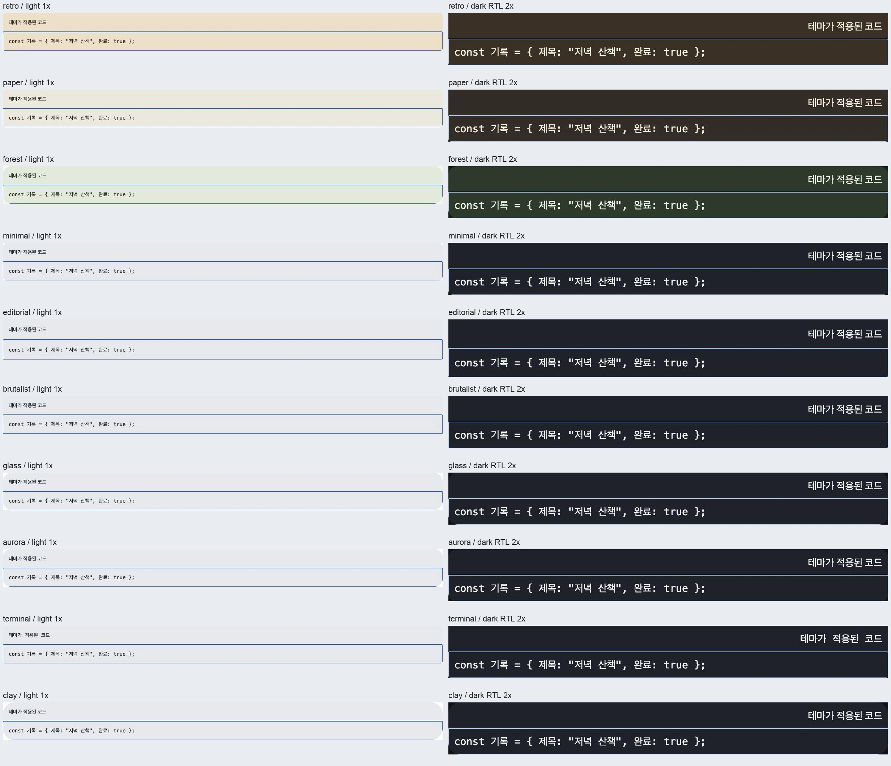

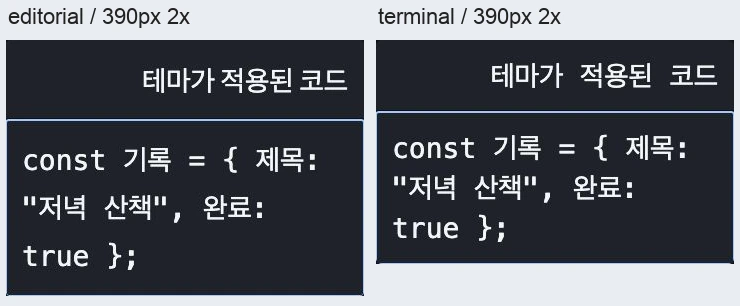

실제 Native/optional gesture host·font 설치·VoiceOver/TalkBack·GPU 성능·제품 채택은 아직 미검증이다.
기존 전체 Browser ContextMenu 실패를 이 검사로 해결했다고 세지 않는다. 실험 승급/npm 게시 전 전체 검수는 남아 있다.

### 사이트 수집 checkpoint

Minimal Gallery known queue 3433/3433은 original crawler session exit0와 HTTP200 3433 확인.
이것은 수집 완료이며 개별 source 독해·시각·상태/인터랙션 전수 검토 완료가 아니다.
Designbookmark/21st 원래 process는 실제 live 확인했고 계속 수집한다. inventory의 수집 시각/count와
모든 allReviewComplete=false를 유지했다. 미완료 원본과 수집 process는 제거/재시작하지 않는다.

### 원시 자료 정리

실제 비교 WebP 2개와 재사용 script는 보존한다. 이 작업 소유 PNG22/화면 체크 JSON과 before/after 감사 JSON은
아래 SHA-256 검증 후 제거했다. 미완료 reference source crawl과 재사용 script/fixture는 보존한다.

| 파일 | SHA-256 |
| --- | --- |
| `audit-foundation-imports-after.mjs` | `cfc3ba741eba5b57d64ab38383b971f43d518fdeff446163a73f20971f46e602` |
| `audit-foundation-imports.mjs` | `0de3fe7124152af5fac69b712a2cb3aa4f6ab78652bcd2d196eae63d04c35a72` |
| `checks.json` | `4709c05dc574776b4284eb53936f29c60d8640d16393e31cc9b538202ff9a58e` |
| `dark-aurora.png` | `286442b2796f57ded5a8cd87e4402ca8b36efe0b44707614903921d6497cc4f5` |
| `dark-brutalist.png` | `93fc0f9335c5cb3fc076d2c46115b39f787e7af36e206016ee3635b95b56e355` |
| `dark-clay.png` | `2aa39f63bafe5a9e074e4ab9b2d69f8af5e11f789d68debc27dec4d836fb2036` |
| `dark-editorial.png` | `bbbc3bbac3b51c826b289934271b2d6557f50dbe2b74afd185d0a6c1438b2eb0` |
| `dark-forest.png` | `ca348ca2d4d29c75879c77849b8fade809bbb185e12f6cd05556fe7161b1acd6` |
| `dark-glass.png` | `c2a9a8c9058e2b2486533ea9a4b31647e2b5966e3b754d661f9ab318f9e8fa20` |
| `dark-minimal.png` | `087074cd569a6b20254a98bf4a96c1a4cd3c1bdb4609b2d18dc30feec7f5f62b` |
| `dark-paper.png` | `7d1bf000820f39bff5efb1222ab2a9919fa2c8803bbd9732aab75be1bbb1492e` |
| `dark-retro.png` | `3985a057c64268072b274045416e0f393b092fe4aca31fb15afcbaa95c39b7be` |
| `dark-terminal.png` | `eefb74a6d38885ca01ffa9f7571835029234da71649fe74f47b0bc4836aae53a` |
| `foundation-import-after.json` | `642dac362def849b8deae4c801ff5cf40114b3dfd1c810afc4f69b95fd9347c6` |
| `foundation-import-before.json` | `bdf156341bb1f2b7a93854abecbb6ab9b539150c8d990b94f24de6f5c3fc5294` |
| `light-aurora.png` | `45673937dea434690d4951e6944746ed2ecf77693a1e6e1475b9f9031d0219ca` |
| `light-brutalist.png` | `a50058a3624956d119834de5f2621acb157755a03a4b2003f442b0330377427c` |
| `light-clay.png` | `8f65b7056a7da046dea54481ef9380991c40d52b3887538735d9a7dcdeb79143` |
| `light-editorial.png` | `c828344ca65973e92747c759cb4bfce725caf2bd9ba11020fe4f0e380c538097` |
| `light-forest.png` | `28794e139d10264efa09f620adee4c4d9b40876717a3ed4607fc5542842d497e` |
| `light-glass.png` | `d0048fe9715a0d8972398349b900a7624b1fda86b075f24d0097603f618f8aa0` |
| `light-minimal.png` | `4dad40929eaca52ac3c245fb97cf7361a30a4d2c8b1806c0de954ab489d45994` |
| `light-paper.png` | `c0688f1787b52c6e0214a2b12c6f9939a3ad89ddf79891cabb3cebb7c7bdc5c0` |
| `light-retro.png` | `5e83194faebd4938ec030c92f3b544422243cb97cb0e2aa1fd802f9f63069927` |
| `light-terminal.png` | `4716c84305476267b45bf3d515d3a677c48f5bee84a64eb11f6340857f3c7b4e` |
| `make-code-review.py` | `200909de1f96a1e53888ea8136e432901c0bdbc1256a3dc451f8f81b52614448` |
| `narrow-editorial.png` | `104216c1a7a61b4b79e943128d13ac923590e4e6e681798938ebad3ff40ba7c6` |
| `narrow-terminal.png` | `dde019f6d34d0d2177817f34ceba34d1932c1db9c9fa0ce6f0bb73d956c69068` |

- Web Showcase 경계/theme 계약 4파일 18검사, token boundary 301소스/69선언 통과.
- `pnpm showcase:web:build` exit=0, Storybook static build 및 103 canonical Web story/13 navigation page 검증 통과.
- `hjm-token-consumers-showcase-build.log` SHA-256 `dfe4dd21e045ffa7a7430138db50455abfd8eb70a5999326d02889fe34787d8c`.

후속 변경의 docs 567 Markdown, usage/evidence 및 Storybook 421파일/929Web id 정적 검사 통과. 이 검사들은 실제 기기·사이트 전수 검토·npm 게시 완료를 증명하지 않는다.


## 후속 적용: Native UI 서체·입력 host

기준: main `1bb40eb3febe5557cca38106aeb1e78ebf905c35` 이후 미게시 변경.
직접 foundation import 감사에 잡히지 않는 **서체를 아예 읽지 않는 host**를 별도로 대조했다.
버전/원격 CI/npm/소비 앱 변경 없음.

### 원본 조사와 실제 페이지 검토

[Refero token 지침](https://styles.refero.design/ai-agents/css-variables-design-tokens),
[컴포넌트 비교](https://styles.refero.design/ai-agents/component-design-prompts),
[UI 검수 지침](https://styles.refero.design/ai-agents/agentic-ui-quality-checklist)의 전체 보이는 본문을
읽고 실제 1280px desktop/light 기본 페이지 레이아웃을 끝까지 캡처·대조했다. 각 캡처 후 unloaded
image=0. 페이지 높이는 각각 5326/4255/5298px이다. 첫 페이지의 초기 lazy image27은 전체 캡처 후0이다.

- token 역할을 반복 소비하고 하드코딩 예외를 찾아야 한다는 지침을 Native의 실제 host 경로와 비교했다.
- 컴포넌트 문서의 mono/neutral·밀집 상태·반복 모티프 설명과 palette/typography 구역을 확인했다.
  원제품 서체/이미지/팔레트 값을 가져오지 않고 기존 HJM UI/code 역할 구분을 재사용했다.
- 검수 문서의 실제 상태·내용 길이·작은 화면 조건은 기존 HJM 검증 범위와 대조했다.
  이번에는 Native source/mock-host 회귀까지이며 새로운 기기/작은 화면 검증 성공을 주장하지 않는다.

기본 카드 썸네일의 외형만 봤으며 내부의 작은 글자, 연결된 모든 style/detail 페이지, hover/모션/다른
viewport까지 읽었다고 세지 않는다. 3개 guidance 검토는 ledger/inventory에 별도 기록하고 전체 완료 flag는 false다.
[RN Text 상속](https://reactnative.dev/docs/text)과 [TextInput](https://reactnative.dev/docs/textinput)의
공식 계약도 대조했다. Native 서체는 상위 View에서 모든 자식에게 CSS처럼 상속되지 않는다.

### 누락·기존 API 비교·수정

- `Text`의 기존 font 선택을 내부 `resolveNativeFontStyle`로 합성했다. FieldRenderer가 제공하는
  TextField/TextArea/SearchField/PasswordField, Combobox editor, NumberField의 입력/라벨/지원 문구,
  Slider의 라벨/값, TagsInput editor, optional GestureSheetInput과 CodeBlock 제목에 같은 UI 역할을 연결했다.
  공개 wrapper·새 상태 엔진·export·peer/dependency를 추가하지 않는다.
- code 원문과 span은 기존 code 역할/LTR/selectable 계약을 유지한다. 제목은 UI 역할로 구분한다.
- 기본 UI stack 전체는 OS 서체를 유지한다. 이전 Text는 첫 항목이 Inter인지로 기본값을 판정해
  제품이 등록한 `ui: ["Inter"]`도 무시했다. 전체 stack을 비교하고 이 명시적 등록 이름은 전달하도록 수정했다.
  ui-monospace/monospace의 iOS Menlo/Android monospace 번역을 공유한다. 실제 등록·굵기·글리프 성공은 제품 소유다.
- TagsInput의 editor에는 기존 body 크기/행간까지 전달한다. controlled scale2에서 추가 Native 배율을 끄고
  profile body19/30은38/60, neutral14/20은28/40으로 해석한다. 초안/태그/키보드 submit 계약은 유지한다.
- TypeScript import symbol 기준 RN Text/TextInput JSX를 대조한 결과 **9파일20개 host site**다.
  UI13, code 원문/상속 span2, 고정 체크/닫기 glyph4, 투명 OTP editor1로 분류했다. optional Gorhom input1은
  별도 연결·검사했다. 이 목록은 해당 RN named import의 JSX만 찾으며 모든 외부 host/렌더링/토큰 감사 완료가 아니다.

### 로컬 검증

- 대상 Native 10파일52검사 통과. UI font profile 순회, 입력 수명/미확정 숫자/검색·선택·단계 동작,
  controlled scale, 기존 모서리/초안·오버레이·OTP/공유 frame 회귀를 포함한다.
- 새 profile-font-hosts 검사에서 custom → 10종 → neutral을 같은 중첩 Provider 아래 순회했다.
  **7개 editor identity와 초안 유지**, NumberField의 `3.` 미확정 입력·값3, slider/number/code 제목 UI role,
  code 별도 family, 2배 body 값, iOS/Android generic 번역, neutral subtree reset와 explicit Inter를 확인했다.
  선택된 tests의 host는 RN mock이며 실제 설치 폰트/기기 화면 성공의 근거가 아니다.
- Native renderer build/typecheck와 Native Showcase typecheck 통과.
- optional GestureSheetInput 검사는 실제 source에 대해 library drawing host만 대체한다.
  keyboard/gesture runtime 설치나 기기 성공으로 세지 않는다.

### 수집 checkpoint와 검증 공백

2026-10-07 13:50 KST: 원래 Designbookmark PID80505와21st PID83201은 `ps`로 live 확인.
Designbookmark1252/2657,21st6062/12460 record(HTTP2006052,기존 error10)까지 수집했다.
이 숫자는 source reading·시각·interaction 완료가 아니다. 기존 process/미완료 원본을 보존했다.

11사이트 전수 source/시각/상태 검토, 나머지 recipe/literal/optional host 경로와 실제 iOS/Android
font·줄바꿈·큰 글자·접근성·성능, 기존 전체 Browser ContextMenu 실패, 승급·npm 게시·소비 앱 적용은 남는다.

### 원시 자료 보존·정리

아래 실제 reference 캡처와 host inventory digest를 검증·보존한 뒤 이 작업 소유 PNG3/JSON1을 제거했다.
재사용 AST script/fixture·제품 source와 미완료 reference crawl은 보존한다.

| 파일 | SHA-256 |
| --- | --- |
| `refero-tokens.png` | `6784316fddef75c78fc0e8f1e87eef6ef751412961c628d2e2dfff53c629f7f3` |
| `refero-components.png` | `2f3d032a742b354ea812f6f3f33011dd5588bc8fee7dd452aee4cd569dc21f49` |
| `refero-checklist.png` | `a9dc8514bb3257b2448824990ef2dea3e3b2f3eaf0eee61a441eb8af795550b0` |
| `native-text-hosts.json` | `8ee9a6a94204e4b8e6c32597fc855b6b7287f91299233e57939324ce810991fa` |
| `audit-native-text-hosts.mjs` | `4cd2c3f44cc5d0bfe4c36bcde21e3f0229459ec95509f8373af80ee9c7e4155c` |

후속 UI font 변경의 usage/evidence/docs568 Markdown/API308이름·Storybook421파일/929id·renderer import/optional-peer 경계 검사 통과. 최종 profile-font-hosts 1파일4검사도 통과했다. 원격 CI/전체 Browser/기기 검증으로 세지 않는다.
host-audit-output.log SHA-256 `8ea45207a8e688f1f74a05dbcf4346f55dc99802068729d9f68ddca446287b56`를 보존하고 이 작업 소유 중복 출력도 제거했다.


재현 명령(대상 모듈 루트, pinned Node24.20.0/pnpm11.18.0):

```bash
pnpm --filter @hjmds/react-native exec vitest run test/profile-font-hosts.test.tsx test/gesture-sheet-tokens.test.tsx test/profile-token-consumers.test.tsx test/number-field.test.tsx test/slider.test.tsx test/provider-text-scale-parity.test.tsx test/native-input-collection-product.test.tsx test/password-otp-field.test.tsx test/shared-field-frame.test.tsx test/design-profile.test.tsx --maxWorkers=2
pnpm --filter @hjmds/react-native build
pnpm --filter @hjmds/react-native typecheck
pnpm --filter @hjm/showcase-native typecheck
pnpm bundle:renderer:check
pnpm usage:check
pnpm evidence:check
pnpm docs:check
pnpm api-map:check
pnpm storybook:check
```

재사용 symbol 감사는 `/Users/jimin/.codex/tmp/hjm-profile-font-hosts-20261007/audit-native-text-hosts.mjs`에 보존했다.
새 inventory 출력은 다시 생성할 수 있지만 당시 digest/시각 관찰을 현재 실행 결과로 대체하지 않는다.

## 후속 조사: Aceternity 탭·상태 버튼·상세 카드

기준: main `3021ce0` · 2026-10-07 14:02 KST.
이전 사용자 상태 질문에서는 새 구현을 수행하지 않았으므로 이번 목표 턴은 실제 원본 검토와
게시 API 대조를 이어갔다. [채택 판단](../plans/aceternity-interaction-adoption-2026-10-07.md)에
네 페이지별 읽은 소스·실제 행동·기존 API와 미지원 차이를 보존했다.

### 직접 확인

- Aceternity tabs/stateful-button/expandable-card/layout-grid의 설명·props와 제공 Manual/Code를
  읽었다. expandable-card의 Standard/Grid와 outside-click hook을 포함한다. 클릭 후 상태는
  live IAB Chromium 1280px desktop/light DOM과 실제 화면으로 확인했다.
- 탭은 Services/Random의 선택 표시와 쌓인 콘텐츠, 상태 버튼은 같은 실행의 loader→check와
  기본 표시 복귀, 카드 두 배치의 첫 상세와 독립 Standard Escape 닫힘, layout-grid의
  첫/네 번째 상세와 바깥 누름 닫힘을 확인했다. 그 외 모든 상태/항목을 검토한 것은 아니다.
- 상태 버튼의 pending에서 disabled=false/aria-busy=null을 확인했다. 제공 구현에는
  rejection/finally 정리와 자동 중복 차단이 없지만 실패를 주입해 검증한 것은 아니다.
- 첫 2500ms 버튼 success 관찰은 만료됐고 동일 live 실행을 다시 관찰해 check display=block/
  loader display=none을 확인했다. 만료를 종료로 판단하거나 실행을 다시 시작하지 않았다.
- 문서 중복 예제의 heading은 focus 가능한 키 입력 대상이 아니었다. 독립 Standard preview의
  실제 detail link에 Escape를 보내 닫힘 완료 뒤 링크0을 확인했다. 도구의 heading press 실패를
  원본 Escape 실패로 판정하지 않는다. dialog role0은 DOM 관찰이며 전체 접근성 감사 결과가 아니다.

### API 비교와 지침 반영

공개 API 대응표·두 renderer의 navigation/actions/overlays/Grid/Card 경로를 대조했다.
별도 stateful button/expandable card 엔진 대신 Button의 제품 pending/확정/복구, Card.actions의
Button→Dialog.motionOrigin, 인라인 Collapsible, 반응형 Grid/OverviewScreen 선택 기준을 연결했다.
이미지/제목별 shared-element와 unequal CSS span은 현재 일반 상세/열 수 API와 같다고 세지 않는다.
profile selectionMotion은 현재 SegmentedControl에 연결되며 Tabs appearance에는 연결되지 않아
후속 구현 후보로 남겼다. slide와 gooey를 같은 효과로 자동 매핑하지 않았다.

Dialog의 `motionOrigin`은 지침 하단에는 있었지만 축 표에는 없고 미게시 표기가 남아 있었다.
npm registry의 각 1.14.0 tarball을 설치 없이 메모리에서 열어 공개 타입을 읽었다.

| npm package | 확인 타입 | registry integrity metadata |
| --- | --- | --- |
| `@hjmds/react@1.14.0` | `package/dist/overlays.d.ts:20` motionOrigin | `sha512-6t/4x1ajTTZEEpcGsh/bbGSVqmFvdIzETfNisOLLTu75FVmNHgdkgm5+PMJ2bcUR72WFIOERVjBGVayOMhR3bA==` |
| `@hjmds/react-native@1.14.0` | `package/dist/overlays.d.ts:64` motionOrigin, 함수73 | `sha512-TWHjEaSkXbdpGseAdv1ayzhH8HpXAjSBWcy2dNoN10hGDwcoRWLwGbyxD3tqPSKl326EKU7omOHXSYXBgeqIgQ==` |

release commit `8d6f665`의 양 source에도 prop이 있다. 계약과 지침을 게시 API·실험 표현으로
정정하고 Dialog 축 표와 실제 Card.actions/Button의 측정·open 골격을 추가했다.
현재 테마 후속 변경의 게시/실험 승급/기기 성능 검증을 뜻하지 않는다.

### 수집·미확인 범위

14:02 KST 원래 Designbookmark PID80505/21st PID83201의 실제 ps command를 확인했다.
1323/2657 HTTP2001323,6414/12460 HTTP2006404 record다. source capture이며 독해/시각/행동
진척으로 합산하지 않는다. 원래 process/원본을 보존하고 inventory에 같은 시점만 갱신했다.
ledger 네 URL의 source/선택된 visual/interaction은 partial로 갱신했고 전체 완료는 false다.

새 runtime/API/peer/버전 변경, 원격 CI, 게시, 소비 앱 변경과 Native 기기 검증은 없다.
원본 코드·자산을 복사하지 않았고 이 후속 작업이 새 로컬 캡처/로그 파일을 만들지 않았으므로
해당 원시 파일 삭제 대상은 없다. 실제 화면은 도구 관찰로 확인했으며 영구 이미지 증거는 없다.
사이트 전수 상태 검토·Tabs 프로필 선택 표시·shared-element/span 후보·실기기/성능은 남는다.

### 로컬 문서 검증

pinned Node24.20.0 환경에서 `pnpm docs:check`(569 Markdown), `pnpm usage:check`(토큰12·
컴포넌트139·구성54·화면22), `pnpm api-map:check`(308 platform API 이름)가 통과했다.
문서/분류/링크 검사이며 런타임·원격 CI·기기·사이트 전수 검증으로 세지 않는다.

Dialog 지침의 새 `RecordDetail` TSX를 그대로 추출해 제품 소유 `t`/`RecordFields` 선언만 붙이고,
현재 dist 선언을 NodeNext paths로 연결한 임시 fixture에서 strict/exactOptionalPropertyTypes/noEmit
typecheck도 exit0으로 통과했다. 첫 harness는 extension 없는 NodeNext paths여서 module을 찾지
못했다. `.d.ts` 파일 경로로 수정한 뒤 같은 예제를 검사했으며 예제 소스를 타입에 맞춰 우회하지
않았다. 임시 fixture는 TemporaryDirectory 종료로 정리했다. 타입 검증은 실제 열기/초점 복귀
실행이나 제품 편집 상태 보존 성공을 뜻하지 않는다.


## 후속: Tabs 프로필 선택 이동과 표시 중인 좌표 연결

앞 절의 미연결 후보를 기존 Tabs 양쪽 renderer와 공통 gooey-navigation resolver에 구현했다.
적용 상태는 미게시(1.14.0 이후)이며 실험 테마 비교에만 공개 샘플을 추가했다. 새 controller,
peer, 버전 bump, 원격 CI, 게시, 소비 앱 변경은 없다. 일반 slide(공통200ms/standard곡선/2점)와
명시 gooey(기존320ms/늘어남/6점)를 구분한다. 생략 appearance만 profile selectionMotion을 읽고
명시 값이 우선하며 세로는 standard다. 기존 선택·disabled·키보드·패널 수명 계약은 유지한다.

### 실제 화면과 재현

`design-profile-comparison--default`를 IAB Chromium에서 새 배포 dist를 빌드한 뒤 reload했다.
처음에는 Showcase JSX만 HMR로 갱신되어 10종 모두 standard인 오래된 renderer를 관찰했다.
Web build exit0 후 같은 URL reload로 최신 renderer를 검증했고 그 전 관찰을 통과로 세지 않았다.

1280px light/LTR에서 탭 안 초안을 변경하고 보관함을 선택한 뒤 10종을 모두 순회했다.
forest·glass·aurora·clay만 slide, 나머지6종 standard였다. 모든 순회에서 보관함 선택과
초안 문자열·입력 DOM id `hjm-_r_f_`가 유지됐다. 명시 밑줄/이동/늘어남/테마 따르기는
각각 standard/slide/gooey/현재profile slide로 해석됐다. 기록 탭 복귀 뒤 같은 초안도 보였다.

390px에서 처음 OS emulation만 바꿨을 때 Showcase가 명시 light/full을 유지한 것을 확인했다.
Storybook globals를 `theme:dark;direction:rtl;textScale:2;motion:reduced`로 지정한 별도 조건에서는
실제 data-theme=dark, data-motion=reduced, computed direction=rtl, 탭글자28px를 확인했다.
숲 profile의 기록→보관함→기록에서 같은 초안이 유지되며 문서scrollWidth=innerWidth=390이었다.
read-only CUA DOM에는 getAnimations가 없어 한 관찰식이 실패했으므로 해당 항목은 그 도구로
확인하지 않았다. 애니메이션 실행/중단은 아래 실제 Chromium 자동 테스트로 검증한다.

- [공개 Tabs의 테마·표시 선택과 같은 초안](assets/2026-10-07-profile-tabs.png)
- [390px·다크·RTL·200%·동작 줄이기](assets/2026-10-07-profile-tabs-narrow.png)

두 PNG는 실제 로컬 UI의 재현 가능한 결과 증거로 보존한다. SHA256은 각각
`8f403d992f503d9976735fa6226fb6fede950d2bdd5e855a16cc7ec3ae0e58fd`,
`ebe060d0df92f930199d7a2e80431aacc5aa9f3b6b3b7573b7b553fd56756cbc`다.

### 로컬 회귀와 수정

- 계약2파일13개: 기존gooey·명시/상속/세로·plain geometry·중간좌표/clamp·profile.
- Native4파일14개: profile-tabs/gooey-navigation/tabs-actions/navigation-product.
  Animated listener를 흉내 낸 mock-host 검사이며 실기기 프레임 성능 증거가 아니다.
  중간progress0.5에서 다음recipe가 보이는x50부터 시작하는 것을 확인했다.
- Web Chromium3파일5개: profile-tabs/gooey-navigation/tabs-keyboard. manual 방향키는
  비활성 항목을 건너뛰어 focus만 이동하고 Enter로 선택, visited 입력의 동일 DOM/초안,
  모든profile/명시/세로/neutral, RTL fitted폭 변경과 동작 줄이기를 확인했다.
  첫 실행은 paused 중간 WAAPI frame을 running으로만 판정해 다음 시작x312가
  실제표시273.884와 달랐다. running/paused 양쪽 좌표를 샘플하도록 수정한 뒤5개 모두 통과.
  해당 실패PNG SHA256 `0a157c250dcc942cb0f7ff7b76b82b83ead2517b136b5e9ec2ca4f08242cf3dd`를
  여기 보존한 뒤 본 작업의 실패PNG만 제거했다. 다른 세션의 원시파일은 삭제하지 않았다.
- Web/Native renderer와 양 Showcase typecheck4개 exit0. Web/Native build exit0.

전체 테스트를 새로 돌린 것이 아니며 기존 ContextMenu 관련 전체browser 불일치를
이번5개 탭 검사 통과로 해소했다고 보고하지 않는다. Native 기기 외형·프레임/JS 성능·
원본 각 패널과 다른 페이지 모든 상태·사이트 전수 검토·승급·게시·제품 채택은 여전히 남는다.

후속 문서/경계 검사도 통과했다: docs570 Markdown(조사자가 새 문서를 쓰기 전 snapshot),
usage 토큰12·컴포넌트139·구성54·화면22, API map308 platform names,
Storybook421파일/Web929 id, renderer evidence 동기화와 양 플랫폼 import-graph/optional
peer 경계. 첫 usage 검사는 토큰 지침에 규격 밖 새2단계 제목을 추가해 실패했으므로 기존
플랫폼 절의 설명 문단으로 고친 뒤 통과했다. 계약 최종 build도 exit0. 원격검사는 실행하지 않았다.

## 후속: 팝오버·하단 행동·하단 탐색의 프로필 그림자

Tabs 후속은 main `7c56dbc`에 반영됐다. 같은 토큰 소비 경로를 검토하며 Web Popover가
inline recipe 그림자를 고정하고, Native BottomCTA와 floating/capsule BottomNavigation이
프로필 그림자를 읽지 않는 누락을 확인했다. 새 컴포넌트를 추가하는 대신 기존 renderer의
그림자 선택만 고쳤다. 프로필이 없으면 기존 표현을 유지하며 bar 탐색은 그림자를 만들지 않는다.
하단 행동은 콘텐츠 위쪽을 구분해야 하므로 프로필 강도를 쓰되 offsetY를 `-abs`로 바꾼다.
Native는 기존 elevation helper로 opacity0 프로필의 Android elevation도 0으로 만든다.
공개 비교 구성의 저장 행동을 양쪽 BottomCTA로 바꾸고 Web Popover를 추가했다.
저장·라우팅 callback과 safe area는 제품 소유로 유지하며 Native Popover API를 만들어내지 않았다.

### 재현·수정·로컬 검사

- 수정 전 Web 검사에서 프로필 footer의 computed shadow가 `none`이고 Native 검사에서
  recipe의 radius8/opacity.08/y-2가 프로필 radius12/opacity.12/y-4와 달라 실패했다.
  수정 후 Web Chromium 4파일23개(profile-chrome-shadows/design-profile/popover/popover-origin),
  Native mock-host 3파일18개(profile-chrome-shadows/design-profile/navigation-product)가 통과했다.
- 모든10 프로필, 프로필 없음, 제품 custom 그림자, 열린 중첩 provider portal의 동일 DOM·
  값·초점, safeAreaBottom24, nonmodal 계약, bar/floating/capsule을 검증했다. 테마 갱신은
  저장/탐색 callback을 호출하지 않으며 실제 action 호출만 제품 callback으로 전달됐다.
- Web/Native renderer build와 양 renderer·양 Showcase typecheck4개 exit0.
  docs574 Markdown, usage 토큰12·컴포넌트139·구성54·화면22, Storybook421파일/Web929 id,
  양 renderer import-graph budget/platform boundary 검사도 통과했다. docs 수는 조사자 문서가
  추가되던 시점의 snapshot이며 전체 사이트 검토 완료나 실기기 확인을 뜻하지 않는다.
- 실패 PNG SHA256 `0a157c250dcc942cb0f7ff7b76b82b83ead2517b136b5e9ec2ca4f08242cf3dd`를
  보존하고 이 검사에서 만든 실패 파일만 제거했다. 다른 세션의 원시 출력은 보존한다.

### 실제 브라우저 확인

빌드한 dist의 `design-profile-comparison--default`를 IAB Chromium에서
dark/RTL/textScale2/reduced globals로 열었다. Popover를 연 채 초안을 입력하고 모든10 프로필을
순회했다. 열린 입력의 id `hjm-_r_37_`와 초안이 같았고 그림자는 각 floating token을 따랐다.
terminal은 투명/0, brutalist는 radius0/y6, glass는 radius24/y8, clay는 radius28/y12였다.
footer는 같은 강도를 위쪽 방향으로 표시했다. Escape 뒤 재열기는 새 DOM id를 가지지만
controlled 초안이 유지됐다. 390×844에서 popup left14/right374/width360,
문서 scrollWidth=innerWidth=390이고 Escape 후 팝오버 열기 trigger로 초점이 돌아왔다.

공개 BottomCTA에서 이름을 `실패 후에도 보존할 기록`으로 바꾸고 실패→재시도를 수행했다.
실패 상태·다시 저장, 재시도 pending의 양 행동 disabled, 최종 저장 성공에서 같은 이름을 확인했다.
fixture 저장이며 네트워크·저장소·운영 데이터 변경은 없다.

- [10종 순회 후 열린 팝오버와 주변 구성](assets/2026-10-07-profile-popover.png)
  SHA256 `753f6665e00afd02c02d6cffb15c7d9570f3129f3512f1d6be1c8fd6f8e9a99a`.
- [390px·다크·RTL·200% 팝오버](assets/2026-10-07-profile-popover-narrow.png)
  SHA256 `ec08c64a49964475328c4e58a460396e4ae3c164044ff26aeba3ddf7e5536180`.
  처음 viewport-only screenshot은 browser 기본 캡처 영역과 emulation이 맞지 않아 증거에서
  제외하고 실제 DOM viewport/document 좌표 clip으로 다시 캡처했다. 임시 override를 해제하고
  본 작업의 탭을 닫았다. 두 PNG는 실제 결과 증거로 보존한다.

이 수정은 1.14.0 이후 미게시이며 Changeset만 추가했다. 버전 변경·원격 CI·npm 게시·소비 앱
변경은 없다. Native 검사도 기기 외형/프레임 성능 증거가 아니다. 전수 조사·모든 상태/환경,
실험 승급·게시·소비 제품 채택은 계속 남는다.

## 선택형 Native 리퀴드 토스트 프로필 연결 — 2026-10-07 15:15 KST

기준 main `0c602a1`. optional `/toast-liquid`의 Skia shadow는 foundation `raised`, settled
corner와 RN body clip은 recipe 12로 고정돼 있었다. 일반 Toast는 이미 nearest profile의
`radius.lg`/`shadow.floating`을 읽으므로 optional 경로를 별도로 대조했다. 새 Toast 엔진을
추가하지 않고 기존 optional surface의 `radius.lg`/`shadow.raised` 소비를 연결했다.
raised는 기존 2026-10-02 얕은 카드 결정이며 no-profile 12/raised, 원형 origin, 큐·행동은 유지한다.
그림자가 위로 향하는 제품 프로필도 Canvas 네 가장자리의 3sigma+offset 여유를 확보한다.

공개 geometry helper의 네 번째 선택 인자는 유한한 0 이상 모서리(기본 12)다. 폭·높이의
절반을 초과하지 않으며 기존 3인자 호출의 결과를 유지한다. 양 renderer API/optional 경계를
비교했고 Web은 기존 일반 Toast fallback이다. Native liquid를 Web 신규 기능으로 세지 않는다.
기존 `실험/구성/비교와 검증/테마 조합`에 접힌 물방울 비교를 추가했다. 같은 visible entry의
timeout을 이 비교에서만 해제하고 다음 테마로 순회한다. 신규 실험 제목·컴포넌트 수는 늘지 않았다.

검증과 재현:

- 변경 전 geometry 신규 검사: 모서리 전달/잘못된 값 거부 4건 실패, 기존 3건 통과. 수정 후
  contracts `toast-liquid/toast/design-profile` 3파일 43건 통과.
- Native `toast-liquid/profile-token-consumers/profile-chrome-shadows/design-profile` 4파일
  25건 통과. no-profile·11 preset(중립 포함)·사용자 프로필을 light/dark로 바꾸며 같은 알림,
  action/dismiss 미호출, 애니메이션 재시작 없음, Skia/RN corner 및 upward shadow bounds를 확인했다.
  테스트 host wrapper의 parent/height 접근과 children의 string union 타입을 수정한 초기 실패는
  테스트 harness 오류로 구분한다. import 경로 오류도 recipes로 정정했다. 최종 Native typecheck
  통과 후 수정한 토스트 테스트 11건을 다시 실행해 통과했다.
- contracts/Native build와 두 package typecheck, Web renderer 및 양 Showcase typecheck 통과.
  Native Showcase registry/component stories 2파일 7건 통과. 이들은 실제 기기 시각 확인이 아니다.
- docs 576파일, usage 12토큰/139컴포넌트/54구성/22화면, Storybook 421파일/929Web id,
  public API map 308이름, contracts 103, workspace/evidence 동기화와 renderer graph 경계 통과.
- contracts bundle에서 이전 Tabs 변경의 `gooey-navigation → foundations` 2모듈이 옛 1모듈
  기록에 걸렸다. HEAD와 현재 import가 동일하고 추가 경로가 `motion.normal` 공유용 foundations
  하나뿐임을 확인했다. 허용 2모듈로 기록하고 metadata 금지/3번째 모듈 차단·옛 byte baseline은
  유지했다. bundle 재검사와 geometry/bundle-budget 회귀 2파일 9건 통과했다.

미확인: Native GPU rasterization·터치/제스처·VoiceOver/TalkBack·프레임 성능, 모든 소비자의
recipe/literal 감사 및 11사이트 전수 검토. 원격 CI·버전 상승·npm 게시·소비 앱 적용은 실행하지
않았다. 기존 ContextMenu 전체 browser 검사 이력도 이번 focused 검사로 해결됐다고 보고하지 않는다.

사용자 추가 요청에 따라 조사팀은 모든 채택/개선 후보의 근거와 최종 실험 경로를 매핑한다.
조사 완료 뒤 규격에 맞춘 실제 등록과 대조하며, 현재 후보 목록을 등록 완료로 세지 않는다.

### 자산 액자의 프로필 상속 — 15:56 KST

3dicons의 색/각도 실제 선택을 대조하며 Asset rounded가 양 renderer에서 foundation12를
고정함을 발견했다. nearest profile radius.md를 상속하도록 수정하고 explicit square0/circle999,
크기·라벨·매체/입력 인스턴스를 유지했다. 기존 테마 조합의 접힌 액자 비교와 양쪽 사용 지침을
보강했다. 원본3D 변형 선택은 제품 자산 manifest 소유이며 이번 source가 자동 선택을 새로
제공한 것은 아니다([실제 재현·수정·10테마 비교·검사](2026-10-07-3dicons-page-review.md#8-재질각도-실제-선택과-asset-테마-상속--1556-kst)).

변경 전 신규 Web/Native 회귀 각1실패, 수정 후 Web4/Native10통과. 양 renderer build/typecheck,
양 Showcase typecheck, docs/usage/Storybook/API지도/workspace/evidence/renderer경계 통과.
실제 Web390px dark/RTL/200%/reduced 10종 그림 로드와 액자·명시모양·줄바꿈을 한 장으로
검토했다. Native 기기 decode·AT·성능, 전수조사·새 후보 등록·승격·게시·Utilverse 적용은
아직 미완료다. 원격 CI·버전상승·릴리스를 실행하지 않았다.


## FAB 프로필 그림자 소비와 같은 실험의 비교 변형 — 21:06 KST

시작 main `7741bde59a06abce2612707c0e8921cd66e58140`. 후속 정적 소비 대조에서
양 FAB가 floating recipe 값을 직접 읽어 무그림자/깊이 변경을 놓쳤다. Web은 프로필일 때
resolved `--hjm-shadow-floating`, Native는 가까운 프로필의 기존 floating token 및 공통
Android elevation 해석기를 읽는다. 프로필 없는 recipe depth는 유지한다. 새 API·prop은 없다.

기존 `실험/구성/비교와 검증/테마 조합`에 `FloatingAction` 변형을 양쪽에 등록했다.
테마 선택→실행 횟수→단일 생성 행동이며 여러 비교 tile 위에 FAB를 겹치지 않는다.
Web의 viewport-fixed FAB와 Native의 기존 비교 높이640unit positioned viewport를 사용한다.
같은 공개 clearance callback을 콘텐츠 하단 padding으로 예약한다. 데이터/서버 저장은 없다.

- Native 집중 host 회귀: 새 flat/custom/legacy 프로필·가까운 Provider 상속·같은 버튼/행동 유지 및 기존 scroll-direction 테스트 2건 통과. 기존 textScale2 검사 2건은 실행하지 않았다.
- Web 집중 Chromium 회귀: flat/custom/legacy 그림자·가까운 Provider·같은 포커스/클릭 및 기존 누적 scroll 검사 2건 통과. 기존 scale2 검사 3건은 실행하지 않았다.
- 양 renderer build/typecheck, 양 Showcase typecheck 통과. import-graph/금지 peer 경계 통과.
- Web 실제 새 비교 preview에서 390×844의 10종×light/dark 20조합을 UI 다음 테마로 순회했다. root `data-theme`/`data-design-profile`, 같은 FAB DOM/포커스 및 실행 횟수1을 대조했다. 임시 증거 harness 검사1건 통과.
- 임시 첫 screenshot path `/tmp`는 Vite fs 경계로 거부됐다. 허용된 본인 screenshot 경로에 저장했다. 첫 preview harness는 src Provider와 dist preview Provider context를 혼용해 dark가 실제로 light였으므로 최종 dark 증거로 사용하지 않았다. 같은 public Provider로 바꿔 모든 실제 theme 값을 단언하고 최종20장을 다시 캡처했다. resize measurement의 act 경고는 harness 한계로 남기며 제품 오류/실물 성능으로 해석하지 않는다.
- 실제 기존 Device Hub iPhone17Pro/iOS26.5·402×874·HJM 개발 호스트 PID2686·Metro8187 PID54288에서 새 변형에 진입했다. 각 10종을 touch로 선택한 뒤 실행 횟수1과 FAB를 확인했고 clay에서 재실행해2가 됐다. 실제 창10967 캡처31장(Web20/Native11)을 한 장에 모아 보고 clay/brutalist 및 dark 원본을 대조했다.
- Native 환경/기기는 재시작·새로 만들거나 build하지 않았다. touch/AX는 idb, 진입은 simctl deep link, 시각 판단은 실제 Device Hub 창 픽셀을 사용했다. Cua로 Device Hub를 연결하지 않았다. 공유 comments dirty 및 다른 runtime은 보존했다.
- Native dark/RTL·VoiceOver·Android·실물/Release 성능·운영 소비 앱·npm 게시·승급은 이번 결과의 범위가 아니다. 최대 글자/모사 확대는 실행하지 않았고 후속/차단 조건으로 두지 않는다.

| 최종 source | SHA-256 |
| --- | --- |
| Web floating-action-button.tsx | 407fe0812f4a1af43a88aa01e588b5e2c2b2193c2fb967bb5222d42ef9ca3f65 |
| Native floating-action-button.tsx | a01f0c4255c59b5c86fd302b2643209d1ba33894f6d60f7888f04da82f54ed7e |
| Web design-profile-preview.tsx | bf8849a52a8f0eb3677ef93b6f023f02e187a63955073b913ea13c1f2c8e49cf |
| Native design-profile-preview.tsx | 4b634bb73922cb255bc7f77495270916e593b2fec368c6a3e0fb513832245be1 |

정적 usage 13토큰/139컴포넌트/59구성/22화면과 Storybook433파일/970ID, 문서 링크592개, 공개 API 대응표310개, Web token 경계313 source/70선언 통과.
새 Web ID는 `design-profile-comparison--floating-action`이며 기존 ID는 유지했다.
Changeset은 양 renderer patch이며 버전 상승·원격 CI/dispatch·npm 게시는 하지 않았다.
전체 기존 컴포넌트의 모든 역할 소비/기기 상태 완료로 확대하지 않는다.

VQ PNG SHA-256 `9ecd360173d9abeb43a7f5cc6c178c0343139c8be692b3c75f192d0c0378c246`. 본인 raw/helper 45파일/4817178bytes의 정렬 JSON manifest SHA-256 `a75396d810c3d0008bc914f9953e6937387506e86041e6c5bdceaca780827a21`.
검토 후 본인 `/tmp/hjm-fab-profile-20261007`, 두 본인 screenshot 하위 경로 및 임시 증거 test를 제거했고 경로 부재를 확인했다.
실제 source·fixture·새 행동 회귀 검사는 보존한다.

## 필요한 조사 마감과 등록 원장 대조 — 2026-10-07

사용자의 “이제 조사 마무리해”, “필요한것만 조사해”에 따라 추가 페이지 수집을 종료하고
이미 확보한 근거로 7개 적용 단위를 확정했다. 코드 기준은 main
`8dd30cd6245f200e42bb382935bee63d7f48ca9a`다. 이번 작업은 문서·판단 원장 정리이며
새 외부 관찰이나 기기 실행을 수행한 것으로 표시하지 않는다.

- 149개 후보의 처분 수를 재계산해 재사용96·개선24·신규 검토10·보류19와 일치함을 확인했다.
  A/B/C 출처 원장 3개의 SHA-256도 저장된 값과 일치했다. 처분 수는 구현 완료 수가 아니다.
- 등록부 7개 각각의 Web/Native 제목, 선언된 변형 export, 사용 지침과 QA 파일을 대조했다.
  새 실험6·기존 테마 실험 개선1로 명시했다. 기존 목록 화면 골격을 포함한 메뉴8개와
  이번 조사 등록7개를 구분했다. LargeText의 기존 export는 정적 등록 확인만 했으며 실행하지 않았다.
- 판단 원장의 오래된 Native 대기 문구를 기존 선택 iOS 개발 검수 기록에 연결했다.
  실제 glyph 식별·미검수 플랫폼·AT·실물/Release 성능·게시 소비자 반영은 미확인으로 유지했다.
- 최종 테마10종과 필요한 적용 단위는
  [조사 마감 문서](../plans/reference-research-closeout-2026-10-07.md)에 있다.
  추가 목적별/장식 변형은 제품에서 선택할 참고 옵션으로 남기고 자동으로 조사 범위를 늘리지 않는다.

정적 검사: usage13토큰/139컴포넌트/59구성/22화면, Storybook433파일/970ID,
문서 링크592개 및 `git diff --check` 통과. renderer 코드 변경이 없어 행동 검사를 반복하지 않았다.
새 원시 캡처·수집 파일·임시 helper는 만들지 않았다. 승급·버전 상승·원격 CI·npm 게시·소비 앱 변경은
이번 마감 작업의 실행 결과가 아니다. 최대 글자/모사 확대는 검증·후속·차단 조건에서 제외한다.
