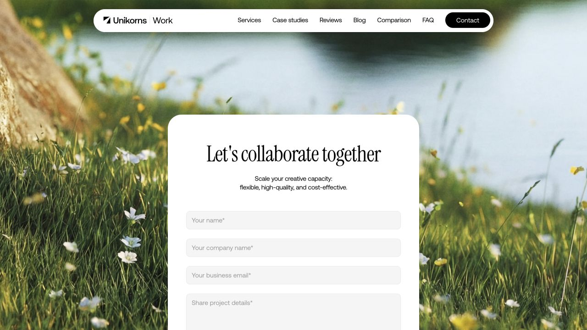
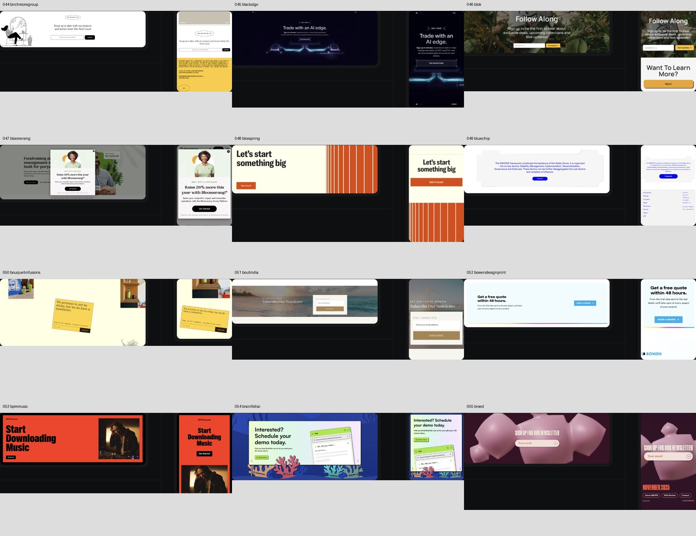
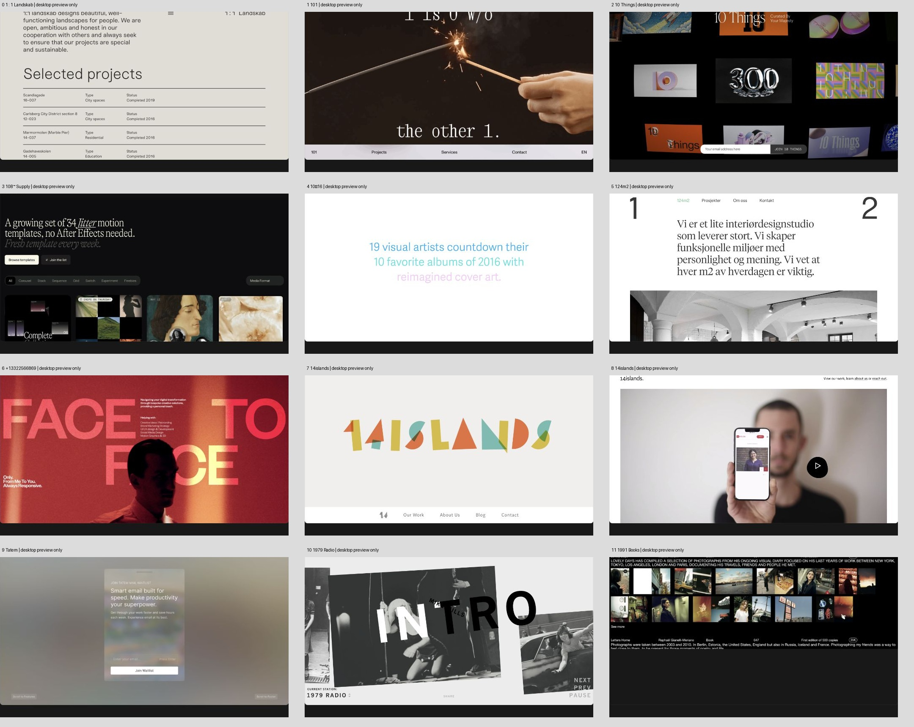
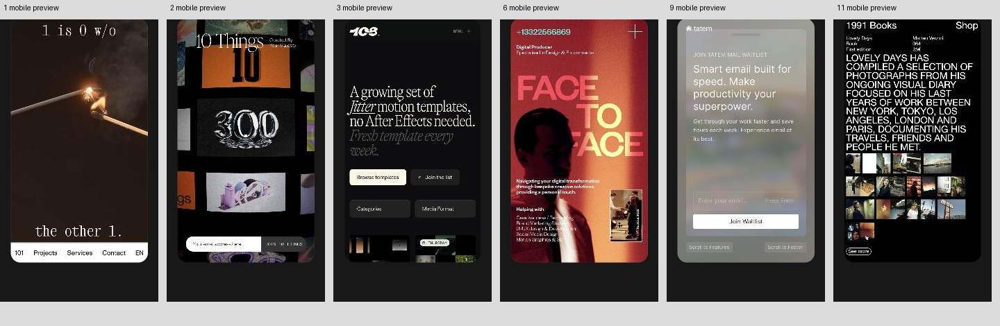

# 병렬 레퍼런스 조사 A — Minimal · DesignBookmark · CTA

검토일: 2026-10-07 · 상태: 진행 중, 전수 완료 아님

사용자의 병렬 전수 조사 요청으로 세 사이트를 분담했다. 수집된 HTML·소개 문구, 실제 갤러리 이미지, 원제품 동작을 분리한다. URL 수집만으로 독해·시각·상호작용 확인을 주장하지 않는다. 공용 inventory/ledger와 구현 소스는 root 담당이며 이 보고서는 조사 담당자 소유다.

## 최신 저장 범위

이 보고서의 아래 기록은 순차 checkpoint 이력이다. 현재 저장값은 A 전용 index를 기준으로 한다.

| 사이트 | 실제 읽은 콘텐츠 | 실제 시각 독해 | 동작 확인 한계 |
| --- | --- | --- | --- |
| CTA snapshot551 | 상세505 소개·분류 + 비상세46 고유 본문 | 상세505(두 preview500·desktop-only5), 비상세46 desktop 첫 viewport | 원제품 흐름은 Unikorns contact anchor 이동만; 나머지 상태/전송/전체 모바일 미완료 |
| CTA live 신규1 | Numa DOM 소개·분류1 | Numa desktop/mobile1 | 제품 구매·의료 기능 미확인; snapshot 밖 별도 |
| Minimal snapshot3433 | 상세3199 중 website metadata3006 + template소개193 + 나머지234 고유본문/목록, description510 | 상세desktop252(유효mobile116·미제공135·제공되나실패1) | Mobile switch partial116, keyboard/focus/original 흐름 미완료 |
| Minimal 추가 live 목록 | 추가294 요청(75+78+39+29+25+24+24)·신규canonical252, snapshot포함 소개/metadata층3685 | 이번 추가 목록 시각0 | 목록/소개/탐색label 독해만, discovery closurefalse |
| Minimal 목록 썸네일 | 기존 소개독해와 중복 URL, source수에 추가안함 | Websites목록10개230 작은desktop썸네일 | detail252/mobile116에 합산안함·세부글자/상태/flow미확인 |
| DesignBookmark queue2657 | snapshot tool2249 + 비tool103 소개/고유본문 + 신규live tool298/비tool7 = known2657 소개층(2656canonical) | 최초 홈·8bitcn panel + 순차대표desktop24, tool mobile0 | retro 검색·drawer·Escape·query 보존 부분 확인 |

등록 제안 후보39개는 기존 API 재사용·부족 가능성·보류를 분리한 목록이다. 실제 실험 등록0, API 교체0이며 조사 전수 완료와 discovery closure를 주장하지 않는다.

## 최초 checkpoint의 범위

2026-10-07 14:19 KST 읽기 전용 checkpoint. 알려진 URL queue의 discovery closure는 아직 확인하지 않았다.

| 사이트 | 알려진 URL | 기존 HTML 수집/HTTP 200 | 이번 실제 페이지 콘텐츠 확인 | 이번 시각 확인 | 동작 범위 |
| --- | ---: | ---: | --- | --- | --- |
| Minimal | 3,433 | 3,433 / 3,433 | 홈, Ogon 상세 2개 | 홈 상단, Ogon 모바일 갤러리 이미지 | 필터 열기·검색·Escape, Desktop/Mobile 선택 |
| DesignBookmark | 2,657 | 1,425 / 1,425, 기존 crawler 진행 중 | 홈, 8bitcn 상세 panel 2개 | 홈 상단, 검색 결과·상세 panel | 검색 결과 전환, 상세 열기·Escape, 검색어 보존 |
| CTA | 551 | 551 / 551 | Form category, Unikorns 상세 2개 | category 첫 카드 줄, Unikorns desktop/mobile 캡처 | category→detail 이동 |
| 연결 원제품 | 별도 | 별도 | Unikorns 홈 전체 DOM 본문 1개 | 초기 hero, 실제 Contact form | Contact anchor 이동만, 제출 안 함 |

이 표의 페이지 콘텐츠 확인은 해당 페이지 텍스트를 읽었다는 의미다. Minimal/CTA의 아래쪽 모든 썸네일, DesignBookmark의 lazy 목록 전체, 연결된 전체 원제품 사이트를 읽거나 모든 상태를 확인한 것은 아니다. DOM에 존재하는 숨은 내용과 화면에 보이는 내용을 혼동하지 않는다.

## 실제 URL별 관찰

### Minimal Gallery

- [홈](https://minimal.gallery/): Website/Template/Tool 전환, 태그 분류, 뉴스레터, 카드 목록·페이지 이동, footer 본문을 읽었다. 실제 1280×720 화면은 검은 배경·연한 태그 pill·3열 preview 카드와 가운데 newsletter를 보여 줬다. `All types`로 분류/검색 overlay를 열고 `paper` 입력 뒤 Enter에서 `Flying Papers` 결과를 확인했다. Escape 뒤 overlay 요소가 AX에서 제거됐다. 포커스 반환 target은 확인하지 못했다. 첫 입력은 AX setValue였으며 이 결과를 debounce 자동 검색 증거로 주장하지 않는다.
- [Ogon 상세](https://minimal.gallery/ogon/): 설명용 긴 본문 대신 이름·외부 링크·유형(Agency/Production Studio)·게시일·submitter·viewport metadata와 유사 사이트가 있다. Desktop 첫 screenshot은 로딩 중 빈 자리였고 Mobile 선택 후 실제 이미지가 나타났다. 화면 캡처에 기재된 viewport는 375×667, DPR 2. 산 배경 사진 위 파란 로고·작은 intro·영상 작품 선택이 보였다. 이것은 Ogon 원제품의 실제 재생/선택 동작을 증명하지 않는다.

### DesignBookmark

- [홈](https://designbookmark.com/): 2,547 tools / 59 categories라는 현재 사이트 표기, 9개 상위 분류·OS별 목록·정렬·검색·bookmark 설명과 첫 목록 소개를 읽었다. 전수 queue 2,657과 tools 2,547은 서로 다른 분모다. 실제 화면은 좌측 탐색과 상단 분류, 3열 카드, 하단 검색 bar였다.
- `retro` 검색: AX setValue+Search 클릭만으로는 확정되지 않았다. Playwright textbox fill 후 바로 `1 result for retro`와 8bitcn 카드가 나타났고 Search button이 Clear search로 바뀌었다. 따라서 자동 입력 검색은 이 두 번째 시도에서 확인했다. 사라진 Search를 클릭하려던 후속 시도는 selector timeout으로 중단하고 새 DOM을 읽었다. 이를 사이트 오류로 분류하지 않는다.
- [8bitcn 상세](https://designbookmark.com/tool/8bitcn): 검색 카드 클릭으로 우측 `dialog "8bitcn details"`가 열렸다. 소개, Frameworks & Libraries 분류, 외부 도메인, 비슷한 도구 6개를 읽었다. 배경의 검색어·결과 카드가 유지됐다. Close details 버튼에 Escape를 보내 dialog가 제거되고 `retro`+1개 결과가 유지된 것을 확인했다. 그림은 흰 배경·검은 픽셀 경계·작은 RPG 캐릭터를 쓰는 UI screenshot이었다. 원래 8bitcn 코드·문서·인터랙션과 폰트 라이선스는 아직 확인하지 않았다.

### CTA Gallery와 연결 원제품

- [Form category](https://www.cta.gallery/categories/form): 제목·소개·모든 DOM 목록 이름/외부 링크·footer를 읽었다. 갤러리 첫 카드 줄에서는 자연 사진 위 독립 흰 폼, 보라색 배경의 작은 대화 카드, 노란 타이포 형태를 확인했다. 아래 목록 모두의 이미지 검토는 미완료다.
- [Unikorns 상세](https://www.cta.gallery/cta/unikorns.work): intro, category Form, industry Landing, mode Light, 관련 CTA 본문을 읽었다. desktop/mobile static capture 모두 자연 풍경에 흰 독립 폼을 둔다. mobile capture는 필드와 행동의 순서를 유지한다. 모바일은 실제 390px browser 실행이 아니라 갤러리의 static screenshot이다.
- [원제품](https://unikorns.work/): hero→대상팀→case study→시작 단계→고객 리뷰→가치→비교→FAQ→Contact→footer의 전체 DOM 텍스트를 읽었다. 현재 live Contact는 이름·회사·업무메일·프로젝트 설명의 **4개** required input/textarea다. 갤러리 screenshot은 예전 5필드처럼 보이므로 현재 원제품과 같다고 가정하면 안 된다. 상단 Contact 클릭 뒤 `#contact`로 이동하고 자연 배경의 흰 폼을 실제 봤다. 초기 screenshot은 smooth scroll 도중 hero였으며 다음 screenshot에서 도착을 확인했다. 입력·제출·서버 오류·성공 상태는 확인하지 않았다. 필드의 aria-label/aria-labelledby는 null이고 placeholder만 보였지만 전체 accessible-name 진단을 실행하지 않았으므로 접근성 실패로 단정하지 않는다.

## 기존 HJM과 비교한 판단

공개 API 대응표와 실제 사용 지침, `design-profile.ts`를 대조했다. 새 API 추가를 전제로 하지 않는다.

| 관찰 | 기존 재사용/흡수 | 남은 차이·판단 |
| --- | --- | --- |
| 분류+검색+카드 | SearchScreen의 query/filters/suggestions/resultSummary, Grid·Card | debounce/취소·오류 복구는 이미 공유 계약. 갤러리마다 새 검색 엔진 불필요. 원본의 floating 검색 위치는 제품 레이아웃 판단이며 공통 화면 계약 우회 금지 |
| 결과→우측 상세→검색 보존 | 기존 Sheet/Dialog와 제품 controlled query/selected item | 현재 원본의 result context 보존을 기존 공개 구성으로 먼저 표현한다. 애니메이션·focus restore 비교는 미확인 |
| Desktop/Mobile preview 전환 | SegmentedControl+Image/AspectRatio | 독립 상태 엔진·새 preview component 불필요. 전환 시 접근성 label과 image metadata를 유지 |
| 픽셀 레트로 표현 | 기존 retro profile·radius/shadow/font tokens | pixel stepped outline은 현재 단순 모서리 축과 차이가 있을 수 있어 보류. 코드/양 renderer/확대 글자 확인 전 treatment를 추가하지 않는다. RPG 이미지·폰트는 제품 소유 |
| 자연 배경+흰 폼 | forest profile, 기존 Card·TextField·Textarea·Button, 기존 form composition | 숲 느낌을 임의 green input으로 바꾸는 것보다 읽을 수 있는 surface 대비와 제품 배경 asset 슬롯을 유지. 산/숲 bitmap 자체를 공유 token에 내장하지 않는다 |
| Contact 필드와 submit | 기존 FormState/field validation·Button pending/failed recovery 계약 | 원제품 성공/실패를 확인하지 않았으므로 동일 회복 품질이라고 주장하지 않는다. 반복 contact form wrapper 신설보다 기존 공개 form composition을 우선 |

테마는 HJM의 표현 옵션과 검증 기준을 공유하고 제품이 브랜드 자산·조합을 소유한다는 기존 방향을 유지한다. 이번 조사는 동작 계약을 브랜드 screenshot과 함께 복사하지 않는 근거다.

## 남은 전수 검토와 추정 한계

- Minimal 전체 3,433 URL 개별 소개/metadata 독해, 모든 screenshot, 실제 원제품 링크와 상태는 남았다.
- DesignBookmark 수집 queue가 진행 중이다. 전체 2,657 URL의 detail와 category 소개, tool 원제품·코드·동작, signed-in bookmark는 남았다. 기존 crawler를 재시작/종료하지 않았다.
- CTA 전체 551 URL 중 나머지 상세·분류·소개 독해와 전체 desktop/mobile 캡처·연결 원제품 상태는 남았다. 기존 Ente/Webflow 검토를 반복하지 않았다.
- 동일 layout category가 반복된다는 이유로 URL별 독해/검토를 생략했다고 보고하지 않는다. 반복 패턴과 URL 확인 수는 따로 기록한다.
- 이 첫 batch의 도구 round-trip에는 화면 전환·상태 확인이 포함된다. 수천 URL의 원제품 상태까지 포함한 완료 시간을 지금 신뢰할 수준으로 계산할 수 없다. 약 10분 첫 batch는 전체 전수 ETA가 아니다.

## 검증·산출물 경계

외부 UI는 CUA의 agent-owned 임시 탭 하나에서 확인했다. 기기·네이티브 build·원격 CI·릴리스·git 조작을 실행하지 않았다. 원본 HTML 수집 산출물은 읽기만 했고 소유 crawler/로그를 변경하지 않았다. 유지한 PNG는 실제 원제품 도착의 최소 증거다. package/runtime 검증은 이번 문서 조사 범위가 아니다.

## CTA 전수 독해 checkpoint — 2026-10-07 두 번째 batch

CTA의 알려진 551 URL은 상세 505개(`/cta/<slug>`)와 목록·분류·소개·폼·템플릿 46개로 나뉜다. 상세 **505/505의 고유 소개 및 Category/Industry/Mode**를 실제 순서대로 읽었다. 비상세 **46/46의 고유 추출 본문과 카드 제목**도 읽었다. 비상세는 반복 nav/footer와 responsive 복제 행만 제거했다. 상세 관련 CTA 목록 개별 독해·HTML 구현 코드·원제품 전체 본문과 상태는 이 완료층에 포함하지 않는다. 전체 페이지 검토 완료는 여전히 아니다.

URL별 source SHA, 읽은 범위와 pending 층은 [A 전용 index](2026-10-07-reference-parallel-a-index.json)에 남겼다. known queue의 discovery closure는 확인하지 않았다. CTA 작성 팁의 명확한 행동/이익/위험 감소/사회적 증거 원칙, 광고 페이지의 세 plan 및 quote form, 제출/구독 폼, template 소개도 읽었다. 사이트의 전환율·보안·의료·금융 효능 주장은 소개 문구일 뿐 검증 근거로 채택하지 않는다.

### 캡처 정정과 시각 완료층

초기 의미 기반 Desktop/Mobile 이미지 metadata 84개를 확보했지만 CUA clip PNG 일부가 **광고 영역**을 찍었다. 성공 수에서 제외했고 metadata를 시각 독해로 집계하지 않는다. 전체 화면 PNG를 다시 저장한 뒤 DOM image rect에 맞춰 로컬 QA crop을 만들었다. 교정 batch **0–7의 8/505** desktop/mobile 기본 화면은 실제 이미지 독해를 마쳤다. 교정 PNG 저장 수와 독해 완료 수는 index에서 별도 기록한다. 이 작업은 갤러리의 정적 desktop/mobile 이미지 비교다. 원제품의 breakpoint·키보드·focus·hover·pressed·loading·error·reduced-motion 검증은 아니다.

교정 0–7 관찰: 11x의 좌측 정보/우측 사막 사진은 모바일에서 사진이 아래로 이동한다. 13g는 두 명의 얼굴 portrait와 상담 행동, 247artists는 어두운 원근 grid와 중앙 보라 CTA, 8returns는 청록 패널·라임 제목·primary/secondary·신발 사진을 세로 재배치한다. Aaavatar는 avatar ring와 다운로드, Aboardhr는 파스텔 rainbow와 한 행동, Acctual은 초록 grid/종이 조각과 송장 행동, Adventurenannies는 teal/orange 도형과 채용 행동이다. 이들 각각은 기존 Card/Grid/Button/Image 및 브랜드 asset 구성으로 우선 흡수하며 별도 검색/상호작용 engine 교체 근거는 없다.

### 독해에서 나온 보수적 판단

- `poch-studio`/`poch.studio`, `web-meetcleo`/`web.meetcleo`처럼 유사 소개가 별도 URL로 존재한다. 각각 읽고 두 URL을 남겼으며 중복을 한 페이지로 줄이지 않는다.
- 일부 상세는 mode/industry/category 값이 비거나, 소개와 산업 분류가 맞지 않아 보인다. `backlog.design`의 Medical, `payy`의 Marketing 등은 테마 선택의 자동 근거로 사용하지 않는다. 분류 tag만으로 화면을 생성하면 원제품 목적을 잘못 추정할 수 있다.
- pricing/subscribe/form/modal/navigation/download는 의미·상태가 다르다. theme 변경으로 구매/구독/연락/다운로드 동작까지 서로 바꾸지 않는다. 기존 HJM action/form/modal 계약을 유지하며 화면 구성 recipe와 표현 옵션을 조합한다.
- 종이·숲·retro/pixel·rainbow·cosmic·editorial 표현은 참조할 수 있지만 현재 API를 대조한 재사용 우선 판단이다. 원제품 코드·라이선스·두 renderer·확대 글자 검증 전 새 token/treatment/컴포넌트를 공개 API로 추가하거나 교체하지 않는다.

남은 범위: 상세 기본 시각 497/505, 46 비상세의 전체 시각·실제 동작, 상세마다 related CTA와 연결 원제품 흐름, Minimal 3,433 및 DesignBookmark 2,657 전수 독해/시각/흐름. 이 checkpoint는 문서 조사이며 구현 적용·승급·게시·원격 CI를 수행하지 않았다.

## 교정 시각 checkpoint — 0–103 실제 독해

교정된 fullPage/DOM crop의 상세 **0–103 = 104/505**를 12개씩 contact sheet로 실제 읽었다. 이 층은 기본 배치·색·주/보조 행동 위치·정적 모바일 재배치 확인이며 작은 모든 문구의 판독이나 원제품 동작 검증은 아니다. URL별 corrected PNG SHA 및 읽은 contact-sheet SHA를 A index에 기록했다. 교정 PNG 저장 135개와 시각 독해 104개를 구분한다. metadata상 이미지가 아직 로드되지 않은 106–114는 시각 성공에서 제외하고 재캡처가 필요하다.

새로 확인한 차이: Bouquetinfusions(50)는 노란 sticky note 형태 newsletter와 회전한 종이 표현, Alpbio(14)는 점 기반 픽셀 글자와 rounded 입력, Bluechip(49)는 stepped 경계와 가운데 download 버튼이다. 이들은 종이 rotation이나 pixel outline이라는 시각 옵션 후보지만 accessibility·확대 글자·native clip 검증 없이 공개 treatment로 승급하지 않는다. Forest 이미지 위 newsletter(Blok46), paper/green line contact form(Cultivatefood103), rainbow primary/secondary(Aboardhr5), dark neon single action(Aptosbuild23), 물 표면 위 white newsletter(Augustcollections30)는 기존 semantic surface와 Card/Button/Form/Image 표현 조합을 먼저 비교한다.

Collider(88)는 Yes/No 두 선택과 close, Bloomerang(47)/Cobfoods(81)/Aligne(11)/Chobani(72)는 입력 팝업을 정적으로 보여 준다. 클릭·dismiss/focus trap/전송 상태는 확인하지 않았다. 이를 HJM Dialog 또는 form recovery 교체의 근거로 사용하지 않는다. 일부 작은 글자는 contact sheet에서 정밀 판독할 수 없으므로 그 부분은 미확인이다.

### 알려진 분모 변경 발견

기존 수집 snapshot 551 URL에 없는 [Numa 상세](https://www.cta.gallery/cta/get-ripe-copy)가 현재 [Compoundplanning 상세](https://www.cta.gallery/cta/compoundplanning)와 [Cursor 상세](https://www.cta.gallery/cta/cursor)의 live `Related CTA's` AX에 나타났다. `link Description: Numa, Value: cta.gallery/cta/get-ripe-copy`; 연결 외부 href는 `numa.uprock.pro/`이다. 이 페이지는 아직 열지 않았으며 독해/시각/원제품 모두 pending이다. 따라서 기존 **551 snapshot 독해층**과 현재 **최소 552 known URL** 분모를 구분한다. discovery closure는 false를 유지한다.

## 순서별 시각 checkpoint — 상세 0–209

교정 시각 독해는 **0–209 총 210/505**의 사용 가능한 기본 화면까지 진행했다. 이 중 desktop/mobile 두 이미지 **206개**, desktop preview만 있는 template **4개**(Draftr121, Habitline192, FintechX208, Flexora209)를 분리한다. 106–114는 load 확인 후 재캡처한 9개를 다시 실제 읽었으며 이전 빈 이미지는 근거에서 제외했다. 작은 모든 필드 문구·테마 motion·실제 breakpoint·원제품 상태는 여전히 pending이다. 기본 화면이 210개 확인됐다는 것은 모든 상태/페이지 검토 완료가 아니다.

Debugger110의 연노랑 ruled paper·serrated 경계·name/email newsletter, Data.to.design107의 editor selection handle처럼 보이는 white card와 forest green surface, Dibi113의 paper ticket/perforation 형태 pricing, Heyjay201의 scallop+pink stripe/border 버튼을 확인했다. 종이 계열은 asset/texture·border·rotation·font 조합 후보로 두고 기존 Form/Card/Button 슬롯과 비교한다. 새로운 widget state나 전송 엔진은 필요하다는 근거가 없다. Halo dental193/Henge200/EdSheeran130은 checkbox consent와 입력/submit 순서를 정적 갤러리에서만 보여 준다. 동의 의미·disabled/pending/failed/성공 상태는 제품 기능 계약 소유다. 텍스처의 opacity와 대비는 동작 의미와 분리해야 한다.

## 순서별 시각 checkpoint — 상세 0–299

상세 기본 시각 독해 **300/505**(desktop/mobile 296, desktop-only template4). capture 저장 수와 기본 화면 실제 독해 수가 이 checkpoint에서는300으로 같지만 원제품 동작 층은 별도다. 알려진 snapshot 밖 internal link를 기계적으로 비교한 결과는 **0개**이며 `snapshotInternalLinkDiscovery`로 따로 기록했다. 현재 live Numa 신규 링크는 source snapshot 외부 발견1개다.

상세 210–299에서 form/modal의 의미 차이가 다시 보인다. Janvi217은 date/grid와 contact를 같이 둔 구성, Journa224는 관심 항목 checkbox와 이메일을 둔 sign-up, Michelbeaulieu264는 budget 선택과 email을 가진 listing 구독이다. 이는 theme 하나로 필드나 동의 의미를 바꿀 근거가 아니다. 브랜드/의도별 composition recipe가 field schema와 상태를 받고 theme는 표현 축을 공급하는 구조가 맞는다.

Langbase237은 desktop에서 Start free→Get a demo가 나란하고 mobile에서 demo→free 순서를 바꾼다. 이를 자동 theme interaction 변경으로 복제하지 않고 제품 행동 우선순위를 별도 계약으로 둔다. Katana227은 desktop 장식 object가 mobile에 덜 보이는 두 static 이미지다. 원제품의 실제 viewport 조건·reduced motion과 일치하는지는 확인하지 않았다. Lockerland249의 checkerboard·red grid, Memelord261의 pixel typography·초록 풀 배경·desktop-window motif, Obscura295의 pixel 캐릭터는 레트로 계열 참고다. 원본 상표/캐릭터 자산을 shared token으로 복사하지 않는다.

## 순서별 시각 checkpoint — 상세 0–359

기본 화면 실제 독해 **360/505**(desktop/mobile355, desktop-only5). 모든 상세 원제품 flow는 기존 Unikorns anchor 부분 확인을 제외하면 pending이며, 이 숫자는 정적 이미지 독해만 나타낸다. Rows357의 ruled paper/hand illustration과 yellow CTA는 paper 계열 참고, Ruul359의 좌측 help action+우측 FAQ는 기존 Accordion/FAQ composition 재사용 후보다.

유사 소개인 Poch-studio322와 Poch.studio323의 캡처는 큰 손그림 전화/Call us와 작은 portrait/video 카드로 다르다. 같은 소개라고 시각 검토 URL을 합치지 않았다. Revolut348은 desktop Stocks와 mobile Commodities라는 서로 다른 콘텐츠를 보여 준다. 단순 반응형 reflow로 단정할 수 없어 gallery preview의 서로 다른 state일 수 있다고 기록하며 원제품과의 동일성은 pending으로 둔다.

## 순서별 시각 checkpoint — 상세 0–419

기본 화면 실제 독해 **420/505**(desktop/mobile415, desktop-only5)까지 진행했다. fullPage 저장 수와 실제 독해 수는 이번 checkpoint에서420이지만 원제품 flow/코드·작은 모든 문구·전체 상태 검증은 별도 pending이다. CTA 전체551의 소개/분류 또는 비상세 고유 본문 읽기 층은 기존과 같고, live 신규 Numa는 별도 pending으로 유지한다.

Sapphic365의 pink paper/scissors 입력 구성, Spring390의 photo+paper 형태 이름/성/이메일 구성, Studioloop404의 cream/handdraw newsletter는 기존 Card/Form/Button에 질감·폰트·브랜드 asset 옵션을 조합할 후보다. CAPTCHA가 보이는 Sage363은 challenge를 실행하지 않았으며 form 성공/실패 상태도 확인하지 않았다. Slush380의 newsletter/help 두 패널과 Storytale400의 resource/newsletter 두 카드는 기능 의도에 따라 composition을 고르는 사례다.

Sui407의 iridescent image와 translucent form은 정적 캡처에서 확인했으며 실제 motion/glass 성능 검증은 아니다. Teachable418은 audience size 선택이 있는 첫 step처럼 보이는 폼 캡처로, 선택 후 이동/복구/전송 동작은 미확인이다. SVZ412와 svz413은 같은 브랜드라도 yellow organic3D와 white fuzzy3D로 다르므로 시각 URL을 합치지 않았다.

## 순서별 시각 checkpoint — 알려진 상세 505 기본 화면 층

기존551 snapshot의 상세 **505/505 기본 정적 화면을 실제 읽었다**. desktop/mobile 두 이미지500, desktop-only template5(Draftr, Habitline, FintechX, Flexora, Pixera)다. crop/contact-sheet의 색·기본 영역·행동 위치·정적 세로 재배치를 확인한 층이며 **사이트 전체 페이지/전체 상태 검토 완료가 아니다**. 46 비상세 기본 시각·갤러리 live 전체 동작·related CTA 상세 연결·원제품 코드/상태/라이선스·발견 closure·작은 모든 문구의 정밀 판독은 남았다. 551 소개/분류/비상세 고유 본문층과505 기본시각층은 서로 다른 집계다.

420–504에서는 The Subtext427의 black/white mailbox photo와 white newsletter, Victoria463의 pink ruled paper/taped note와 purple action, Workflow493의 dotted paper 같은 바탕, Zenwood502의 dashed card edge/작은 tree 장식을 확인했다. Forest/paper/retro 조합에는 texture나 brand asset을 표현 슬롯으로 공급하고 기존 form 입력·action·focus·pending/recovery 계약을 유지하는 방향이 맞다. Zkpass504는 lime stepped action과 선형 글자, Wheregiantsroam481은 화살표 패턴과 Play를 보여 주지만 실제 hover/motion을 확인한 것은 아니다.

Thursdayboots429는 newsletter modal에 Men/Women 선택이 있고 Transform9437은 전화 입력/action과 demo를 나누므로 필드 의미와 전송 intent는 theme가 임의로 바꾸지 않는다. Web-meetcleo475는 단일 Get app 카드, web.meetcleo476은 QR와 두 store action으로 달라 유사 소개 URL도 별도 이미지로 읽었다. Unikorns450 갤러리는 forest/photo 폼이지만 앞서 확인한 현재 원제품 form과 capture 필드가 다르므로 gallery를 최신 implementation 증거로 사용하지 않는다.

### live 신규 Numa — snapshot 밖 별도 읽기

[Get-ripe-copy/Numa](https://www.cta.gallery/cta/get-ripe-copy)의 현재 DOM 본문을 읽었다. 소개는 smart insulin pump concept, taxonomy는 All types/Call-to-Buy·Ecommerce·Light, related는 Get-ripe/Eternalblue/Animos다. 소개의 의료 기능은 사이트 자기 설명이며 제품의 의학적 효능을 확인하지 않았다. Desktop/mobile 정적 이미지 두 개를 실제 읽었고 white surface·blue gradient·큰 Start living 제목·product image·Pre-order Numa action을 확인했다. 작은 하단 disclaimer의 모든 문구, original pump/product 구현·구매 flow는 미확인이다.

기존551 snapshot source층과505상세 시각층은 그대로 유지하고, live 신규1의 DOM 본문/기본시각을 별도 필드로 기록했다. 현재 알려진 최소552이며 discoveryClosure=false, allPagesReviewComplete=false다. 이 페이지도 기존 hero/Card/Image/Button 슬롯의 제품 asset 조합으로 먼저 흡수하고 새로운 구매/의료 동작을 theme로 추가하지 않는다.

## Minimal/DesignBookmark 본문 순서 checkpoint — 각각 상세 80

Minimal 기존3,433 snapshot에서 `Back` 소개/preview metadata 구조의 상세3,199와 비상세234를 식별했다(구조 식별은 독해 완료 수가 아니다). 그 상세 순서 **0–79의80 URL**에서 소개·이름/외부 domain·type·submitter/credit·게시일·preview viewport/DPR·desktop/mobile label을 실제 읽었다. Related/Similar Websites와 원제품본문/HTML code는 제외한 층이며 시각/flow는 pending이다. 1991 Books·246Queen·3drops·AI Aerobics 등의 type은 비어 있고, 14islands/Aesse/Aaron Shapiro/Aino/246Queen처럼 같은 이름과 domain에도 다른 게시일의 별도 URL이 있으므로 합치지 않는다. Viewport/DPR metadata는 실제 breakpoint·접근성 증거가 아니다.

DesignBookmark 현재 수집1,659/knownqueue2,657 중tool 상세1,556 구조를 식별하고 tool순서 **0–79의80 URL**에서 breadcrumb·title·pricing label·About/Features 본문을 실제 읽었다. 원래 crawler/PID/raw data는 보존했다. Related/Alternatives·vendor 코드/라이선스/화면 동작은 pending이다. 8bitcn은 기존 읽기를 중복 합산하지 않고 이80에 포함했다. Adobe Spectrum40, Aceternity25, 3dicons10, 21st6, 23rd7, 8bitcn14의 소개는 참고 연결이며 원사이트 실제 계약/라이선스를 이 directory 소개로 인증하지 않는다. 특히 Free/Freemium/Paid 분류를 token이나 dependency 허용 정책으로 옮기지 않는다.

이전 추가 본문 읽기(새80과 별도): Minimal `/tag/editorial/`, `/tag/environmental/`, `/tag/museum-gallery/`, `/tag/science/`의 captured category navigation/item names; DesignBookmark `/design`, `/design/design-systems`의 captured 목록/소개. Design systems 목록의 Balsa UI와 Springs는 theme/DTGC·motion 관련 후보 소개지만 API/renderer/원본 license를 확인하지 않아 도입/교체하지 않는다. 기존 home/Ogon/검색/8bitcn drawer partiallive 범위는 최초 표를 유지한다.

### 순서 본문 checkpoint — 각각 0–159

Minimal 상세 소개/preview metadata160/3,199, DesignBookmark toolAbout/pricing/category160/현재수집tool분모까지 실제 읽었다. 범위는 앞선80과 동일하고 읽은 원문 excerpt·source SHA·URL을 A index에 보존했다. 서로 다른게시일의 AKU/Ajeeb/AndyChung 같은URL을 합치지 않으며 일부type 빈값은 추천 자동근거로 쓰지 않는다.

DesignBookmark Alphredo86은 translucent/opaque color 동일 appearance 변환 소개, ArkUI139는 unstyled accessible cross-framework 소개, AntDesign110/Atlassian156/Atomize157는 디자인시스템 소개다. 해당 원사이트 API나 contrast/accessibility 실측을 확인하지 않았으므로 HJM API교체·의존성 도입으로 승급하지 않는다. AppleHIG125 About에 JavaScript-required 문구가 섞이고 AmazonQ90은 end-of-support notice가 섞여 있어 수집 소개만으로 원문 정책/유효 버전을 확정하면 안 된다. 기존 token/color·primitives 접근성 계약에서 부족이 확인됐을 때만 해당 원문을 따라 검토한다.

### 순서 본문 checkpoint — 각각 0–279

Minimal **280/3,199 상세 고유preview metadata**를 실제 읽었다. 첫160은 description도 읽었고160–279는 `Back`부터 preview까지 고유 본문을 읽으며 exact공통 Copy link/Copied/Download/Viewport1440x800/DPR1.33 블록만 출력에서 제외했다. 이새120의 반복description 문장은 독해 완료로 세지 않았다. index에 URL별 scope와 읽은본문excerpt를 구분한다. DesignBookmark **280 tool 상세 About/pricing/category**를 읽었고 related/vendor/시각/flow는 pending이다.

DesignBookmark Balsa186·BoardUI244·BeautifulUI202·Bencho211·beUI218·BorderBeam253·BoringAvatars254는 각각 theme/source distribution·dashboard·AI state·interactive blocks·motion·border decoration·generated avatar 소개다. 현재HJM의 색/profile·Card/Grid·input/state·motion treatment·Avatar/primitive와 먼저 비교하는 후보이며 directory 텍스트만으로 교체할 이유는 아직 없다. 기능과 관련 없는 HR/결제/automation 도구 소개도 누락시키지 않고 순서읽기를 유지했다. Minimal은 Aspen Search234의 분리된brand/design/dev/illustration credits처럼 source별소유가 나뉘는 사례를 확인했고 브랜드자산을 sharedtoken으로 복사하지 않는다.

### 순서 본문 checkpoint — 각각 0–399

Minimal 상세metadata **400/3,199**(description추가160), DesignBookmark tool본문 **400**까지 실제 읽고 URL별 excerpt/SHA를 업데이트했다. snapshot 전수시각/flow완료로 합산하지 않는다. Minimal Bïrch337의 designer/developer credit, Bobbi353의 design/video credit, BlankInside341의 디자인 credit를 확인했고 provenance를 보존했다. BaseDesign282/Base283, Bedow300/301, Bleed343/344/345, Blok348/349는 별도 URL/domain/게시일을 그대로 남겼다.

DesignBookmark CanvasUI315·Carbon325·CentralIcon334·Chakra335·Checklist345·Chromatic352의 소개를 읽었다. Canvas/WebGL 효과는 웹 전용에 가까운 별도검토 대상이고 기존 두 renderer 공유를 대신하지 않는다. Checklists/visual testing 도구는 품질절차 참고이며 디자인API교체 후보로 분류하지 않는다. 일부 About(Clipwing378/Forms&Surveys 등) category는 소개기능과 어긋나므로 category별 자동승급하지 않는다. 원본계약·code·interaction은 pending이다.

## CTA46 비상세 desktop 첫viewport 읽기층

비상세46/46을 현재 desktop1280×720 첫viewport로 실제 읽었고 URL별 viewport/headings/screenshot SHA를 index에 저장했다. 긴listing의 모든 아래카드/전체페이지시각이나 gallery모바일레이아웃을 확인한 것은 아니므로 상세505 desktop/mobile preview층과 합산하지 않는다. 첫 `/categories` 캡처가 빈흰화면이어서 성공에서 제외한 뒤 해당URL을 다시 열어 AllCategories DOM과실제이미지가 나타난 것을 읽고 교정했다. 최초빈캡처는 `listing-03-initial-blank.png`로 분리했다.

현재 첫viewport에서 `/categories/all-types`는 제목이 없고 소개와grid가 시작하며 `/mode`에는 “Content here” 소개가 보였다. 이는 참고사이트구현 관찰이고 HJM미흡이나 디자인패턴으로 복제하지 않는다. submit에는 SiteURL/Designer/DesignerLink/Submittedby 이름 등의 입력이 보여 기존 form composition 참고이고 required·검증·전송/복구동작은 실행하지 않았다. subscribe에는 이메일과 SubscribeNow가 있으나 실제가입/전송을 하지 않았다. categories는8종, industry/mode는별도정보축이라는 목록구성을 기존navigation/filter/Card/Grid로 흡수할수있으며 엔진교체 근거는 아니다.

CTA 남음: 비상세46의긴전체시각/모바일live·gallery모든controls의flow·상세related연결 및원제품full본문/코드/라이선스/동작·발견closure·작은전체문구. 현재551snapshot소스층+상세505기본시각+비상세46첫viewport+신규Numa1은 각기 다른완료층으로 유지한다.

## Minimal 순서 시각 checkpoint — 상세 0–11

첫12 desktoppreview를 실제 읽었으며 제공된mobilepreview가있는6개(1/2/3/6/9/11)는 버튼전환 후 실제 모바일이미지도 읽었다. 나머지6은현재갤러리에 Mobile버튼이없어 desktop-only로 분리했다. 원제품실제mobilebreakpoint/전체상태/작은전체문구는 미확인이다. source메타400·이12시각·추가갤러리partialflow6은 별도층이다.

0 Landskab은 gray/white 프로젝트표,1 101은 sparkler photo와serif 문장·하단navigation,2 10Things는 dark imagegrid+newsletter,3 108Supply는 dark editorial motion-template grid/filter다. source E-commerce분류만으로 실제상품종류를 확정하지 않는다.4 10×16은white에 pastelgradient텍스트,5 124m2는white serif editorial+interior image,6 +13322566869는red/orange 큰타이포/portrait,7 14islands2017은geometricmulticolor로고,8 14islands2020은portrait/video+play,9 Tatem은blur/photo위 translucentwaitlistcard,10 1979Radio는black/white collage와INTRO글자,11 1991Books는blackphotogrid/editorial이다.

기존공개API색인과실제export를 대조하여 표는 DataTable(Web)·행구성, grid는Card/Grid, imagepreview는AspectRatio, 보기선택은SegmentedControl 또는서로다른panel인Tabs를 먼저고른다. Native DataTable export가없으므로 web표를 native지원으로 주장하지 않는다. 원본gallery의디자인별배치는brandasset/intentcomposition표현후보이며 입력/전송/탭계약을 교체할근거가아니다.

Mobile 전환은 최초 accessible name을 단순Mobile로 추정한selector가실패해서 현재DOM의 “View mobile screenshot”과button본문Mobile을 확인한뒤 전환했다. 실제viewport메타는1440x800/DPR1.33→375x667/DPR2로변경했고image도변했다. 이6개는갤러리의click+preview변경partialflow만확인했으며 keyboard/focus-return/원제품interaction은미완료다.

### Minimal 순서 시각 checkpoint — 상세0–23

첫24 desktoppreview(두preview11+desktop-only13)의 기본시각을 실제 읽었다. 제공Mobile11개는 click→metadata/image변경partialflow를 확인한 범위며 original동작·gallerykeyboard미완료다. 12 19h47은dark미니멀typo/작은하단링크,13 1×1은cloud/lamp사진,14 2020ISASONG은blue/white표와AddYourSong,15 23d.1은큰editorialtype,16/17 246Queen은white공간과건축사진,18 247은portrait/제품3열,19 27b는red큰로고와mockup,20 33Letters는blue/yellow3Dletter,21 3drops는darkphone3Dmockup,22 Unsplash는black큰연혁문장,23 52Obsessions는darkblogcard열이다.

특히27b의desktop/mobile중앙내용,33Letters의mobileheadline노출,2020ISASONG의mobile표밀도는 서로 달라 단순반응형재배치로 단정하지 않는다. gallery의서로다른capture시점/state/scroll일수있어 original동일성pending으로 유지한다. 19h47의작은darkcopy와2020ISASONG의아주작은mobilecopy는 정밀판독/대비실측미확인이다. 246Queen유사이미지는서로다른URL/게시일을 합치지않았다. 기존Card/Grid/Image/DataTable/typography표현후보이고 새로운interaction승급근거는 아니다.

### 순서 본문 checkpoint — 각각0–599

Minimal 고유preview메타 **600/3,199**(description도읽음160), DesignBookmark toolAbout/Features·pricing/category **600**을 실제읽고기존시각24의증거를보존한채 URL별index를갱신했다. 공통label·반복Submitter=이름·반복category/title만exact중복제거하여출력했고유일본문값·credits·dates·About/Features는유지했다. source평문파싱이나capture를독해완료로자동합산하지않는다.

Minimal ChusRetroOS507은이름에retro가있는portfolio고유메타,CozyJournal578은app분류의메타다. 실제시각/동작은아직pending으로두고이름만으로retro/paper테마에승급하지않는다. 여러brand/design/dev크레딧을가진ChainGPT465도원자산복사후보가아니다.

DesignBookmark ColorLeap406·ColorReview409·ConverlyColors441·Coolors450은역사palettes·contrast·Radix-style scales/radius·palette lock 소개이고 Ditther586은dither/ASCII/halftone/grain 소개다. theme참고팔레트/질감축에연결할수있는탐색후보지만실제원페이지출력·정확한contrast·code/license·renderer를보지않아HJMcolor contract나textureAPI를교체하지않는다. DesignSpells552/Details568은interaction참고소개,CreateUI472/DesignSystemsRepo557/DjectStudio588은라이브러리/kit소개라기존공개component·recipe·theme로흡수가능한항목을먼저비교해야한다. “free”,“accessible”,“open-source”directory분류를실제인증으로쓰지않는다.

## 조사 후 실험 등록 제안 — 현재 발견28개 후보

사용자추가요청 “조사끝나면 실험에다등록해줘 규격지키면서”에따라, **현재관찰된서로다른추가·개선·교체후보28개**를 아래처럼모았다. 사이트조사와등록은아직미완료이고 실제스토리/공개API는수정하지않았다. 수백개같은form/grid/hero는각기독해증거를보존하면서같은행동·표현후보로묶는다. 매번새component를만들어기존API를중복하지않는다. 아래경로는등록제안이며 `Default/Dark/LargeText`와그역할에맞는상태, globals환경, Web불변id·Nativeid제약 등 [스토리북규격](../STORYBOOK_NAVIGATION.md) §1.1–1.6을따라root가조사후등록한다.

기존실험 **테마조합/영상미리보기**는해당항목변형에흡수한다. 이미배포된 **질감비교/일정과식별정보티켓**은실험으로옮기지않고기존API재사용을검토한다. 기존`HjmDesignProfile`의11preset·palettecontrast·material표면·content/selection motion·collection/toolbar/overview값을읽어비교했다. 외부motion/라이브러리는소개만읽은경우별도보류한다. **확정API교체0건,등록완료0건**이다.

| 후보 | 제안 실험 경로 | 기존 API 우선 및 판단 | 불채택 이유·미확인 |
| --- | --- | --- | --- |
| A-01 테마 조합 | `실험/구성/비교와 검증/테마 조합` | HjmDesignProfile/hjmDesignPresets + theme tokens/material/interactions/compositions/screens; 기존11 presets · 흡수·기존실험변형 | 기존 실험 항목의 표현/구성 변형으로 흡수. 새 theme registry 또는11개별폴더 불필요. 원제품 motion/state·font/asset license 미확인. |
| A-02 종이 표면과 경계 | `실험/구성/비교와 검증/종이 표면과 경계` | EffectSurface grain/noise + Card/Form/Button + paper profile; 기존 배포 질감 비교/티켓 · 개선후보·기존API조합 | ruled/tape/rotation/perforation/scallop는 기존grain과 동일하지 않음. 두 renderer clip/큰글자/대비·원본asset 미확인. 배포 항목 이동 없이 새비교 또는 기존스토리변형 검토. |
| A-03 계단 모양 테두리 | `실험/컴포넌트/시각 효과/계단 모양 테두리` | retro radius/shadow + Card/Button; 일반radius만으로 stepped outline 동일표현 불가 · 추가후보·보류 | pixel/selection-handle 경계의 두renderer·확대글자·focusring clipping/code/license 검토 후 역할단일surface인지 결정. 신규primitive 확정 아님. |
| A-04 색 조합과 대비 | `실험/토큰/색과 글자/색 조합과 대비` | semantic palette/brandPalette + checkPaletteContrast + existing profile palette · 흡수·기존값비교 | 팔레트/gradient 참고를 제품의미와 대비계약 안에서 비교. directory 도구 소개만으로 WCAG/색재현/license 보증하지 않음. 새로운색엔진 불필요. |
| A-05 제목 위계와 줄바꿈 | `실험/토큰/색과 글자/제목 위계와 줄바꿈` | profile heading/typography/fontFamily + Heading/Text · 흡수·크기변형 | 큰editorial/serif/pixel title은 typography/profile 비교. 폰트 실제 license/Korean fallback·large text 및원제품resize 미확인. |
| A-06 사진 위 입력 카드 | `실험/구성/입력과 작성/사진 위 입력 카드` | Card/Image/Form/Field/TextField/Textarea/Button + forest/glass profile · 흡수·구성변형 | newsletter/contact field schema는 제품 intent. 사진은 제품asset이며 sharedtoken 복사아님. 갤러리와현재Unikorns필드가달라 원제품전송/복구미확인. |
| A-07 비쳐 보이는 표면 | `실험/컴포넌트/시각 효과/비쳐 보이는 표면` | profile material.surface blurStrength/fillOpacity/insetShadows + Card/EffectSurface · 흡수·기존표면비교 | 현재 surface contract 범위에서 비교; iridescent 사진/motion을 실제shader검증으로 세지 않음. renderer blur/performance/reduced motion·텍스트대비 미확인. |
| A-08 입체 장식과 행동 | `실험/구성/정보 표시/입체 장식과 행동` | Image/AspectRatio + Card/Button/Heading; clay/forest profile · 흡수·제품asset슬롯 | 3D mascot/geometry/portrait는 식별자산/장식. 새3Dengine/shared상표token 불필요. 원asset/code/license·nativeperformance 미확인. |
| A-09 버튼 순서와 의도 | `실험/구성/비교와 검증/버튼 순서와 의도` | Button/Link + action slots/Grid/Stack + overview/intent recipe · 개선후보·의도계약 | primary/secondary 순서는 theme로 무작위변경하지 않음. Langbase desktop free→demo/mobile demo→free 등 제품우선순위 별도. originalbreakpoint/state 미확인. |
| A-10 구독 정보 입력 | `실험/구성/입력과 작성/구독 정보 입력` | Form/Field/TextField/Select/Checkbox/Button + FormState/action recovery · 흡수·폼변형 | 이메일/name/budget/interest schema로 변형. mandatory/consent/전송API는 제품소유. gallery submit/pending/failed/success 미확인. |
| A-11 관심과 동의 선택 | `실험/구성/선택과 필터/관심과 동의 선택` | Checkbox/FieldGroup/Form + existing controlled selection · 흡수·기존입력조합 | 선택과법적동의 의미를 장식 theme로 치환하지 않음. consent/keyboard/error announcement/실전서버 미확인. |
| A-12 단계별 가입 입력 | `실험/구성/입력과 작성/단계별 가입 입력` | Form/Select/RadioGroup/FieldGroup + FormState; 상태는제품schema · 개선후보·짧은흐름 | 단계전환·이전입력유지·실패복구 필요성을 실험에서 검토. 정적 첫step만 확인하여 원제품 step엔진/자동다음동작은 미확인. |
| A-13 팝업 입력과 닫기 | `실험/구성/입력과 작성/팝업 입력과 닫기` | Dialog/Sheet/Form/close action + existing overlay contract · 흡수·기존오버레이변형 | close/YesNo/email/promo variant를 기존control로. original focus trap/keyboard/restore/backdrop-dismiss/submit 미확인; overlay엔진교체 없음. |
| A-14 신청 옵션과 비용 | `실험/화면/소개/신청 옵션과 비용` | Card/Grid/DescriptionList/Button + 기존티켓/상품소개구성 · 흡수·화면변형 | 가격tiers/free trial/구매/구독은 의미상다름. 원결제/약관/성공단계 미실행, theme가 구매intent를 바꾸지 않음. |
| A-15 문의와 질문 답변 | `실험/구성/정보 표시/문의와 질문 답변` | Accordion + help/action Card/Stack/Grid · 흡수·기존질문구성 | FAQ/help/newsletter/resource 조합의 정보순서. original accordion/route/supportflow 미확인. |
| A-16 자료 검색과 선택 | `실험/화면/검색/자료 검색과 선택` | SearchScreen/query/filters/suggestions/resultSummary + Grid/Card + existing300msdebounce/AbortSignal · 흡수·기존검색상태변형 | Minimal homepaper검색/DesignBookmarkretro검색 partiallive만 확인. 0건/loading/error/fullfilter·로그인bookmarkcloud/keyboard복구미확인. 새검색엔진 불필요. |
| A-17 목록 옆 상세 보기 | `실험/구성/탐색과 이동/목록 옆 상세 보기` | Sheet/Dialog + controlled query/selection; list/detail state separation · 흡수·기존상세변형 | DesignBookmark8bitcn drawer→Escapeclose후query유지는확인. focusreturn/URL/deeplink/scroll복구未확인. 새drawerengine 교체없음. |
| A-18 기기별 미리보기 | `실험/구성/정보 표시/기기별 미리보기` | Tabs 또는SegmentedControl + Image/AspectRatio; panel vs scalar semantics선택 · 흡수·기존선택과미디어 | Minimal11버튼click→viewport375x667/DPR2+image변경확인. gallerynative/keyboard/focus-return/원제품actualviewport 미확인. |
| A-19 달력과 문의 안내 | `실험/구성/정보 표시/달력과 문의 안내` | DatePicker/DateEntry/DataTable(Web) 또는staticGrid; 기존문의action · 보류·정적표시구분 | Janvi date/grid가 실제입력인지 장식/달력표시인지 미확인. theme에서 날짜입력엔진을 자동추가하지 않음. |
| A-20 영상 미리보기 | `실험/구성/정보 표시/영상 미리보기` | 기존실험영상미리보기 + Image/AspectRatio/explicitPlay action · 흡수·기존실험변형 | gallery정적play/영상thumb만 관찰. originalplay/pause/caption/reducedmotion 및리소스실패 未확인; autoplay엔진추가안함. |
| A-21 앱 받기와 코드 보기 | `실험/구성/탐색과 이동/앱 받기와 코드 보기` | Button/Link/Image/AspectRatio; file이면기존DocumentResource 검토 · 흡수·목적별download구성 | QR/store/freefile/gatedsignup 의미를 구분. QR 실제scan·store/download/권한/구매flow 미실행. storelogo는제품asset. |
| A-22 미리보기 실패와 재시도 | `실험/구성/피드백과 복구/미리보기 실패와 재시도` | Image/AspectRatio/loading/error recovery + existing support/actions · 개선후보·로딩관찰 | CTA clip광고오인·106–114blank·categoriesinitialblank와MinimalOgoninitialimageblank 근거. 로컬fixture 재시도/공간유지검토, 원사이트장애원인/HJM결함 확정아님. |
| A-23 화면 상태와 순서 | `실험/구성/비교와 검증/화면 상태와 순서` | DesignProfile/OverviewScreen + explicit intent/state + samefixture · 개선후보·동일상태비교 | 서로다른gallerycapture state/date/scroll을 theme반응형변화로오인하지않음. fixture동일상태·제품actionpriority 유지 검토; original실제statepending. |
| A-24 작업 목록과 설명 | `실험/화면/콘텐츠/작업 목록과 설명` | DataTable(Web)/Card/Grid/Text/Heading + collection rows/cards/grid · 흡수·기존목록변형 | Landskabtable/photo/art/editorial/blogcard 참고. native표export없으므로nativeDataTable지원주장않음; sort/filter/pagination/originalflow미확인. |
| A-25 질감과 글자 표현 | `실험/구성/비교와 검증/질감과 글자 표현` | EffectSurface grain/noise + typography/profile; ASCII/dither외부소개와 비교 · 조사보류·소개만읽음 | 원도구imageoutput/code/license·두renderer 실제동작 미확인. CSS/ASCII/GPUengine 무조건추가안함; 필요한표현차이확인후실험범위결정. |
| A-26 입력과 상태 구현 비교 | `실험/구성/비교와 검증/입력과 상태 구현 비교` | 현재공개입력/상태/오버레이/표면/recipe + 기존사용지침 · 교체후보보류·소개만읽음 | 라이브러리headless/React/Vue/theme/motion/AIstate 소개범위. 원API/code/라이선스/native지원/접근성 품질·현HJM결함 미확인이라 교체/의존성추가0건. |
| A-27 아이콘과 아바타 조합 | `실험/구성/정보 표시/아이콘과 아바타 조합` | Icon/Image/Avatar; AvatarGroup은Webexport + 제품assetrenderer슬롯 · 흡수·asset비교보류 | 3Dicon/portrait/mascot/대체avatar소개. 원source/code/license/semanticname/큰글자clip미확인, directoryfree주장은라이선스증거아님. 3dicons원사이트는C담당조사와합치기. |
| A-28 대비와 상태 검토 | `실험/구성/비교와 검증/대비와 상태 검토` | palettecontrast + existingDark/LargeText/ReducedMotion/Rtl/statefixtures + Storybook · 흡수·검토절차참고 | a11y/contrast/visualtest/viewport툴소개만읽음. 기존로컬criteria를먼저활용; 자동체커/의존성설치·원격CI실행없음. |

각후보의정확한URL/검토층은동반 A index `experimentCandidateCheckpoint.candidates[].sources`에전부기록했다. 아직도메인소개만있는대상은 실제vendor/code검토전등록완료나교체확정으로바꾸지않는다. 새후보발견시이목록에추가하며불필요한동일API는변형으로흡수한다.

### 후보 경로 정정·출처 정밀화

현재 소스를 다시 확인하니 영상 미리보기는 양 renderer에서 이미 `배포/구성/정보 표시/영상 미리보기`이며 Web id는 `compositions-information-video-preview`다. A-20은 기존 배포 항목의 변형·개선 후보로 연결하고 같은 이름의 실험을 새로 만들지 않는다. 이전 표의 기존 실험이라는 표현은 이 현재 상태로 정정한다. 등록·승급 완료는 주장하지 않는다.

구독 양식 후보에서 Janvi 연락 달력과 Wrike 무료 체험을 제외했고, 영상 후보에서 정적 장식만으로 영상이라고 확정할 수 없는 출처를 제외했다. 앱/코드 후보도 실제 download/store/QR가 관찰된 출처로 제한했다. Minimal 출처의 mobile 여부는 개별 visual record가 증명하는 경우에만 인정한다. 28개는 현재 기록된 후보 범주이며 이후 미검토 페이지에서 추가 후보가 나올 수 있으므로 목록 전수 완료 플래그는 false다.

## 후속 본문·시각 checkpoint — Minimal1000 / DesignBookmark800

Minimal 상세0–999의 고유 metadata1000/3199를 실제 읽었다. 소개 추가독해는 기존160을 유지하고 related·original·full HTML/code는 제외한다. 처음600–699 출력이 잘렸으므로 이 출력 자체를 완료로 세지 않고600–799를 footer/반복블록만 제외해 다시 전체 읽었다. Denmu688은 creative direction/design/development credit를 나누며 Durup767은 visual identity와development를 나누고 ElenaBorisova798은 brand/illustration/website credit를 나눈다. DDS669/670, DennisAdelmann689–691, Department692/693, Diffusion716/717, Elias801/802, Explose862/863, Feed894/896, Florent931/932와같은domain의별도 URL/date를 합치지 않았다. Type빈값이나도구/제품이름만으로 새로운 UI interaction을 확인했다고 주장하지 않는다.

DesignBookmark tool0–799의 category/pricing/About/Features800개를 실제 읽었다. 현재crawler 수집 1827와tool구조 1724는 읽기 완료 수800과 구분한다. DotMatrix604 loader·Drawably607 손그림UI·EpicEasing652·Eva658·EvilButtons662/EvilCharts663·Float719/Flowbite726/Fluent731·FramePad778/Frameblox779/Framerize796/FramesX798 소개를 읽었으나 원사이트/코드·Native·license는 미확인이라 HJM교체근거가 아니다. Dub620/Endel649는 DesignInspiration분류이지만 실제소개는 linktracking/soundscape라 category자동등록하지 않는다. FramerSupply789 About의 Inmes 문구는도구목적과어긋나 provenance 이상으로남긴다. Fonts directory의 상업이용/free문구도 원license확인으로세지않는다.

Minimal 상세24–35 desktop12를 추가실제 읽고 제공mobile5(25/26/27/28/31)는 click후metadata/image변경까지확인했다. 합계desktop36, 두preview16, desktop-only20이며 originalbreakpoint·keyboard·fullcopy·상태미완료다.24 56은white serif소개/서비스목록/점장식,25 5AM은gray큰type와photo,26 70Materia는concrete제품사진,27 855HOWTOQUIT는paper/grain표면과큰번호/약사진,28 9.8은serif·forest사진,29 AColorBright는큰소개문장,30 Adam은색block/사진collage·상품행동,31 Journal은black3Dbook·RequestACopy,32 AM은black작품2열,33 ASavage는photo와색navigationpanel,34 splash는pastelpink제품소개/newsletter,35 consciouspractice는editorial색columns다.31 desktop닫힌책/mobile열린책 등 다른staticstate는반응형구조변화로단정하지않는다.

후보는기존28에서31범주로 늘렸고 URL별근거는 A index에 연결했다. 모두 proposal-only, 실제등록0이다.

| 후보 | 제안 실험 경로 | 기존 API·판단 | 남음 |
| --- | --- | --- | --- |
| A-29 손그림 경계와 배경 | `실험/컴포넌트/시각 효과/손그림 경계와 배경` | paper·EffectSurface·Card/Image/Icon 슬롯 우선, 새경계API 보류 | Drawably/Excalidraw 소개뿐; 실제시각·code/license·두renderer 미확인 |
| A-30 점 배열 로딩 표현 | `실험/구성/비교와 검증/점 배열 로딩 표현` | 기존 Spinner/Progress/Skeleton·pending 의미 보존 | DotMatrix 소개뿐; originalloader/a11y/reducedmotion/Native 미확인 |
| A-31 움직임 속도와 감속 | `실험/구성/비교와 검증/움직임 속도와 감속` | 기존 motion token/treatment 비교 우선 | EpicEasing 소개뿐; easing코드·timing/Native 미확인 |

### Minimal 기본시각 후속 — 상세0–47

desktop48/제공mobile21/desktop-only27의 갤러리 기본시각을 실제 읽었다. 새36AAFF는gray3Dbook,37/38AaronShapiro는각각큰sans소개와serifwork목록으로 서로다른URL의별도표현,39AATHER는warmcandle사진과shop행동,40AB/GD는큰type·가로줄과원형graphic,41Abeer는paper표면과serif질문,42Abhay는파란손icon/큰제목,43Abhijit는perspective작품카드열,44AcceptProceed는어두운사진위소개,45Acctual은연한배경·floatingproduct이미지와email/demo행동,46AcidHouse는white공간과studio사진,47ActiveSpaces는lavender문구와곡선장식이다. 제공Mobile40/42/43/45/46는 실제click후image/metadata변경을확인했다.

43의좌우scroll/swipe,44의영상배경재생,47의곡선animation을 실제시험한것은아니다.40의줄무늬graphic은actualstatic시각근거로기존A-25질감비교에추가하고,43의입체카드배열은A-08장식/정보slot후보로추가한다.45의email+demo는구독으로분류하지않고A-09행동의도비교로연결한다. 새API·자동interaction추가근거없음.

### DesignBookmark 후속 본문 — 상세0–999

About/Features독해1000개를완료했고source 수집 1845와tool분모 1742는별도다. GenerativeLoaders833는기존loading의generative표현소개로A-26구현비교에연결한다. Grainient891/halftone921는A-25질감,gradient883–890/HappyHues925/Huemint985는A-04색대비,손그림Funnn821/Highlights956는A-29에연결했다. HoloSticker963 foil설정소개는새A-32반사무늬·광택후보이며actualoriginalappearance/code 미확인이다. 현재EffectSurface layers는mesh/glow/grain/noise 네종류이고 foil/hologram이없으므로asset슬롯으로먼저표현하며새materialAPI추가를승인했다고보지않는다.

이batch는원사이트/추가category 전체/시각·interaction검토완료가아니다. GeminiNotebook830의명칭·license/freeclaims·Gatsby826cloud/Hetzner949cookie문구등은directory원문이고제품계약으로인증하지않는다.등록후보는32범주·실제등록0이며후보32경로는 `실험/구성/비교와 검증/반사 무늬와 광택`이다. 모션사용지침을읽어기존preset micro120/enter200/exit120/context320와easing·Native spring·reducedMotion계약을A-31비교기준으로명시했다.

### Minimal 본문 후속 — 상세0–1399

고유 preview metadata1400/3199를 실제 읽었고description추가160·기본시각48/mobile21은유지한다. 새1000–1399의 소개반복문·Related·원제품은포함하지않는다. GeneralIdea1022의creative direction/art direction/development, HouseYellow1162의developer/designer, Innerwork1219의development/design, KAAN1365의design-development credit를 분리해보존했다. Instrument1228–1230, JoshSender1335–1338처럼다른게시일의동일domain 상세를합치지않는다. Garden1007의finance/law, Hona1155healthcare, IntegratedPodiatry1232 등은분류소개일뿐 새로운HJMinteraction이나제품효능검증이아니다. UI미확인metadata만으로실험에장면을자동복제하지않는다.

### Minimal 기본시각 후속 — 상세0–59

desktop60/제공mobile25/desktop-only35를실제읽었다.48ActualSource는blackserif행사표현,49actualidea는dark굵은work목록,50Ada는white serif작품목록,51Adaline는warmforestlandscape·소개/brandlogos,52Adam은white3Dblock,53Adaptable은bluephoto와명시Play,54ADBC는큰type·사진desktop과whiteintro mobile,55Adcker는paper표면과큰sans/portrait장식,56Adda는3열작품grid,57Adele는interior photo에nav·subscribe,58Admir는whitegraphicwork,59Adoratorio는dark작품카드다. Mobile51/52/54/55를실제click후읽었고54처럼다른state/scroll의static이미지는원제품반응형결함또는재배치로단정하지않는다.53Play는기존배포영상미리보기A-20출처로연결하되실제재생은미확인이다.

### Minimal 본문 후속 — 상세0–1599

고유metadata1600/3199를 실제 읽었다. description160/기본시각60/제공mobile25는별도층을유지한다. KO1400의design/build, KyivCannabis1422의art/brand/web/dev/projectmanagement, LimeIQ1473의design/creativecoding/management, MainRose1547/MandyGraham1562/March20041578의credit를원문단위로보존했다. Literal1485/1486, LoveMoney1512/1513, LowerEast1515/1516, Luca1518/1519, MAD1533/1534, Mambo1559/1560, ManuelMoreale1566–1568은서로다른URL/domain/date에따라개별기록을유지한다. 메타만확인한이batch를새theme표현·동작·시각검토로주장하지않는다.

### Minimal 기본시각 후속 — 상세0–71

desktop72/제공mobile29/desktop-only43을 실제 읽었다.60AdvanceCopy는colored editorial tilegrid,61Aesop은black/white bottleimage,62Aesse는black소개/white글자,63AesseLogos는white소개,64Aesse는gray businesscard,65Afrika는큰sans·설명·bookphoto,66AfterHours는색·글자collage와mobile사진,67AfterParty는bluecustomtype·영상/작품목록,68Agnes는seriflargeheading·fashionphoto,69Agora는serif설명·단일행동·productpreview,70Agronomy는제품사진/size선택처럼보이는control·shopping행동,71Ahmad는cream/photo/projectnavigation이다.

Mobile66/67/69/70를 실제전환후읽었고66의사진/67의logo표현은desktop과state가달라실제반응형동일조건으로인증하지않는다.70은새A-33 `실험/구성/선택과 필터/상품 옵션과 미리보기` 후보이며 기존Select/RadioGroup/Image/AspectRatio/Card/Button과제품controlledoption을재사용한다.옵션전환·동기이미지·가격/재고·구매는실행하지않아새engine/교체는보류한다.후보33·실제등록0이다.

### DesignBookmark 본문 후속 — 상세0–1199

category/pricing/About/Features1200개를순서대로실제읽었다. 소개의accessible/color/license/성능문구는검증주장으로전환하지않는다. InputOTP1041은양renderer이미공개된OtpField와숫자OTP/paste/autofill/failure복구계약부터비교하는A-26출처이며원코드/동작未확인이라교체하지않는다. QR원payload는공개QRCode가있어서A-21재사용표를QRCode우선으로정밀화했고갤러리이미지는Image슬롯에둔다. InclusiveColor1032/Khroma1112/Leonardo1169는A-04대비·색, icon1006–1023은A-27asset/license검토, illustration1026/1062는A-29, Kinetics1117/Lenis1167는A-31motion검토에연결했다.

Mac전용keyboard sound도구Keeby1101/Klack1124는실제HJMtheme동작근거가없어sharedaudioAPI후보로채택하지않고불채택예시에정확한URL/이유를보존했다. Lenis의smoothscroll소개도theme가keyboard/anchor/스크롤동작을강제로바꿔도된다는근거가아니다. InterfacesDS1050 About의Framer/Figma설명차이·Ionicons1059 NoResults문구·Kinde1115CookieSettings는directory source혼입으로유지한다. 후보33·등록0·전수시각/원본flow미완료이다.

### Minimal 본문 후속 — 상세0–1799

고유metadata1800/3199를실제읽었다. description160·기본desktop72/제공mobile29를유지하고metadata만으로material/interaction을선정하지않는다. Melody1653/Minorstep1703의creative direction과design/dev, Misato1709의webdevelopment·creative direction, Molo1723의design/dev와fontSimonMono credit, Mutebox1762의creative direction/visualidentity/development를분리해보존했다. MattCarvalho1619–1621, Matthew1626/1627, Maxim1637/1638, Metalab1659/1660, Moon1733/1734는같은domain별도게시기록으로유지한다. Milkshake1692/1693·Moniker1725/1726은같은이름이지만domain/제품종류도달라병합하지않는다. Metalmorphism1661은도구이름/metadata만읽었으므로실제metal표면이나API를확인한후보로승격하지않는다.

### Minimal 본문 후속 — 상세0–1999

고유metadata2000/3199를실제읽었고Original/Related/소개추가description은이batch에포함하지않는다. 원래먼저확인한Ogon은순서1887에도포함되어source완료수에중복합산하지않는다. NicolasBussière1812의photography/set/copy/motion/front-backdev, Obys1874의design/creative/dev, OnImpulse1912·OriginalSin1940·Otherdays1950의designer/developer credits를그대로보존했다. Nord1847/1848, Norm1850–1852, NotStudio1857/1858, OhMy1889/1890/1892, Olssøn1906/1907, Only1915/1916은domain/게시일/제품다름을합치지않았다. 이름Palette/Paper/Osmo/OrderChaos만으로색·종이texture·interaction실험후보를새로만들지않고시각/원본동작확인queue를유지한다.

### Minimal 기본시각 후속 — 상세0–83

desktop84/제공mobile37/desktop-only47를실제읽었다.72/73AhmedYasser는각각darkprojectgrid와whitephoto/profile,74AIAerobics는darkintro·LaunchExperiment,75Aidan은darkgreen/grid/serif/collage,76Aim은purple3Dphone·QR,77aimpie는dark3Ddoorway/mascot,78/79Aino는서로다른white/dark ASCIIgraphic,80Airvoir는blueairplane/quoteform,81Ajeeb은blackcondensedtype/orangecards,82Akademi는white큰sans,83akeo는whiteembosstype/blackgraphic이다. 제공Mobile72/73/75/76/77/78/79/80을click후실제읽었다. Aino78의TapToContinue는갤러리capture문구일뿐실제로눌러전환한것이아니며originalinteraction미완료다.

A-25에Aino78/79actualASCII기본시각을연결했다. 새A-34 `실험/구성/입력과 작성/장소와 기간 신청`은Airvoir정적장소·날짜·승객·연락처·request구성으로양renderer공개DatePicker/DateRangePicker/Select/TextField와기존날짜입력구성을우선재사용한다. autocomplete/calendar/quote전송·validation/복구를확인하지않아새engine·전송API교체는보류다.등록후보34·실제등록0이다.

### Minimal 본문 후속 — 상세0–2399

고유 metadata2400/3199를 실제 읽었으며 description160·기본desktop84/제공mobile37은 유지한다. Paysages2016·PerformProduce2023·Pihlmann2045·Polecat2076·PPNeueMontreal2101·Provider2121·RAWorkshop2141·Remark2179·RigAI2206·RobertFeasley2213·Rory2231·Roxoseco2235·Savate2298·Scholz2306·Seth2345·SevenGrid2347·Seventeen2348·ShortSentence2374·SideStage2381의 디자인·개발·사진·서체 credit는 개별 원문으로 보존했다. Pavel2012/2013·Pizza2055/2056·Polytechnic2081/2082·Regis2170/2171·RobertToman2215/2216·Roger2222/2223·SamDallyn2267/2268·SamuelMedved2281/2282·Say2301/2302·Scott2309/2310·Sgustok2352/2353·SheOnly2360/2361·ShiftWalk2367/2368·SimonFreund2390/2391은 별도URL/date라 합치지 않았다. Rezo2196/2197의 도메인 차이와 ShaderGradient2354/Shapes2357의 이름·metadata는 원문 범위일 뿐 실제 gradient/shape 동작이나 소유 관계 확인이 아니다.

### Minimal 본문 후속 — 상세0–2799와 상세 종류 구분

Back 구조 상세2800/3199의 실제 독해를 보존했다. 0–2621은 website 고유metadata2622개이고 2622–2799는 template178개의 제목·고유소개·플랫폼·offer이다. 3199를 모두 website metadata라고 부르지 않도록 index에서 종류별 분모/독해수를 나눴다. Template 소개의 CMS·반응형·conversion·접근성·smooth motion 주장은 원소개이며 demo/code/license/실제 동작으로 검증한 것이 아니다. Template Related는 제외했으며 큰 출력 두 번이 잘린 batch는 전부 다시 잘리지 않는 범위로 읽은 뒤 완료수에 넣었다. Sofaknows2431·STAGECREW2466·StudioArvin2509·StudioChen2517·StudioPingPong2550·Sunday2575·SurImpression2583·TForTroels2599·Talgh2604의credit는 역할별로 보존한다.

### Minimal 기본시각 후속 — 상세0–95

desktop96/제공mobile45/desktop-only51을 실제 읽었다.84AKU는 사진작품grid,85AKU는소개/큰sans 프로젝트이름,86Akuto는ChordMachine제품/암석사진·원형mailinglist와mobilepreorder,87Alaa는cream/red소개·serif/sans조합,88AlbumColors는큰type/album/circle/Refresh문구,89Aleksandr는dark손collage·scrollbadge,90Ales는white굵은소개,91AlexAlspaugh는serif소개/phonepreview,92AlexBadovsky는darkblurredwork·floating삼각contactpanel,93AlexEzhov는큰white여백/작은type/sticker,94AlexKalashnikov는sans큰소개와프로젝트설명,95AlexKyritsis는소개+workimage다. Mobile86/87/88/89/91/92/93/94는 click후 실제 이미지로 읽었다.88refresh/89scroll/92panel hide/93graphicinteraction은정적문구만이며누르거나원제품상태전환을실행하지않았다. 새API·후보중복추가없이 기존A-05/08/09/13/24 표현비교범위로 유지한다.

### Minimal Back 상세 소개·metadata층 snapshot 완료 —3199

현재 수집 snapshot의 Back 상세3199개를 모두 순서대로 읽었다. website3006개의 고유이름·외부domain·분류·submitter/credit·게시일·제공preview metadata와 template193개의 제목·고유소개·플랫폼/offer만 완료한 층이다. 비상세234·website 전체description·Related·full HTML/code·라이선스·원제품상태·시각 대부분이 남아 모든페이지 검토 완료가 아니다. website description 추가 독해는160만 유지하고 exact 남은description 개수는 아직 전수분류하지 않았다.

마지막399 중 Trinity2803의 retirement investing소개·template일반광고문·Terminal2820의이름·Wist3127 AI소개·xmcp3155 code소개는 그대로 directory 소개로 기록하며 실제품질/성능/동작증거로쓰지않는다. TheBrandt2834·Tiffany2901·Tillmann2903·TKCreative2921·Topicals2948·TRStudio2953·UnevenObjects3002·Unify3004·UnionBoulangerie3006·UnitedFlags3007·VanGogh3036·Watts3097·Wwake3146·Xanvier3148의credit는역할별로유지한다. template소개만으로 새API를추가하지않으며 기존34후보와범위보류를유지한다.

### Minimal 나머지234 고유본문·목록 소개층 완료

비Back234개는 tool상세106와홈/소개/법률/제출/구독/북마크/collection/platform/tag목록128이다. 각URL의고유본문·tool소개·목록이름/소개·페이지이동문구를 실제읽고 own index `otherRecords`에URL/sourceSHA/읽은excerpt를추가했다. 반복nav/footer·hiddenfiltertaxonomy의동적counter와toolRelated는개별독해층에서제외했다. 이는수집snapshot3433개전부의고유소개또는metadata층을읽은것이며 discoveryclosure·full HTML/code·사이트의전체페이지시각/flow완료가아니다. 목록에131pages같은표기가있지만paginationURL들이snapshot에얼마나포함되었는지는추가발견검사가남았다.

Bookmarks의NoWebsites/collection관리·구독confirmation의24시간만료·제출thanks/접수설명을읽었지만새bookmark쓰기/실제가입·제출/전송은실행하지않았다. Tool소개Pryzm205/Pointilliser199/Displace145는기존A-25질감비교,RealtimeColors207/Hexful169/Picular195는A-04색,icons163/172/190/210은A-27에흡수될소개근거로분류한다. NoCodeFlow188 map기능소개는원동작/UI가미확인이라신규mapengine의추가근거가아니다. Polymer200은Analytics분류와채용dashboard소개의차이를보존한다.

Legal페이지(May2026)의gallery screenshot/thumbnail/public reuse범위를읽어갤러리bitmap을실험asset으로채택하지않는근거를기록했다. 제안실험은자체fixture·제품asset과기존HJM슬롯으로재구성하며단순gallery공개여부를원vendor/code/font라이선스로세지않는다. 현재후보34·등록0이다.

### Minimal 저장·페이지 이동 기존 배포 대응

새범주A-35는기존 `배포/화면/콘텐츠/저장한 항목`의SavedItemsScreen으로, A-36은기존 `배포/구성/탐색과 이동/보관함과 페이지 이동`의Breadcrumb/Pagination으로연결했다. 동명실험을새로추가하지않고기존배포의검토후보로기록한다. 두사용지침전문을읽어SavedItems의제품data/생성Sheet/해제Undo콜백과Pagination의Web전용·포커스/실패범위를대조했다. Minimalcollection빈상태/목록첫페이지/Next문구는본문독해뿐이며원생성·저장·삭제·복구·pagination실행은미확인이다. Native에Breadcrumb/Pagination이있다고주장하지않고LoadMore/플랫폼navigation을먼저고른다.후보36·등록0, API교체없음이다.

### Minimal 기본시각 후속 — 상세0–107

desktop108/제공mobile51/desktop-only57을실제읽었다.96AlexLitovka는white serif큰소개/inlineicon,97AlexNaghavi는dark작은소개/workgrid,98AlexSingh는white소개·영상처럼보이는이미지,99Alexandra는cream/redarrow·언어표시와번역가소개,100Alexandre는darkwatchwork,101Alexey는중앙소개/작은navigation,102Alexis는portrait/소개,103Ali는workphone·gift장식desktop과phoneworkmobile,104James는흰여백/원형logo,105alli는물체사진grid,106Allagi는albumart·track정보/playglyph·외부Spotify/thumbnail줄,107Allan은handdrawn취소표현·링크·worktext다. Mobile96/97/99/102/103/106은click후실제읽었고103의서로다른contentstaticcapture를동일breakpoint재배치로단정하지않았다.

새A-37 `실험/구성/정보 표시/음원 정보와 재생`은기존 optional-extensionVoiceNote(`/voice-note`,rootexport아님)·Asset/Image/Button/Link를먼저활용한다. Asset사용지침전문으로재생기/음원/이미지asset은제품소유·controlledduration/position은실제player값임을확인했다. Allagi정적play/skip glyph만읽었고재생·탐색·track전환·Spotify경로는실행하지않아audioengine/API교체를추가하지않는다. 후보37·실제등록0이다.

### DesignBookmark 후속 본문 — 상세0–1249

About/Features1250개를실제읽었다. Lit1200/Liveblocks1202/Liveline1203소개는현재UI/API비교보류범위로유지한다. Lordicon1224/Lottie1226/Files1227/Lottielab1228/Lucide1235/Animated1236는소개만확인해기존asset/Icon/motion계약으로먼저연결하며원runtime·license·reducedmotion미완료다. LofiSpace1207는Mac음악도구소개이므로theme가배경음악을자동재생하는공유API근거로채택하지않는다. Lummi1239의license주장·Logowik1215Backend분류·Lusha1242DesignInspiration분류는directory원문과검증을구분한다.

### DesignBookmark 후속 본문 — 상세0–1499

50개 단위로 category/pricing/About/Features를 실제 읽어 누계1500으로늘렸다. 반복breadcrumb/title/Visitwebsite만 출력에서줄이고 모든고유소개·featuredFeatures를읽었다. MagicPattern1260/MeshGradients1312/OKLCH1494는A-04/25, ModernFontStacks1361는A-05, Mantine1277/MUI1394/Nexus1436/NumberFlow1477는A-26으로기존token/Text/CounterBadge/입력·상태API비교에흡수한다. NumberFlow의accessibility소개는실제읽은코드/동작근거가아니며 새숫자engine확정이나의존성추가없음이다. Microinteractions1320/Motion1380/Primitives1384는A-31로연결한다. MagicUI1262·MotionPrimitives1384는directory소개층뿐이며원사이트담당자의code/flow전수를대체하지않는다.

Matext1291 CookiePreferences·MicrosoftBookings1321의writing소개·NovaUI1472의Framer/Figma소개차이·NocoDB1442cookie·MonitorControl1372savedsearch문구는source혼입으로보존한다. 무료/상업asset문구(Nappy1416/NegativeSpace1423/NewOldStock1430)나성능/전환율·보안주장은원license/실측으로인증하지않는다. MyKeep1408/mymind1409는기존A-35저장화면의소개근거로연결하고제품storage/permission은검증이남았다.후보37·등록0이다.

### Minimal 기본시각 후속 — 상세0–119

desktop120/제공mobile57/desktop-only63을 실제읽었다.109Alonzo는최초image미로딩blank를성공수에서제외하고별도파일로보존했으며 freshDOMnaturalWidth>0뒤재캡처를실제다시읽었다.108Alleyway는3column소개/서비스/work사진과mobile단일column,109Alonzo는중앙소개/사진,110Aloof는paperbusinesscard,111Alphabet은색회화face,112Alphamark는큰sans/B2B/work,113Alphatek는dark제품graphic,114ALSO는landscape제품bicycle/order와mobile상단reserve,115AltBorder는큰sans/inline사진/feed,116Amateur는긴소개+SelectedWork,117amo는collage/appstore,118Amos는흰여백/큰nav,119Amour는cocktail제품/사진split/arrow/menu다. Mobile108/112/114/115/117/119를click후읽었으며119의mobile제품공백은원제품loading/error라고단정하지않고다른staticcapture조건으로남겼다.114order/reserve·117store·119arrow/menu는실행하지않았다.새API등록없음이다.

### 제품 preview 화살표의 기존 Carousel 대응

A-38은새실험이아닌기존 `배포/컴포넌트/데이터 표시/캐러셀` 개선검토로연결한다. 사용지침전문으로singleactivepanel·finiteid·controlledselection·renderer별swipe·autoplay/reducedmotion과숨긴slide렌더범위를확인했다. Amour정적arrow는원arrow전환/swipe실행증거가아니고Allagi의작은thumbnail줄은multiitem목록이라단일panelAPI동일의근거로쓰지않는다. Carousel에임의stripCSS를덮지않는현재지침과root의별도Filmstrip검토를유지한다.후보38·등록0이다.

## DesignBookmark About 1700 checkpoint

기존 순서1500–1699의 200개를 각50개씩 실제 읽은 뒤 URL·원문 SHA·독해 범위를 index에 저장했다. 현재 수집 snapshot2009, tool1906이며 기존 crawler는 보존했다. queue2657에 대한 수집·전체 독해 완료를 뜻하지 않는다.

OpenDoodles/OpenPeeps는 손그림 자산 소개, Phosphor/PixelArtIcons는 아이콘 소개, OriginUI/ParkUI/Polaris는 UI 라이브러리 소개를 읽었다. 기존 Icon/Image 및 입력·상태 계약과 비교하는 기존 후보로 합친다. 라이선스·코드·native·실제 렌더는 아직 확인하지 않았으므로 해당 자산이나 라이브러리 도입을 제안하지 않는다. Paper는 디자인 canvas 도구이고 PaperAnimator/Paperman도 종이 관련 소개만 있으므로 실제 종이 질감 확인으로 세지 않는다. PageFlows·Polypane·Playwright는 기존 검토 절차 참고 소개이며 새 QA 설치나 원격CI 대상이 아니다.

Outseta의 가입 완료 문구, Pixlo의 JavaScript 요구, PixelSnap 항목의 CleanShot 설명, PocketTube의 Payments/Finance 분류와 실제 소개 등 원문 불일치도 보존한다. 도구명과 분류를 근거로 HJM 기능을 추정하지 않는다. 이번 checkpoint는 About/Features 독해만 늘었고 DesignBookmark 시각·원제품 동작은 늘지 않았다.

## Minimal 기본 화면132 · DesignBookmark About1800 checkpoint

Minimal120–131의 desktop12/mobile9 이미지를 실제 보며 기본 구성·색·글자 위계·행동 위치를 읽었다. 현재 desktop132/mobile66, desktop-only66이다. 전체 작은 문구와 원제품 상태·동작을 완료한 것은 아니다. amra120은 흰 바탕의 중앙 소개·그라데이션 원·영상 형태 play 행동이고, Amzigo121은 보라 소개/대시보드 이미지 위 cookie panel이 mobile 아래 행동 일부와 겹친 정적 캡처다. 실제 cookie 처리나 현제품 결함으로 판정하지 않는다. An Open Understanding122는 주황 소개와 짙은 보라 작품 구획, Ana Rita Morais123는 desktop 경력/본문 두 열과 mobile 본문 중심이다. Anagram Club124는 검은 배경 큰 소개와 작품 카드, Anagram.paris125는 검은 sans 소개와 민트 손글씨, Anagrama126은 검은 바탕 RESEARCH/DESIGN/DEVELOPMENT 큰 제목이다.

Anatoly Ivanov127는 desktop 검은 laptop 작품 화면과 mobile 흰 소개+작품 카드로 캡처 상태가 다르다. 같은 화면의 breakpoint 증거로 쓰지 않는다. Ancient Ritual128는 나무 sauna 사진과 Reserve Now, AND2ES129는 가운데 책 사진 및 주변 작은 사진 배열·mobile 하단 테두리 탐색, AndAgain130는 검은 바탕 큰 로고·소개 격자, Andermatt131은 설산 사진 위 작은 intro·mobile menu가 보인다. AND2ES의 배열은 실제 선택/스크롤/활성 항목을 확인하지 않아 Carousel 계약과 동일시하지 않는다. 기존 후보 A01/A05/A20/A23/A24/A29로 흡수하며 이번 정적 독해만으로 추가 실험을 만들지 않는다.

DesignBookmark1700–1799는 각50개씩 category/pricing/About/Features를 실제 읽고 URL·SHA·본문을 저장했다. Practical UI/Primer/Preline UI/Radix UI/Rare UI/React Bits 소개는 A26 비교 후보, Radix Colors/Realtime Colors 소개는 A04 색 비교 참고로 합친다. 실제 코드·버전·접근성·Native·라이선스는 미확인이다. Prototype/ProtoPie/Principle 소개만으로 센서/모션 engine을 HJM에 추가하지 않는다. Receipt Maker는 영수증 생성 도구 소개뿐이며 실제 종이 질감 근거로 삼지 않는다. Public Work/pxhere의 무료·저작권 설명도 자산 사용 허가로 확정하지 않는다. Puppeteer/Qampanion 등 검토 도구 소개는 설치·실행 없이 기존 검증 절차 참고로 남긴다. 현재 수집2019/tool1916이며 queue2657 전수 수집·원제품 검토는 계속 미완료다.

## Minimal queue 밖 링크75 발견 · live 본문20 추가 독해

snapshot3433의 같은 origin anchor를 비교해 queue 밖 정확 URL75를 발견했다. trailing slash/fragment를 정규화했고 실제 query는 보존했다. 원시 anchor·발견 페이지 URL·본문 SHA를 own index에 보존한다. 이 단계는 발견이며 전수 완료가 아니다. `/templates`, `/tools`, 여러 category/tag/platform/collection pagination, `/websites/page/.../%20`와 같은 비정상 형태도 원시 링크 그대로 별도 남겼다. 사이트 closure는 false다.

발견 목록 첫20을 live browser에서 직접 열고 실제 렌더 본문 중 고유 소개·분류·목록 이름/상대 날짜·페이지 이동 label을 읽었다. offline 마지막17은 Newer만, screenshot43·uncategorized72도 마지막 페이지가 보이고, impressive-portfolios3은 Carl Beaverson 한 항목이다. Framer2/3/6은 template 이름과 Pro 연간 partner 코드 안내, Readymag2는 A—Bureau 및 할인 안내가 보인다. 할인 조건을 검증하거나 구매하지 않는다. Agency2/3/33, AI2/3은 분류와 작품 목록·Newer/Older를 읽었다. 목록 이미지/mobile/pagination 클릭은 이번 단계에서 확인하지 않았다. 기존 snapshot3433의 고유 metadata 독해와 이20을 별도 분모로 남긴다.

DesignBookmark1800–1899 About/Features100을 추가 실제 읽었다. Refactoring UI/Relume/Reverse UI는 A26 기존 입력·상태 비교 소개에 합치고, Remix Icon은 A27, scribbbles는 A29, Resurf/Savee는 배포 SavedItems 계약 참고에 합친다. Rive/Rotato는 animation/3D 도구 소개이며 실제 runtime·파일·license를 조사하지 않아 HJM engine 추가 근거로 쓰지 않는다. Runey는 Audio & Voice 분류지만 invoice/project 소개이고 Room Service·ScreenLex는 원문이 잘린 상태다. 잘린 내용을 추정하지 않는다. 도구 수집과 전수시각/원제품 동작은 미완료다.

## 추가 목록 live40 · DesignBookmark About1942 checkpoint

Minimal 추가 발견75 중20–39의 고유 intro·목록 이름/날짜·Newer/Older label을 직접 읽어 별도 live본문40으로 늘렸다. App2/3, Architecture2/3/6, Blog2(query 원문 보존), Branding2/3/4, Ecommerce2/3/7, Education2, Finance2, Food&drink2, Healthcare2, Music2, Onepage2/3/6이다. 같은 분류 label은 이전 독해 범위이고 이번에 다시 전부 읽었다고 합산하지 않는다. 원제품 사이트나 이 목록의 전체 이미지·모바일·탐색 동작은 여전히 미확인이다.

DesignBookmark1900–1941의 실제42개 소개를 읽었다. Sections/SegmentUI/Setproduct/shadcn 관련 항목은 A26 소개 비교, Shade Generator는 A04, ShaderGradient/Shaders는 A07 기존 표면과 움직임의 참고 소개에 합친다. 소개의 WebGL/3D 주장을 실제 구현 확인으로 세지 않는다. serif.sh는 인용문 이미지를 만드는 테마 도구 소개이며 바로 공통 테마나 글자 token을 복사할 근거는 없다. Senja는 후기 수집 서비스 소개만 있어서 새 결제/메시지/서비스 API를 HJM에 넣지 않는다. 실험 등록·의존성교체0, 사이트 전체 검토 완료false 유지.

## Minimal 추가 목록 live60 checkpoint

발견75의40–59: Personal2/3/35, Photography2/3/4, Portfolio2/3/43, Pricing2/3/5, Product2/3/4, ProductionStudio2, Realestate2, SAAS2/3, Startup2의 고유 소개·목록 이름/날짜·페이지 이동 label을 실제 읽었다. Realestate2는 Haus Steuermann 한 항목, 여러 마지막 페이지는 Older 없이 Newer만 표시한다. Pricing 분류에도 상품·스튜디오가 함께 있어 분류 이름을 pricing card 구조로 해석하지 않는다. 새 실험 범주를 늘리지 않고 기존 배포 탐색·SavedItems 및 실험 자료검색/작업목록 참고로 합친다. live본문60/75, 시각0/flow0이며3433 snapshot metadata 독해와 별도로 유지한다.

## 추가 발견75의 소개·목록 독해 및 redirect 분모 정정

75 요청URL 모두 실제 live본문을 읽었다. 최종URL은72개로 겹쳤다. `%20`가 붙은 websites2/3/131의 세 요청은 정상 pagination URL로 이동했고 `union-bboulangerie`는 기존 snapshot의 `union-boulangerie`로 이동했다. 따라서75를 새 고유 페이지75로 합산하지 않는다. 최종72 중 기존3433 밖 고유71이며 요청/최종/기존과 중복을 index에 따로 저장했다. 분모3433+75=3508은 최초 발견 요청URL 기준 상한이고 실제 새로운 canonical 최소범위는3433+71=3504다.

마지막15에서는 Startup3/6, Tools분류2/3/4, TypeFoundry2의 intro·목록·Newer/Older, Templates hub의 platform별 이름·9페이지 Next, Tools hub의24개 이름/분류/소개/domain 및5페이지 Next를 실제 읽었다. Union 상세 metadata는 기존본문과 중복이고 Similar Websites 전체는 독해범위에서 제외한다. hub offer나 directory 문구를 현재 구매/라이선스/품질 검증으로 쓰지 않는다. 목록 이미지·모바일·pagination 동작0, site closurefalse다.

방문75의 DOM link text/href를 다시 비교해 후속 pagination/새detail URL을 발견했다. 이 단계는 다음 조사 queue이고 실제 독해완료에 포함하지 않는다. 정확 URL·발견본문SHA·link label을 `followupRenderedAnchorDiscovery`에 보존한다. 전수분모는 계속 확대될 수 있으므로 사이트 완료를 주장하지 않는다.

## Minimal 기본 화면144 checkpoint

132–143 desktop12/mobile4를 실제 읽어 현재 기본 화면144/mobile70이다. ANDMADE132의 desktop 소개·작품3열 목록은 mobile 긴 소개/하단검은 Menu로 바뀐다. André Cândido133는 검은 바탕 얇은 HELLO 제목, Andre do Amaral134는 큰 사진 위 Speedo 제목, André Mooij135는 본문 소개와 흑백 사진, Andre Pahl136는 겹친 retro browser/window 작품 그림과 형광 노트가 보인다. 창 draggable/dialog 조작은 확인하지 않았다. Andre Ribeiro137는 사진과 Squarespace 소개 두 구역, Andrea Brugi138는 나무 식기 사진 위 간격 넓은 글자, Andrea Dominici139는 흰 여백의 흩어진 글자·하단소개·분류와 작품 일부가 보인다.

Andrea Jiapei Li140는 옷사진6칸과 가운데 시즌제목, Andrei Rybin141은 여러 높이 card 열과 pill/화살표 glyph이고 mobile에는 소개와 첫 card가 보인다. 실제 filter/상세열기/펼침/스크롤은 미확인이다. Andrew Alford142는 노랑/주황/큰 각도글자·작품/문의 nav, Andrew Herzog143는 검은 손그림 면 위 흰 소개다. 이번 정적 형태는 기존 Card/Grid/List/Text/Button/Dialog/테마 조합으로 비교하고 각각 A01/A05/A23/A24/A29에 합친다. 새 desktop window framework나 그림 mask engine을 추가하는 근거로 삼지 않는다.

## Minimal 후속 발견78 중20 요청 독해

첫20의 실제 고유 intro·목록/날짜·탐색 label을 읽고 요청URL/최종URL/본문SHA를 저장했다. `/page/1`의 여섯 요청은 기존 category/collection/platform 첫 페이지로 redirect하여 새 고유 독해에 합산하지 않는다. 새 canonical14이며 snapshot3433+첫 추가71+후속14=현재 소개/metadata층 canonical3518이다. 시각이나 flow 분모를 늘리지 않는다.

Offline15/16/4/5, Screenshot4/41/42/5, Uncategorized4/5/70/71, Framer4/5는 새로운 목록 본문이다. 여섯 alias의 실제 목록도 다시 읽었지만 반복검토로만 남겼다. Framer는1–6 목록 소개·이름 layer를 모두 읽었으며 Template의 코드/원제품/시각 전체를 완료한 뜻은 아니다. 읽은URL의 인접 페이지 link를 계속 discovery 비교하므로 사이트 전수 완료false 유지.

## Minimal 후속 요청40 checkpoint

20–39의 live본문도 실제 읽어 후속40 요청이다. 최종URL 식별에서 `utm_`는 유입 추적값으로 제외하지만 요청/최종URL 원문은 보존한다. Blog `/page/1?utm_source=chatgpt.com`이 기존 Blog 첫페이지로 이동하므로 새 내용으로 세지 않는다. 후속 새canonical23이며 전체 소개/metadata 고유3527(3433+71+23), 이미지/flow 증가없다.

Agency31/32/4/5, Architecture4/5, Ecommerce4/5/6의 고유 목록·날짜·탐색 label을 읽었다. 그 외11개는 첫페이지 alias의 재독해다. Architecture와 Ecommerce 각1–6·1–7 목록 소개/이름 layer는 끝까지 읽었지만 상세 작품 전체시각/원제품 흐름은 미완료다. 실제 Architecture 첫페이지 현재 DOM에는 페이지 label이 없어 이 상태를 hiddenlabel이나 일반규칙으로 추정하지 않는다. 같은일자가 분류별 상대날짜 차이로 보이는 경우도 원문 그대로 보존하고 현재정확한 게시일로 변환하지 않는다.

## Minimal 후속 요청60 checkpoint

40–59의 실제 목록/소개/날짜/탐색 label을 읽었다. 새canonical은 Onepage4/5, Personal33/34/4/5, Portfolio4/41/42/5, Pricing4의11개다. 나머지9개는 기존 첫페이지 alias 재독해다. 후속 총새34, 소개/metadata층3538(3433+71+34)이다. Onepage1–6, Photography1–4, Pricing1–5의 목록 layer는 읽었으며 각각의 모든 상세화면·본문/원제품상태 검토 완료를 뜻하지 않는다. 같은 목록의 중복이름(Personal/Portfolio 등)을 새 기능 후보로 만들지 않는다. 전수 시각·flow와 discovery closure는 미완료로 유지한다.

## Minimal 후속 요청78 독해 checkpoint

후속78 요청을 모두 실제 읽었다. alias/utm를 제외해 후속 새canonical46, 누적 소개/metadata층3550(3433+71+46)이다. 마지막18은 Startup4/5, Templates2/3/9, Tools2/3/5, Websites129/130/4/5의 고유본문 및 기존 첫페이지 alias 재독해다. Websites 첫페이지 두 요청은 같은 canonical로 합쳤다. Templates의 platform/목록이름과 Tools의 도구명/분류/소개/domain을 읽고 offer/license 주장은 검증하지 않았다. 실제 모든 페이지의 시각·상호작용을 완료한 것은 아니다.

읽은 추가75+후속78의 실제 DOM link text/href를 기계적으로 다시 비교해 `nextRenderedAnchorDiscovery`에 다음미검토범위를 기록했다. 닫히지 않은 pagination 범위 때문에 discovery closurefalse이며 현재 누적3550은 완료된 사이트전체 분모가 아니라 읽은 소개/metadata층이다.

## Minimal SEO description460 checkpoint

160–359의200개 captured description 문구도 실제 읽어360으로 늘렸다. 대부분 이름/유형/제작자를 넣은 갤러리 SEO 문구이며 원제품 기능 본문이 아니다. Anne Thai/Anton Repponen 등은 유형이 공백이고 Arkitektkontoret Vest/Artem Shcherbakov/Artifacts/Aspen Search 등은 creator를 명시한다. 빈 유형을 기능분류로 추정하지 않고 같은이름의 여러 URL(Bedow/Bleed/BenBate 등)을 최신버전으로 합치지 않는다. 원제품 코드/기능/시각·flow의 완료 수는 늘지 않았다.

## DesignBookmark About1992 checkpoint

1942–1991의50개 About/Features를 실제 읽고 URL/SHA/범위를 저장했다. ShakeShape/Shapeoholic/Shapefest/SimpleIcons는 기존 Icon/Image 등을 통한 A27 소개 비교, Sip은 A04, SimDaltonism은 기존 대비·상태 검토 A28, Shuffle.dev는 A26, SideNotes는 A17 같은 기능 비교에 합친다. 소개만으로 자산/라이선스/engine/runtime이나 drawer keyboard/focus를 검증했다고 세지 않는다. Shapefest는 구매 pack 안내와 free 형태 library 설명이 함께 있어서 무료 이용 조건의 근거로 삼지 않는다. 브랜드 icon은 제품 제공자의 가이드·라이선스를 따로 확인해야 한다. ShieldCN은 repository badge 생성 tool 소개이므로 이름만으로 Badge 컴포넌트 구현을 확인했다고 판단하지 않는다. 새 후보 범주·실제 등록0을 유지한다.

## 이번 checkpoint 문서 검사

`pnpm docs:check` 통과: documentation links ready, Markdown580개. 이전에 다른 소유 문서의 root 밖 링크로 실패한 기록은 그대로 두고 이번 검사 통과를 별도로 기록한다. source 구현·빌드·원격CI·릴리스 검증을 실행하거나 완료한 것은 아니다.

## Minimal 다음 pending39 중20 본문 독해

Offline13/14/6/7, Screenshot39/40/6/7, Uncategorized6/68/69/7, Agency29/30/6/7, Personal31/32/6/7의 실제 소개·목록이름/날짜·Newer/Older를 읽었다. 모두 prior canonical 밖 새20이며 누적 소개/metadata층3570이다. `nextLiveSourceRecords`에 URL·rendered SHA·실제읽은 본문·시각/flow pending을 저장한다. 목록의 모든 썸네일이나 원제품 정보는 아직 읽지 않은 범위다. 같은 제목·나이·반복분류로 새 실험 기능을 만들지 않는다.

## Minimal 다음 요청39 본문 독해 checkpoint

나머지19도 실제 읽었다. Portfolio39/40/6/7, Templates4/5/7/8, Tools4, Websites127/128/6/7의 신규13과 hub/page/query alias 재독해다. 다음39 요청의 새canonical33, 누적 소개/metadata층3583(3550+33)이다. 관찰한 `mc_cid` 유무의 같은 목록본문도 직접 읽고 비교했으며 유입 추적 query를 새 내용으로 세지 않는다. exact raw URL·본문SHA는 유지한다. Tools1–5 소개/목록 layer는 모두 읽었고 Templates는6 목록이 남았다. 전체 자산/code/license·원제품흐름·목록이미지·모바일을 완료했다는 뜻은 아니다. 다음 anchor discovery는 아직 미완료라 site closurefalse 유지.

## 최신 discovery 재비교

실제 방문한 추가75+후속78+다음39 요청의 DOM anchor를 다시 비교했다. 최신 소개/metadata canonical3583 외부의 다음미검토 URL29를 발견해 `latestRenderedAnchorDiscovery`에 정확 link text/href/본문SHA로 보존했다. 발견은 source/visual/flow 검토 수가 아니며 이 비교로 site closure를 주장하지 않는다.

## Minimal 기본 화면156 checkpoint

144–155의 desktop12/mobile6을 실제 읽어156/mobile76으로 늘렸다. Andrew Herzog144는 연도별 작품 열과 아래tag 목록, Andrew Leguay145는 검은 바탕 작품 collage/큰환영 글자, Andrew Manuilov146은 파란 바탕 긴 이름/phoneportrait이다. mobile에는 이름과 phone 일부가 잘린 구도가 그대로 보이며 실제 overflow 결함이나 drag를 검증한 것은 아니다. Andrew McCarthy147은 붉은 두 구획과 작은 인물 그림, Andrew Spencer148은 serif 작업목록과 옅은pinkgradient, Andrew Trousdale149는 주제 node 그림과 오른쪽 접힘 항목처럼 보이는 INDEX/INITIATIVES/RESEARCH/ARTIFACTS/PATHS이고 mobile에는 항목/+표시만 보인다.

A.F.150은 검은 바탕 흰소개와 mobile 작품사진, Andrey Alekseev151은 검은 바탕 반투명케이스 사진이 desktop중앙/mobile일부 잘린 상태다. Andrey Baev152는 어두운작품tile, Andrey Krauzov153은 dark질감 위 작은형상과 mobile큰문장/원형엠블럼으로 캡처상태가 다르다. Andrey Sudarikov154는 grain이 보이는 색portrait/Gallery·About, Andy Chung155는 검은바탕 작은 소개·메일링크다. 원제품click/drag/재생·현재responsive상태 미확인이다.

149의 접힘내용은 기존 A15의 Accordion 비교에 합친다. 실제 사용지침을 읽고 Web id/panel·Native value/content·한번에하나펼침 기본·Native그룹label·제목줄바꿈·최소56/44 touch 높이를 대조했다. Tree는 Web만 지원하는 깊이계층 탐색이므로 자유관계diagram과 같지 않다. graph 그림은 제품의 원본illustration과 읽을수있는 동일주제 목록으로 표현하는 방향이며 실제node선택/관계 변경을 확인하기 전 공용graph engine추가를 보류한다. 추가범주·등록·교체0 유지.

## DesignBookmark About2041 checkpoint

1992–2040의 실제49개 About/Features를 읽었다. 당시 수집 tool2041에 맞춰49로 저장하며 아직 읽지 않은2041번째를50배치로 반올림하지 않는다. Sonner/SortUI는 기존 Toast·입력/상태 비교 A26, SkeuDesign/SolarIcons는 기존 Icon/Image 기반 A27, SketchTo/Skribbl은 손그림 자산 소개 A29에 합친다. Skeuomorphic/3D는 소개만 확인해서 material/engine 적용으로 세지 않는다. Skribbl의 Free분류와 premium/royaltyfree소개를 같은 이용조건으로 단정하지 않는다. Soundraw/SoundBible/Soundstripe의 copyright-safe/free 주장은 별도 라이선스 검증 없이 public자산으로 쓰지 않으며 SonicPi의 synth소개를 HJM 공용음원 engine으로 도입하지 않는다. Sonner 실코드·기존Toast결함·교체조건은 미확인이므로 API교체0이다.

## Minimal 최신pending29의20 요청 독해

Offline11/12/8/9, Screenshot37/38/8/9, Uncategorized66/67/8/9, Agency27/28/8/9, Personal29/30/8/9의 고유소개·목록이름/날짜·페이지 label을 실제 읽고 저장했다. 모두 새canonical20으로 누적 소개/metadata층3603이다. latestLiveSourceRecords에 exact URL/SHA/본문·visual/flow pending을 보존하며 같은 반복소개·분류를 새기능으로 추정하지 않는다. 전수시각/원제품상태/discovery closure는 미완료다.

## Minimal 최신29 요청 독해 완료층

나머지 Portfolio37/38/8/9, Templates6, Websites125/126/8/9의9개 실제 소개·목록이름/날짜·탐색 label을 읽었다. 최신29는 모두 새canonical29, 누적 소개/metadata층3612이다. Templates1–9와 Tools1–5의 목록 소개·이름 layer는 끝까지 읽었으며 모든 template/code/license·도구원제품·전체시각·모바일 검토완료를 뜻하지 않는다. Latest request layer source읽음29, visual/flow0, 전체 site closurefalse를 유지한다.

## 최신 자체 수치 검사

own index의 snapshot detail3199/other234, DB2041 unique records, latest29본문 저장, staticvisual156/mobile76, 후보38 uniqueid, 실험경로4단계/이름16자/중복없음, 실제등록0 및 전수완료false를 재확인했다. 일부 초기24개 visualstatus는 string이고 이후는 object이므로 둘을 합쳐156으로 확인한다. JSON 기록의 행 수를 새로운 실제독해/시각완료로 합산하지 않는다.

## Minimal 기본 화면168 checkpoint

156–167의 desktop12/mobile5를 실제 읽어168/mobile81이다. Andy Chung156은 흰여백 가운데 이름/메일, 같은이름 다른URL157은 프로젝트사진3열과 아래작은작품격자로 내용·구성이 다르다. 최신/동일버전으로 합치지 않는다. Andy Rader158은 왼쪽 tan소개와 오른쪽 capability/연도작품table, mobile에는소개와 Selected Work 시작이 보인다. Andy Shaw159는 녹색소개와 작품사진2칸이다. Anècdota160은 cream바탕 주황serif타이틀이고 mobile에 Shop/Locator/Cart·아래List/Map·닫기표시가 보이나 지도·상품·close동작은 확인하지 않았다. Anekdote161은 물건사진 위 AJOTO글자다.

Ang Studio162는 높이여러작품사진열 위큰이름, mobile은작은사진4열이다. Angela Moore163은 흰여백 속파란사진, Angibaud Samuel164는 검은/흰두영역사진이 mobile세로로 배치된다. Angus Plunkett165는 작은작업명목록, Animade166은 mint바탕 작은캐릭터illustration, Anna Erdelen167은 검은바탕 왼쪽작업목록/오른쪽큰사진·mobile작품사진열이다. 원제품동작/큰글자/keyboard/selection상태는 미확인이다. 기존 A01/A05/A23/A24 비교로 합치며 DataTable Web과 Native List/Card 분기를 유지한다. 닫기glyph나 캐릭터/지도그림을 보았다는 이유로 공용close/map/animation engine이 필요하다고 추정하지 않는다.

## DesignBookmark About2071 checkpoint

2041–2070의30개 실제 About/Features를 읽고 저장했다. Springs의 easing/spring token·실제UI preview·CSS/Tailwind/FramerMotion/DTCG export 소개는 기존 motion token 사용지침과 비교하는 A31에 합친다. 실제export/code/native/reducedmotion 검증을 완료한 것은 아니다. Spectrums flaticon은 A27, Sprrrint는 A26, Spline의 실시간3D editor·scroll/click·liveembed 소개는 A08 부족가능성으로 남긴다. 실제 HJM에3D engine을 붙이거나 bitmap과동일계약으로 취급하지 않는다. 음악/영상/analytics/commerce도 서비스 소개범위이며 새공용서비스·의존성·실험등록0을 유지한다.

## 다음 목록 discovery checkpoint

실제 읽은 추가221 요청의 DOM anchor를 비교해 canonical3612 밖 다음미검토25 URL을 발견했다. sequentialRenderedAnchorDiscovery에 exact href/label/출처URL/rendered SHA를 기록한다. 분모발견이며 source/visual/flow 독해완료를 늘리지 않는다.

## Minimal 순차 목록 추가25 실제 독해 checkpoint

기존 렌더링 anchor 근거로 발견한25 URL의 live 소개·목록 이름/상대 날짜·페이지 이동label을 실제 읽었다. category Offline10, Screenshot10·11·35·36, Uncategorized10·11·64·65, tag Agency10·11·25·26, Personal10·11·27·28, Portfolio10·11·35·36, Websites10·11·123·124다. 요청25=신규canonical25이며 URL별 본문SHA/독해scope는 own index `sequentialLiveSourceRecords`에 보존했다. 추가 live246요청·신규204canonical, 최초3433포함 소개/metadata 독해층3637이다.

Offline1–17 목록 소개/이름/탐색label층의 확인은 이 배치로 끝났지만 해당 제품의 이미지·코드·원제품 동작과 전체 사이트 조사는 미완료다. 목록의 새로운 작품 이름은 새로운 UI 기능으로 세지 않으며 후보38/실제등록0을 유지한다. 이번25의 실제 시각0/mobile0/flow0, discovery closurefalse.

## Minimal 실제 시각168–179 checkpoint

12 desktop preview의 기본 배치·글자·색·행동 위치를 실제 읽었다. Anna Lomax 보라색 분산 사진, Anna Rosa 세이지 사진2분할/회전 제목, Anne Boysen 파란 사진 콜라주/mobile 세로 구성, Anne Thai 검은 큰 소개, Anonymous 영상처럼 보이는 정지사진 위 작품 제목, Another Code Project 흰 여백/상단탐색/방사형glyph, Another 사진2열, Antfood 붉은 원형 일러스트, Anthony Kolber 글/파란 제목2분할, ANTI 작품과 연락정보, Antimetal 따뜻한 회색 serif 소개/점구름/mobile 하단menu·demo행동, Antinomy 흰 desktop 작품사진과 검은 mobile 별표시다. 세부 문구 전부·영상재생·드래그·모션·sticky흐름은 미확인이다.

170·178·179 유효mobile3 실제 독해, 173 Mobile 버튼은 있었으나 2회 DOM에서 loaded=false/이미지URL이자기detail/16×28.57로 확인돼 처음과 재캡처 모두 성공수에서 제외했다. Antinomy179 mobile은 desktop과 다른 캡처 상태이므로 반응형 전환 완료 증거로 쓰지 않는다. 총180desktop·유효mobile84·mobile미제공95·제공실패1이다. SHA/실패근거는 URL별 own index에 보존한다. 기존A01/A05/A23/A24/A22 조합으로 흡수하고 별도 엔진은 보류; 후보38/등록0 유지.

## DesignBookmark2071–2119 실제 소개49 독해 checkpoint

전체 출력이 잘렸던 첫 조회는 성공수에 반영하지 않았다. `Ready to try` 이전 고유 category·pricing·About/Features로 다시 제한한49개의 소개를 실제 읽고 URL별 SHA/본문을 own index에 저장했다. 현재 source snapshot2225/tool2122 중 About/Features2120이며 원래crawler를 건드리지 않았다.

Stippling App 이미지→halftone/dot art소개는 A25질감 비교, Stark 접근성 도구/Storybook 문서 도구소개는 A28검토절차, Start Bootstrap·Stitch·Stylokit template/UI kit소개는 A26기존API비교, StockSnap·Storyset·Streamline·StreamlineHQ 자산소개는 A27라이선스확인후제품slot, Storyset 애니메이션은 A31reduced motion검토, Supa Palette는 A04색대비, Supaframe booking/waitlist/poll은 A10/A12입력흐름에 합쳤다. Substance3D는 A08자산제작참고만 보류한다. Stripe·Supabase·Stytch결제/인증/DB 및 메일·AI생성·MacOS서비스는 HJM기능엔진으로 추가/교체하지 않는다. 특히 StockSnap no attribution, Storyset free 등은 directory주장뿐이며 라이선스확정 근거가 아니다. 이번49시각0/original flow0, 후보38/실제등록0 유지.

## Minimal 이어진 목록24 실제 독해 checkpoint

새로 관찰한anchor의24 URL을 순서대로 열어 고유소개·목록명·상대날짜·탐색label을 실제 읽었다. Screenshot12·13·33·34, Uncategorized12·13·62·63, Agency12·13·23·24, Personal12·13·25·26, Portfolio12·13·33·34, Websites12·13·121·122다. URL/본문SHA/독해scope를 `continuationLiveSourceRecords`에 보존했다. 요청24=신규canonical24, 전체추가270요청·신규228canonical·소개/metadata층3661. 목록의 pagination이 추가 미확인URL을 계속 드러내므로 discovery closure는false이고 이미지/원제품/코드/flow는 미완료다. 이번24시각0/mobile0/flow0, 후보38/등록0 유지.

## Minimal 실제 시각180–191 checkpoint

다음12desktop와 제공mobile4(181·182·184·187)를 실제 읽어 총192desktop/유효mobile88/미제공103/제공실패1이다. Anton&Irene 파란 전면사진, Anton Repponen 흰 소개/계단glyph/작품목록, Anton Stallbörger 소개와 기기preview, Antoni 따뜻한 사진위 제목, AnucHome 검은 둥근 사분면격자+실내사진+mobile예약행동/menu, AnyOtherName 산업사진, AnyStudio 작품사진과1/10counter, Anyone 얼굴사진/desktopQR·mobile다운로드, anyways 노란 화살표패턴, APA실내사진, AP&CO편집사진, Aperto검은 다면배경/소개/점indicator를 확인했다.

기존 A21앱받기/QR, A38finiteCarousel, A01제품표현, A23화면상태, A24작품목록에 출처를 합쳤다. QR payload/다운로드·counter이동·영상·sectionnav·원제품flow는 미확인이다. Anuc모바일 motif재배치는 정지캡처자료이며 런타임반응형규칙이 검증된 것은 아니다. 후보38/등록0 유지; 이미지SHA는 ownindex.

## DesignBookmark2120–2142 실제 소개23 독해 checkpoint

새로수집된23개 category/pricing/About를 실제 읽었다. SupaHero hero갤러리소개는 A05제목위계, SuperColorPalette hue/saturation/lightness소개는 A04, Supernova design/code연결소개는 A26비교참고, Supermotion mockup동영상제작소개는 A31제품영상준비참고, SuperSplatEditor GaussianSplats소개는 A08보류로 합쳤다. Superwall paywall/A-B시험은 제품결제엔진영역이므로 directory소개만으로 HJM결제·실험엔진을 추가하지 않는다. Super/Superhuman/Supermaven/Surge/SurrealDB 및 Mac 자동화/음성/마케팅서비스도 공유UI엔진추가 없음. tool시각0/originalflow0, 소개독해2143/후보38/등록0 유지.

## Minimal 실제 시각192–203 checkpoint

다음12desktop/mobile6(192·197·198·199·200·202)을 실제 독해했다. Apossible dark이미지/label관계canvas+흰소개와 mobile세로분할은 A15에 보류참고를 추가했다. 자유연결canvas를 Tree계층API로 교체하는 근거가 아니며 graph/drag/zoom은 미확인이다. Apostrophe복숭아여백/glyph, Appico흰소개/큰빨간G, Appointedcream제품사진/1of7, Aprender붉은serifstack, Arc현장사진/mobile소개, ArcadeLabs검은mono강조/mobilephoneprevnext, Arcades작품사진/PrevNext, Arcana전면사진/큰serif, ARCHE68파랑빨강typography, archive연도별사진grid/mobile세로목록, Arda소개/프로젝트link를 확인했다. A38유한Carousel·A24콘텐츠목록·A05제목위계로 출처를 합쳤다.

이동/필터/menu/영상/overflow의 실제동작과 정확한전체문구는 미완료. 총204desktop·유효mobile94·미제공109·제공실패1, SHA/index보존·후보38/등록0 유지.

## Minimal 상세360–409 SEO description50 독해

Bone부터BureauEA까지50개의 실제수집된description을 읽었다. 대부분 작품명/분류/제작자+갤러리안내 형식으로 원제품 본문이 아니며 빈분류(Bone/braw/BryanHughes)를 임의로 보충하지 않았다. 동명 braw/Brett/BureauCool 및 오래된roundup문구가 포함된slug도 다른URL로 유지한다. description독해층410, 기존3433소개/metadata층과 중복이므로 총source3661에 더하지 않는다. 실제시각/flow/추가후보 없음.

## Minimal 실제 시각204–215 checkpoint

12desktop/mobile4(206·208·209·215)를 실제 읽었다. AREA17큰제목/검은rail, Arguons분류sidebar+날짜사진기사, Arif검은Hello, Ariswarmgrey작품목록, Aritro흰큰소개/두행동, Arkitektkontoret사진/Allprojects, ARMArchitecture촘촘한colored-dot사진, Armand노란outline-icon그림, Armoury사진위작품명, Arnaud검은소개/색원형선질감/표head, Arndt흰굵은소개/검은actionpanel, Arnobportrait와mono/italic소개를 확인했다. ARM210의halftone은 실제 정지이미지에 근거해 A25에 추가했지만 shader/postprocessor라이브러리 채택근거가 아니다. Arnaud213의원형표현도 애니메이션 미확인.

기존A05/A24/A25/A27에 출처를 합쳤고 새기능후보는 추가하지 않았다. 총216desktop·유효mobile98·미제공117·제공실패1, URL별SHA/index 보존·후보38/등록0.

## DesignBookmark2143–2162 실제 소개20 독해

수집된20개category/pricing/About를 실제 읽었다. SurveyMonkey는 기존입력/선택 A10, Svelte/SvelteKit는A26비교참고만, SVGBackgrounds·svg.designcode는A25질감/패턴, SVGDoodles·SVGL은A27자산/손그림A29, SVGator·Swishy·svg.designcode animation소개는A31로 병합했다. 외부SVG다운로드도구(SVGExport/Gobbler/Viewer)를 사용하거나 원제품자산을 수출하지 않았다. directory의free/customizable소개는 라이선스나native rendering 증거가 아니다. SuzumeMail소개가 `reada`에서끝난것도 원수집범위를보존했다. Swell·Swetrix·SwissTransfer·음성/영상/전화AI는 HJM서비스엔진으로 넣지 않는다. 소개2163·이번시각0/flow0·후보38/등록0 유지.

## Minimal 후속 목록24 실제 독해 checkpoint

Screenshot14·15·31·32, Uncategorized14·15·60·61, Agency14·15·21·22, Personal14·15·23·24, Portfolio14·15·31·32, Websites14·15·119·120의24 observed-anchor URL live소개·이름/날짜·탐색label을 실제 읽었다. `subsequentLiveSourceRecords`에 URL/본문SHA/scope를 보존했다. 요청24=새canonical24, 총추가294요청·새252canonical·최초3433포함소개/metadata층3685다. 이번목록시각0/mobile0/flow0, discoveryclosurefalse·후보38/등록0.

## Minimal 실제 시각216–227 checkpoint

12desktop/mobile5(220·221·222·224·225)를 실제 읽었다. Arrival검은산업texture/작은소개, art33평범한소개, ArtDesignResearch노란큰제목, ArtemMatyushkin흰파란gradient, Militonian큰여백/작품, Morozov보라장식card/SliderGrid/pause처럼보이는glyph/counter, Shcherbakovgreen손글씨/사진/소개, Tarasov큰주황plus탐색문구, Yavorovskyi검은portrait/제목, Lebedev사진위compactmenu/표, Teboul흰biography, Artifact분홍기하입체/shadow/회전sidebar다. Morozov=A38, Tarasov=A15/A05(plus가disclosure인지link인지보류), Lebedev=A24, Artifact=A08, 손글씨=A27, gradient=A04로 출처병합했다.

pauseglyph/slidergrid/plus/menu/table를 실제조작했다고 세지 않았다. portrait의pointer처럼보이는원도 livecustomcursor증거가 아니다. 총228desktop·유효mobile103·미제공124·제공실패1, 후보38/등록0·전수미완료 유지.

## Minimal 상세410–459 SEO description50 독해

BureauForVisualAffairs부터CecilieBahnsen까지 실제수집SEO description50을 읽었다. type/작품명/제작자(CamronGlobal·Cantor8·CasaPortufornia·CecilieBahnsen)만 있는소개이며 원제품내용/코드/화면을추정하지 않았다. 빈분류/동명Cantor두URL/Canyon두URL는 원수집그대로 유지했다. description층460, 전체소개/metadata3685에 중복합산하지 않음·시각/flow추가0/후보38.

## DesignBookmark 대표 desktop0–11 실제 시각 독해 checkpoint

첫12tool URL의 대표이미지를 실제 읽었다. 첫fullpage캡처0·2·4·6·7·9는 DOMnaturalWidth가있어도대표영역이회색placeholder/부분상태여서 성공에서 제외했다. fresh DOM뒤 재캡처하고 contact sheet를 다시 실제읽은 정정12만 반영한다. 404s11도 처음unloaded를제외하고 fresh loaded후 다시 읽었다. SHA/정정초기실패는 URL별index. 이12는 실제desktop대표이미지독해이고 페이지아래모든image·원제품·mobile/flow는 아니다.

1042흰store/유리처럼보이는preview=A07, 10Weblavenderprompt/1of10collageprompt/21stlibrary/23rd문서layout=A26, 123RFdark검색/assettiles=A27, 15Fivepeachserif/metrics·1Passwordcookieoverlay/toggle=A23, 26KeysDownload=A21, 3DAIplant/shoes·3diconsgradientcard=A08/A27, 404갤러리=A22. 정지캡처의cookiepanel/약한skeleton을 실제HJM버그나동작검증으로 세지 않았다. 특히21st/23rd/3dicons코드와라이선스는이대표이미지로 완료표시하지 않는다. 후보38/등록0 유지.

## DesignBookmark 대표 desktop12–23 실제 시각 독해

첫로드미완료11개는 제외후freshDOM에서재캡처했고13·21은두번째이미지도회색placeholder여서 다시제외/정정/실제독해했다. 60FPSwhitecategory/preview, 7Zip고전sidebar/표, 8bitcnpixelRPG/stepped경계/상태바, 99Invisible노란podcast/play처럼보이는control, 99designs검색hero, 99Soundscategory/email, a0검은prompt/계단장식, A1darkgallery/filter, A11ygatorURL입력/표준/시간필드, Absurdblackturquoise손그림, ABTestmobile비교gallery, AccessibilityInsightsblue소개/WebWindows영역을 실제읽었다.

총대표desktop24/mobile0/originalflow0. 8bitcn과a0의경계=A03, prompt=A26, Absurd=A29/A27, podcast=A37, gallery=A16, a11y=A28, A/B=A23로 기존후보에 병합했다. 다운로드/결과/캐러셀/오디오/검증을 실제 실행한 근거가 아니며 코드·license·native는 미완료. source소개2163와 시각24를 다른층으로 유지. 후보38/등록0.

## A228/DB24 저장값 검증

Minimal실제기본시각228·유효mobile103, DB대표desktop24·소개2163의 URL별기록과 집계가 일치하며 중복URL을 확인했다. 전수/실험등록완료false·후보38을 유지했다. 이번 `pnpm docs:check` 성공: documentation links ready(583Markdown). 원격CI·게시·build·실제등록은 실행하지 않았다.

## Minimal 실제 시각228–239 checkpoint

12desktop/mobile7(228·229·230·231·233·234·237)을 실제 읽었다. Artifacts제품사진/여백, Artone제품디자인소개/사례, ArtTechblue기하배경, Arturistic검은겹침사진곡선/mobilestack, Arvinredpurplegradient, AskPhill전면사진/redmenu, Aspenborderedgrid/halftone/mint, Assembly큰사진제목, AtTheStudio제품tiles, Axelfloatingcollage/mobileblurEnter, Bettystilllife/contact, Athletics천장사진/흰소개다.239첫flat-darkpreview는DOMloadedtrue라도 실제작품이없어제외, freshDOM재캡처 후실제사진을읽은정정값만합산했다.

AskPhill233은desktop/mobile다른정지장면, Axel237은introblur상태로 실제동일breakpoint/Enter/focusflow증거가 아니다. A25/A23/A24/A04에 출처를 병합했다. 총240desktop·유효mobile110·미제공129·제공실패1, SHA/index·후보38/등록0 유지.

## Minimal 별도 목록 썸네일 시각층 시작23

root지시에 따라 목록fullpage에 실제렌더링된썸네일만 별도층으로읽었다. `https://minimal.gallery/websites/`에서 실제스크롤후23작품이미지의loaded/크기/제목/detailURL/sourceimageURL을확인하고 fullpage를촬영했다. 광고카드는aria-label Viewdetailsfor제품링크가없어제외했다. 각crop와2contactsheet를 실제 읽고 basic배치/색/이미지표현만기록했다. `listingThumbnailVisualCheckpoint`에 제목/URL/source목록/이미지rect/fullpage·crop·sheet SHA가추적된다. 작은글자/정확한행동/상태/모션/원제품은미확인.

기존detail240/mobile110에이23을합산하지않는다. 일부URL은앞선detail또는원수집metadata와겹치므로 전체source3685에도추가하지않는다. Onera녹청색diffusegrain과Driftimepinkgradient는A25/A04, TakeControlOS버튼=A21, 큰제목=A05, 작품collage=A24, Sonderdays검색처럼보이는intro=A16에 출처만합쳤다. 후보38/등록0·전수false유지.

## A 소유 원시 캡처 정리 — ENOSPC 대응

Websites목록page002 fullpage저장이 ENOSPC로 실패해 새캡처를중단했다. 이시도는썸네일/시각완료에합산하지않았다. 최초Data여유115MiB를확인했고root의QR정리범위지시에따라 이미URL별결과/근거hash/미확인범위가ownQA/index에보존되고 finalcontactsheet가남은 A소유3디렉터리의 rawfullpage/crop/실패PNG1917개(229596325bytes,219MiB)를정리했다. 디렉터리: parallel-a-cta-captures, parallel-a-minimal-captures, parallel-a-designbookmark-captures. 모든finalsheet·NumaPNG2·repo최종proof4·sourceHTML/JSON·script·fixture·타세션파일은보존했다. exact삭제상대경로/byte/hash는 `ownedRawCleanupCheckpoint.files`에보존했다.

재확인Data여유는13GiB였다. 동시에host다른변경이있으므로13GiB전체를이번삭제의효과로주장하지않고 A삭제량219MiB만보고한다. 원래DesignBookmarkcrawler는종료/재시작하지않았다. 공간을재확인했으므로 다음캡처를재개한다.

## Minimal 별도 목록2–4 썸네일69 실제 독해

실제관찰후소개를이미읽은 Websites/page2·3·4를열어fullpage의작품69개crop/6sheet를실제로읽었다. 목록3 ArtemShcherbakov이미지가초기sheet에서flat-dark여서그slot만제외후freshDOM재캡처·독립correctedcrop을실제로읽어교정했다. 해당URLindex는 originalblank sheetSHA와 correctedcrop/fullSHA를별도지정한다. 광고제외, 본문상의모든작은글자/상태/원제품흐름미확인 유지.

총4목록92작품thumbnailoccurrences/unique92(URL집계검증), detail252/mobile116에 합산안함. BuenaDev문자격자·ContentArchitecture원형text·Aspenhalftone=A25, Karol손글씨outline=A29, SevenGrid/ScreenTune다운로드=A21, Allagi앨범/strip=A37, Félixgradient=A04, Claudiuplanet자산=A08에출처병합했다. 기존A01/A05/A24범위에서많은사진/serif/작품grid를흡수하며 새후보/엔진을추가하지않는다. 전체source3685·후보38/등록0·discoveryclosurefalse.

## 후속 checkpoint — 목록 썸네일 5–7 · 도구 소개 2163–2212

Minimal Websites의 이미 관찰한 목록 URL `/websites/page/5/`, `/6/`, `/7/`에서 각각 23개, 총69 작은 정적 desktop 썸네일을 6개 contact sheet로 실제 읽었다. 누적7목록161개 occurrence/unique161이며 소개층3685·상세desktop240/mobile110과 합산하지 않는다. 광고는 `View details for` 상품 썸네일 selector 밖에서 제외했다. 7쪽 NoGood의 최초 unloaded capture는 제외하고 fresh DOM+교정 이미지 독해만 세었다. 각 title/URL/imageSrc/rect/fullpage·crop·sheet SHA와 읽은 색·배치가 index에 있다.

큰 글자·사진·콜라주·ASCII·grid·손그림 경계는 기존 A-05/A-24/A-25/A-29에 흡수 연결했다. Ponder AI/Diffusion Studio/Dropshot의 정적 영상 제품 화면은 기존 배포 영상 미리보기 A-20로 연결하지만 생성/편집 엔진은 포함하지 않는다. 원본 버튼/재생/상품선택·작은 정확한 문구·responsive·runtime·license는 여전히 미확인이다.

DesignBookmark tool2163–2212의50개 category/pricing/About 및 존재하는 Features를 실제 읽어 누적2213개로 저장했다. 당시 capture2352/tool2249는 독해수가 아니다. Tailwind/TanStack/Tauri 및 library 소개는 기존 API 비교 A-26이며 package 도입·교체 근거가 아니다. 아이콘/손그림/폼/QA/미디어/글자 표현은 기능별 기존 후보로 합친다. Sysinternals/코딩AI/HR/SEO/OCR/OS keyboard/DB/editor/녹화·스크린샷 도구 등의 실행 엔진은 HJM UI 조사와 구분한다. `free`/MIT/라이선스 조건은 디렉터리 주장이고 원문 검증 전 채택하지 않는다.

Tegaki 소개가 주장한 선택 가능한 폰트의 획 쓰기는 별도 보류 후보 A-39 `실험/컴포넌트/시각 효과/손글씨 획과 읽기`로 기록했다. 공개 API 대응표·TextFormat 사용 지침·TextTransition 구현과 작업 중 text-annotation 계약/geometry를 읽었다. 전체문구 전환·줄 주석·손그림 경계는 glyph 획 애니메이션과 다르다. 소개만으로 지원·동등성·구현 가능성을 보장하지 않으며 원제품 코드·라이선스·실제 동작·한글/RTL/선택/모션 감소/Native는 미확인이다. 실제 실험 등록0·교체0이며 원사이트 전수 완료false를 유지한다.

## DesignBookmark capture2352 소개층 checkpoint

남은 tool2213–2248의36 About/category/pricing를 실제 읽었다. Theatre.js는 모션 editor 소개(A-31), Thinking Orbs는 AI thinking 상태 소개(A-30), Thiings/Three.js/device mockup은 원제품 엔진 도입이 아닌 제품 자산 슬롯 후보(A-08/A-27), 색 scale은 semantic palette/대비 검증(A-04/A-28)으로 합쳤다. planner/녹화/압축/OS앱/AI·CMS 실행 엔진은 HJM UI 재사용과 구분한다. 원제품 시각·동작·코드·라이선스는 미완료다.

비tool103 URL을 두 번 나눠 실제 읽었다. 96개의 홈·분류·pagination은 title/breadcrumb/총수/구간/고유 소개까지만 읽었다. 반복 도구목록과 이미지는 포함하지 않는다. 나머지7개의 bookmarks/featured/newest/listing-guidelines/privacy/sponsor/terms는 nav 뒤 고유 추출 본문을 실제 모두 읽었다. 먼저 전체 목록이 출력돼 잘린36k-token 시도는 완료수에서 제외했고, 실제 읽을 소개 범위를 정확히 추출한 두 번째 batch만 기록했다. 따라서 tool2249 + 비tool103 = capture2352 요청URL의 **소개 또는 고유본문층**이며 canonical2351(홈 slash alias1)이다. known queue2657의 전수완료·모든 목록 카드/HTML/code/동작 검토를 뜻하지 않는다.

Sponsor source는 월99달러/5자리 중3 open 표기와 info→FAQ→문의 폼 순서다. 약정·결제·문의전송을 하지 않았다. FAQ/소개/입력 구성은 기존 A-14/A-15/A-10에 연결한다. Bookmarks의 동기화 설명은 공개 SavedItemsScreen A-35에 연결하지만 Google account/bookmark 저장/persistence를 확인한 것이 아니다. Terms는 screenshot·브랜드·로고의 권리를 각 소유자에게 남기고 directory listing이 제품 test/endorsement가 아니며 가격/기능이 정확·최신이라는 보장을 하지 않는다고 명시한다. Directory의 MIT/free/성능 주장으로 원제품 라이선스를 확정하지 않는다. 그림을 실험 asset으로 번들하지 않고 HJM 자체 fixture·제품 소유 자산과 정확한 출처URL로 구성한다.

## Minimal 목록 썸네일8–10 checkpoint

이미 관찰한 Websites8–10의69개 작은 정적 썸네일을 추가로 실제 읽었다. 누적10목록230 occurrence/unique230이다. 9쪽 GIOLABS는 naturalWidth=true여도 최초 contact sheet가 어두운 placeholder였다. 해당 slot을 제외하고 페이지 재방문·fresh DOM·실제 viewport paint 후 standalone 교정 crop에서 구름 collage·큰 흰 제목·CTA/info를 읽어 그 근거만 포함했다. 초기 sheet SHA와 교정 full/crop SHA·정정 범위는 index에 분리되어 있다.

Chus Retro OS/Hackie Techie/Daylman의 desktop icon/window 표현은 기존 retro·상태 비교 A-03/A-23으로 합쳤다. screenshot만으로 OS window engine을 만들지 않는다. 금속/콜라주/ASCII/질감/손그림/큰 제목은 A-08/A-24/A-25/A-29/A-05에 연결했다. 조그만 글자와 클릭·드래그·window state·flow·responsive·원래 자산 권리는 미확인이다. 상세desktop240/mobile110·소개3685·후보39·실제등록0은 그대로다.

## Minimal 상세240–251 기본 시각 checkpoint

12개의 desktop과 제공되는6 mobile 기본 정적 preview를 contact sheet로 실제 읽었다. 누적desktop252/mobile116, 미제공135, 제공되나 invalid1(이전173 Another Code Project 제외 유지)이다. 캡처 수/loaded 표기는 actual visual을 대신하지 않는다. Atilla의 mobile 긴 소개+Email me 순서, Atlason의3열→세로구성, Augen의 제목→portrait 위치, AusHydro의forest surface, Augusto/Atlas의글자 위계, Atrois/Automne의물질적 사진 질감을 확인했다.

Austen Ezzell의30 seconds/5 minutes 선택처럼 보이는 intro는 기존 행동 순서 A-09에 연결하지만 실제 선택 결과는 미확인이다. AustenGoodman/Austen 두 URL의 정적 desktop 카드와 mobile 시작 타일이 서로 다르므로 동일 상태 responsive 비교라고 주장하지 않는다. 기존 카드/Grid/이미지·Typography·상태 구성에 우선 흡수하며 새로운 상태 엔진·갤러리 renderer 교체를 제안하지 않는다. 원제품 flow·a11y·motion·fulltext·이미지 권리는 남아 있다.

`pnpm docs:check` 로컬 문서 검사 PASS(586 Markdown, 상세252 저장 전 실행), URL 중복/후보39의4마디·16자·고유이름 및 전수false 수치 assertion PASS. 이 검사는 원제품 UI/동작 또는 게시 검증이 아니다.

## Minimal SEO description460–509 checkpoint

추가50개의 SEO description과 기존 소개metadata를 실제 읽었다. 누적description510이며 기존 source 소개층3685에 포함된 URL의 더 깊은 글 읽기층으로, 신규50페이지라고 합산하지 않는다. 이름·분류·credit·게시일·제공 preview 여부를 확인했고 빈 category인 Chapter.Zero/Chapter20/Charlie Isslander/Check One Two Perfect/Christian Gruber의 일반 SEO문구를 실제 제품 기능으로 해석하지 않았다. 카테고리/설명만으로 후보를 늘리지 않았다. screenshot·원제품 본문/flow는 별도 미확인이다.

## DesignBookmark 누락 queue live 소개0–39 checkpoint

읽기 전용 ps에서 원래 crawler PID80505가 더 이상 조회되지 않았다. 종료·재시작·원시파일 overwrite를 하지 않았다. known2657 inventory URL에서 원본2352 capture를 빼서 미수집305 URL을 정확히 만들고 own CUA 탭에서40개의 live category/pricing/About를 실제 읽었다. 먼저25개 batch가60초 timeout·kernel reset으로 저장/출력되지 않아 그 시도는 성공수에서 제외했다. 다시 연결한 탭의 실제 Transhumans 소개와0–19/21–39 각 URL을 개별 persist한 결과만 읽어40으로 세었다.

추가40은 원본 snapshot2249tool/103other와 분리한 `additionalLiveToolSourceRecords`로 보존했다. 읽은 renderedText SHA·요청/final URL·excerpt·기계적으로 관찰된 anchors가 있다. HTML/code/원제품/related links나 actual visual은 포함하지 않는다. 원본 snapshot 소개2351canonical + 신규40 =2391canonical 소개층이며 knownqueue 전체/발견closure는 미완료다.

Tokens Studio는 토큰/code sync 소개를 기존 semantic tokens 대조 A-04, Toolcraft/Tremor는 A-26, Transhumans는 A-27/A-29, transitions-dev/Tumult Hype는 A-31에 흡수했다. token usage 앱 Tokens 4 Breakfast는 디자인토큰 exporter와 다르며 도입하지 않는다. CanvasSDK/백엔드/AI/OS관리/마케팅/녹화·컨텐츠생성 엔진은 별도 제품 기능이다. 정적 소개만으로 native/라이선스/동등성을 확정하지 않는다.

## DesignBookmark 누락 live40–99 소개 checkpoint

후속60개 category/pricing/About/Features를 실제 읽어 live100/305, 전체canonical소개2451로 저장했다. 원본snapshot2249tool/103other는 그대로다. Typeform의 한 질문씩·conditional branching/template/전송/brand 표기는 기존 단계입력 A-12 대조이며 원제품 conditional state engine을 실행하지 않았다. 글자scale/폰트/아이콘/gradient/glass/resources는 기존 A-05/A-27/A-04/A-07/A-26에 합쳤다. Untitled/UIAble/UIverse의 library·MIT/free 및 unDraw/Unsplash의 commercial/no-attribution는 directory 주장으로 원문 license 검토를 대신하지 않는다. original code/visual/flow/native는pending, 후보39·실제등록0 그대로다.

## DesignBookmark 누락 live100–199 소개 checkpoint

100개의 live About/category/pricing/Features를 두50 batch로 실제 읽어 추가live200/305, 전체canonical소개2551로 저장했다. 원본 source2352는변경하지않았다. useAnimations의 Lottie microinteraction 소개는 기존 Icon·motion/reduced-motion 대조 A-27/A-31로 묶었지만 라이브 원본 UI나 Lottie 도입/Native 지원은 확인하지않았다. Useberry/VisBug/web.dev는 A-28 검토 기준, UXPin/Geist/Viewport/템플릿은 A-26, variablefont/preview는 A-05, mockup/3Dasset은 A-08에 합쳤다.

Vira/VS Code Themes/Vibe in Color는 에디터테마·코딩환경 소개이며 사용자 제품 테마를200개등록한다는 의미가 아니다. VLC/음성/녹화/편집/OS wallpaper/배포/계약·결제·AI/vectorDB는 UI system renderer 또는 공유토큰으로 채택하지 않는다. 디렉터리 무료·성능·우월성 문구와 vendorlicense/runtime를 구분한다. 시각24·actualflowpartial·후보39·실험등록0은그대로다.

## DesignBookmark known2657 소개층 checkpoint

누락305의 마지막105를 실제 읽었다. 별도live 총298tool About/category/pricing/Features와7비tool(1부모분류 소개,6목록의 고유본문/도구이름·설명)을 original snapshot2352와 분리해 보존했다. 원본2352 요청+live305 요청=known2657 소개 또는 고유본문층, canonical2656(홈 slash alias1)이다. **알려진queue의 해당 소개층만 완료**이며 전수전체페이지/모든listingcard/이미지/모바일/HTML/code/originalvendor/flow 또는discoveryclosure 완료가 아니다.

305개 live에서 기계적으로 관찰된 내부 anchor를 known2657과 비교한 pending목록은 index `additionalLiveInternalAnchorDiscovery`에 별도 보존했다. 새URL발견을 독해수로 세지 않는다. 위7비tool의 실제 출력이 inline guidelines로 전체목록을 포함해 잘리지 않았으므로6목록 본문/카드text를 읽은 그대로 표시했다. 이전captured96 소개only의 목록text독해를 소급 완료하지 않는다.

WhoCanUse 대비/vision 소개는 A-28, WebGradients는 A-04, 단일/NPS/단계form은 A-10/A-12/A-13, Typefacepreview는 A-05, Zdog/Womp/아이콘은 A-08/A-27, library/docs/templates는 A-26에 합쳤다. Workflowy/yEd/Wiretext의 graph/diagram engine은 Tree의 hierarchical list 계약과 다르고 소개만으로 renderer 신설을 요구하지 않는다. actual license/code/visual/reduced-motion/native/flows를 검증하기 전 기능동등성·도입·승급을 주장하지 않는다. 후보39·실제등록0·API교체0·DBstatic24는 유지한다.

## DesignBookmark 신규6 소개·오류범위 checkpoint

known2657밖에서 발견한6 URL을 actual CUA rendered본문으로 읽었다. Windows Apps의5 하위URL은 각각 다른 document title(Utilities/Productivity/Developer/Design/Media)이지만 header가모두33 Windows Apps를 표기했다. 해당 title/breadcrumb/소개만 읽었고, categoryfilter의 실제 결과/전환은미확인이다. 따라서 새valid소개5를별도집계한다. `/libraries`는 404·This page wandered off·Back to all tools라는 실제 rendered recovery 문구였다. HTTPstatus 자체는조회하지않았고 validcontent/성공source수에서제외했다. 전체canonical유효소개2661 + visibleerror1이며known2657/alias분모와분리한다.

원본2352 capture 전체anchors도기계적으로대조해 결과를 `capturedAllAnchorDiscoveryComparison`에 저장했다. 기계적 queue차이가0이어도 state/숨겨진경로/전체원사이트의discovery closure를뜻하지 않는다. 신규UI·flow·공개API·실험등록은추가하지않았다.

## DesignBookmark 새 플랫폼18 + sponsor alias1 checkpoint

기계적으로 발견한19 요청URL을 실제 읽었다. Chrome6/Linux5/Mac7=18 platform 분류의 title/breadcrumb/소개를 읽었고 각platform 총수38/28/278 header를 확인했다. 서로다른분류URL이어도 header전체수가같은지밖에확인하지않았으며 실제category결과filter·시각·동작은미확인이다. 19번째는 `/sponsor#apply`라 이미읽은 sponsor fragment alias로 정정해신규canonical수에서제외했다.

따라서 known2657소개층2656canonical + 새valid분류23(Windows5+이번18)=현재유효소개2679canonical, 별도 `/libraries` visible404 1이다. 원본snapshot2352/knownqueue2657/새request6+19 및alias는서로다른분모다. 원본2352와live330(305+6+19)의anchors를hash/ref/utm 정규화해전체대조한 currentObservedAnchorDiscoveryComparison을저장했다. queue차이가0이어도원제품/모든본문·이미지/로그인상태/숨은경로/discoveryclosure완료로주장하지않는다. 후보39·실험등록0·교체0·시각24는그대로다.
