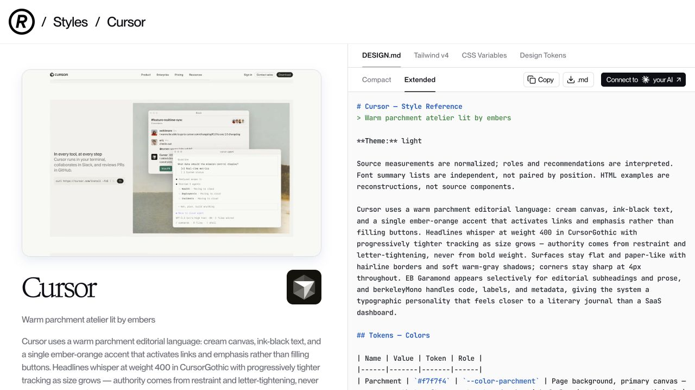
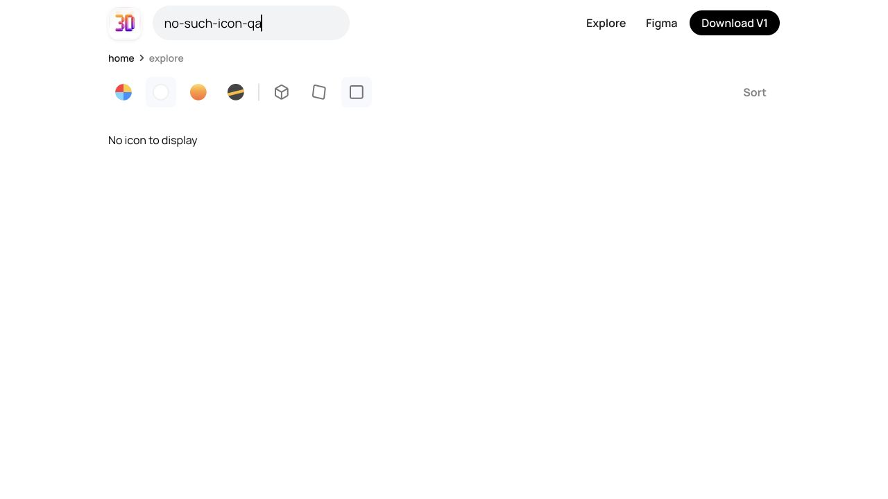
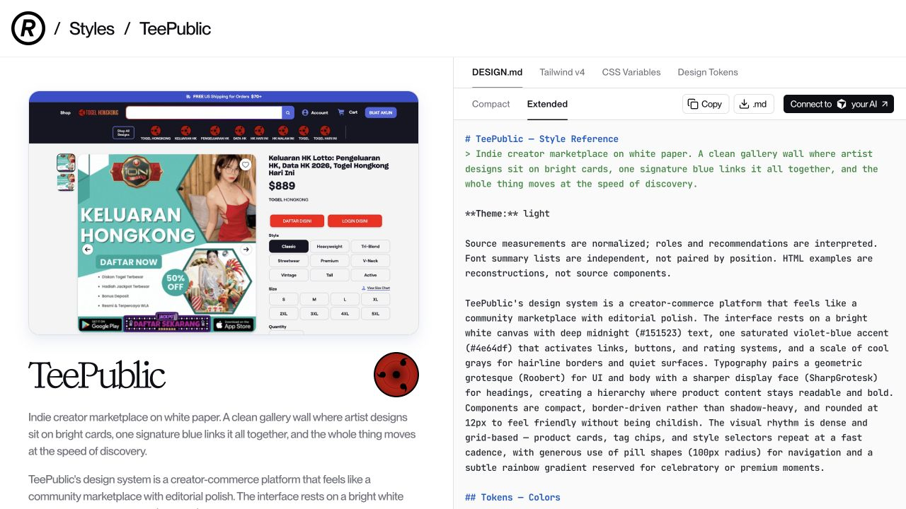

# Reference parallel C — source reading and selected live states

- Date: 2026-10-07. Scope: Component Gallery, Uiverse, 3dicons, Refero.
- This is research evidence, not implementation, adoption, release, or exhaustive interaction QA.
- Existing captures were preserved. Only this report, its own reading index, and three proof PNGs were added. No shared source/ledger, package, lock, dist, Git, remote CI, or native runtime was changed.
- Reading means actually reading captured text; HTTP 200, inventory, and screenshots do not count as reading or interaction completion. Captured sources may differ from the current site.

## Coverage and remaining denominator

| Site | Earlier baseline, not new work | New reading / live work | Still unverified |
| --- | --- | --- | --- |
| Refero | 1,394 captured URL bodies: 1,342 style details + 52 general pages; capture alone was pending reading | All 52 captured general bodies read: 23 ai-agents, 13 design-md, 11 design-styles, 4 examples, 1 home. Own per-URL hash and semantic finding in [reading index](2026-10-07-reference-parallel-c-ledger.json). Wise and Cursor live style detail sections partially read; export tabs not all complete | 1,289 complete style-body reads pending after the first fifty-three sorted detail reads; original websites, all export formats, responsive, keyboard, hover, disabled/loading/error states not exhausted |
| Component Gallery | 131 URL variants, 66 equivalent component paths; 2,671 card images / 189 contact sheets / 756 tiles were basic visual evidence | Search → Carousel via ArrowDown/Enter; React filter 22→10; name sort; clear→22. Dark theme menu selection then restored System. Linked Cedar Filmstrip full text read | 66 linked implementation families and their original behavior/variants remain pending. One linked implementation read is not all 22 Carousel examples |
| 3dicons | 224 variants / 222 public views: 211 icons + 11 general basic views previously read/seen | Explore clay/front selected; Notebook search + detail; gradient/iso real asset loaded; download menu; Escape; no-result state | Every icon style/angle combination and similar/footer details remain pending. Two observed URLs do not cover 211 icons × variants |
| Uiverse | Earlier two selected surfaces + blog were partial | Home, 3D-buttons category, thin-owl-11 post read. One post complete HTML (5 lines) and CSS (88 lines) read; Space/focus appearance observed | All posts, categories, paging/filter combinations, full behavior remain pending. Home’s 7,450 and category’s 1,995 are site claims, not independently verified exhaustive URL counts |

## Refero: why extracted tokens cannot be adopted unchanged

[Wise style detail](https://styles.refero.design/style/367c0c6e-73a7-441c-a8ff-91d139ac60dc) places #9fe870 lime in conflicting roles. Its color-role prose/export says “Do not promote it to the primary CTA color”; its Guidelines recommend lime for primary-action fills and active controls. The description and segmented-control prose also use lime for active states. The page’s no-drop-shadow guidance conflicts with its Elevation recipes, including 10px/32px and 40px/40px card shadows. The observation is an inconsistency within Refero’s generated recommendations, not a finding about the original Wise product.

[Cursor style detail](https://styles.refero.design/style/4e3b4717-84c8-4599-baaf-a343c3d619b6) repeatedly exports invalid five-digit #26251 in prose/CSS examples while the palette’s Ink value is #26251e. Guidance about avoiding pill treatment conflicts with pill/button descriptions. Do not mechanically turn these exports into registered presets. Each role requires validation against HJM semantic intent and real rendered states.

Both pages distinguish normalized measurement, interpreted roles, and reconstructed HTML from original source components. Their image previews and component reconstructions provide visual direction; they do not establish original keyboard, responsive, loading, or business behavior. Original Wise/Cursor sites were not exercised here. Wise DesignTokens initial section and DESIGN.md major sections were read; remaining JSON and other export tabs remain pending. Cursor major DESIGN.md sections were read; the full quick-start/export set remains pending.

The 52 general pages consistently put product purpose and actual content first. Useful shared additions are usage guidance for display/reading/technical typography roles, section density/rhythm, screenshot crop/frame/mobile alternatives, and how a composition selects quiet versus operational presentation. Product requirements still own transaction rules, commercial prices, data, permissions, and state transitions. A proposed DESIGN.md specification and vendor-history assertions were read as page claims, not independently verified standards.

Proof PNG SHA-256: `b8e3af24af908f1061fdf79127f9fc991f1b3e5be6b81736039148c1561f1ab9`.

## 3dicons: selected live interaction chain

[Explore](https://3dicons.co/explore): clay + front radio state selected; visible image currentSrc paths and complete images matched front/clay. Typing Notebook alone did not update results; Enter returned one result. [Notebook detail](https://3dicons.co/icons/628100-notebook?color=clay) opened as a Dialog over Explore. Gradient + iso changed the real image to the 400px gradient isometric asset after an initial loading placeholder. The placeholder was transient, not a persistent defect.

Download opened a menu for current icon, angle bundles, .fbx, .blend, and all icons; no file was downloaded. Pressing Escape on the download trigger closed both the menu and the detail dialog, restoring the prior Notebook search with clay/front. This is observed nested Escape propagation; its code cause was not isolated. Popular sort was selected with one result, so ordering correctness was not demonstrated. Searching `no-such-icon-qa` with Enter displayed No icon to display and preserved clay/front.

Absorb through existing Asset/Image, Dialog/Menu, SearchField/EmptyState, and finite collection composition. A theme can select a material/angle bundle while products own asset meaning and license mapping. Decorative 3D illustrations should not replace functional Icon semantics or official provider assets. Preserve a loading fallback and image layout stability.

Proof PNG SHA-256: `1d9338bbe3f0882df5cae6c62c345ddcf9df1e29714f39a7b947d13a2af6ffe1`.

## Component Gallery: one linked contract read, not complete original behavior

[Carousel page](https://component.gallery/components/carousel) has 22 examples. React filter showed 10, clear filters restored 22, name sort persisted. Gallery global search accepted Carousel by ArrowDown/Enter. The theme menu used System/Light/Dark menuitemradio; Dark changed the site canvas while static example images retained their original appearance. System was restored.

[Cedar Filmstrip](https://cedar.rei.com/components/filmstrip) full body was read: purpose, applicability, anatomy, interaction, content, accessibility responsibility, adapter/model/frame implementation, events, API. It uses five parts, finite related items, partially visible frames to communicate overflow, and owner-provided data adapters. Whole-frame navigation and nested actions need distinct focus handling. The page says Storybook documentation is not available for this component; no working Filmstrip demo was exercised.

Current HJM web Carousel is a single active finite panel; inactive panels are hidden/inert. Cedar’s multiple-visible scroll model is therefore a distinct collection presentation contract, not a safe cosmetic theme switch. A finite filmstrip/peek composition is a candidate for an explicit presentation capability with focus, scroll, and announcement contracts. It should not silently change Carousel semantics.

## Uiverse: reuse a treatment, retain the Button contract

[3D-buttons category](https://uiverse.io/ui/3d-buttons) and [thin-owl-11](https://uiverse.io/njesenberger/thin-owl-11) were read. The post has a native button plus top/bottom/base decorative layers. CSS uses inset shading, radial gradients, 200ms transitions, and a 6px active translation. Space/focus appearance was observed; an application action result or a held pressed frame was not verified. The inspected CSS has no explicit disabled/loading or prefers-reduced-motion handling; this is a source observation, not complete accessibility QA.

The useful addition is an optional press-feedback treatment on the existing HJM Button engine, with disabled/pending, keyboard, reduced motion and native equivalents preserved. Do not add a second functional Button simply to copy this skin. HJM profiles currently expose contentTransition and selectionMotion; press feedback can be assessed as a separate capability. The post’s MIT notice was read; substantial copied code would require its attribution. No code was copied or installed.

## Outcome and follow-up

This pass reduces Refero’s captured general-body pending denominator from 52 to zero, without marking visual/behavior completeness. The owned JSON contains one URL/hash/finding for every completed general page. Fixed sorted style detail reading is next; any further completion must record an actually read body, not a keyword match. Whole-site completion still requires remaining bodies and real UI/interaction coverage. Research judgments above are proposals; source implementation changes remain parent-owned.

## Ordered style-body reading checkpoint

Full captured text, including canonical DESIGN.md, generated CSS/Tailwind quick starts and similar-card labels, was read for the first fifty-three lexically sorted style URLs. This is 53/1,342 style bodies; complete visual and behavioral review of these fifty-three remains pending. The owned index records each hash and reading judgment.

- [pampam.city](https://styles.refero.design/style/001480cb-05f4-4802-be39-84b942169481): paper canvas, display serif and tilted browser-frame composition. Periwinkle role prohibits primary CTA while Guidelines and reconstructed Button prescribe it; the agent guide also says no distinct CTA. Nineties fallback is sans in quick-start CSS despite a serif substitute recommendation. OpenType features are described but absent from quick-start recipes. This strengthens the case for role validation rather than raw preset imports.
- [Getburnt](https://styles.refero.design/style/002cc5a7-0d34-4d8d-afa0-c5fad69477d5): body text description uses 1.5 line height at 16px, while CSS exports `--leading-body: 24` and other large unitless leading values. Direct use as CSS line-height would mean a multiplier, not a pixel height; no rendered failure was tested. Captured 1440px pill radius is a shape choice rather than a new common spacing/radius scale. Monochrome recommendations must not suppress semantic error/status accessibility.
- [David Kirschberg](https://styles.refero.design/style/004f4856-4b01-4c23-a9fb-866303d5013b): dark gallery, two surface levels and shadowless thumbnails; imagery supplies color. The floating navigation and horizontal gallery are composition capabilities. Never-grid and single-weight rules are this reference’s recommendation, not a global HJM requirement.

Validation: `node scripts/check-doc-links.mjs` passed: documentation links ready, 573 Markdown files. This checks document links only, not external source correctness or UI behavior.

- [Gsap](https://styles.refero.design/style/00537a20-e99e-4ef2-b119-c6f532c44cc9): category colors serve taxonomy, while hero type and organic imagery overlap. The palette stores a gradient under a color token; generated CSS separately exports solid green and a gradient recipe. HJM should preserve color versus material distinctions. Actual original animation, reduced motion and category behavior are unverified.
- [Haus Otto](https://styles.refero.design/style/0057e55a-8a66-4ffc-9c21-f0b757e580b3): typographic composition with sharp corners. `--card-padding: 12-20px` exports a textual range; it is not a directly usable padding value. Preview display line-height 0.12 differs from the canonical/export 1.0. Fixed 216px/minimum120px heading recommendations need responsive review; compact consent/navigation styling cannot override hit targets or product/legal behavior.

- [Cowboy](https://styles.refero.design/style/00ce9181-45be-4340-b6a6-75a4d5d60cef): Moss is supporting/non-status in token role but success in agent guide; no-card-shadow guidance differs from feature-card Elevation. Third-party Intercom fonts are explicitly excluded in prose but present in generated foundation CSS. Preserve original product variant contracts and photo/scrim roles; exclude third-party widget contamination.
- [Paper](https://styles.refero.design/style/01771d1f-43c6-4e91-88c5-e4d213fe4ff2): two-tone heading description uses invalid #83837 while palette/export uses #83837e. Tags are 4px in guidance but 9999px in export. Suppressing all semantic status color is a marketing recommendation, not a safe universal system rule.
- [Simone Sniekers](https://styles.refero.design/style/017ce823-c338-417d-849d-497c97701c4c): extracted reds/golds are explicitly photographic, not functional UI tokens. The black-text-on-any-photo recommendation does not prove adequate contrast. Bottom overlay composition requires real focus, hit targets and safe areas.
- [Amaterasu](https://styles.refero.design/style/01b3bfc1-95df-425f-9b7a-15cff09adc5f): invalid #0a1a2 hero-surface hex; CSS section-gap50-60px and card-padding30-40px are textual ranges. Gradient recipes and solid colors must retain distinct types. Outline text/radius recommendations differ between component and prompt; tiny tracked labels need accessibility review.
- [Azione](https://styles.refero.design/style/01d00b5d-5afe-4940-97b6-90ee994f62f6): campaign photograph/rust-copy diptych is a useful composition choice; serif/sans/mono roles matter more than copying the brand fonts. A trial-named font requires actual license review. Continuous 20s client marquee recommendation has no verified pause/reduced-motion behavior in the captured text, so it cannot override HJM motion contracts.

Checkpoint: 105/1,394 captured Refero bodies actually read (52 general + 53 full detail). Remaining detail bodies: 1,289. These fifty-three details were read in lexical URL order, not selected as the easiest examples. All fifty-three complete detail visual/state coverage remains pending; the fourteenth had selected live provenance inspection. Next sorted URL is recorded in the index for continuation.

- [Oevra](https://styles.refero.design/style/01d6013d-a176-4a22-b7dd-fbd113592956): sage wash, light display and photograph inset inside a heading suggest a forest composition, not a palette-only change. Invalid #4e4e4 appears in body/footer/divider recommendations while palette uses #4e4e4e. Quick-start CSS wraps Suisse Int’l with a literal apostrophe inside a single-quoted string without escaping it; this requires valid CSS string handling. Duplicated raw font aliases are capture artifacts, not eight shared font requirements. White text on the suggested soft pale wash needs actual contrast review.

- [Grafik](https://styles.refero.design/style/0226e028-3cd3-440d-b469-ca459267161d): hairline/flush gallery is an explicit composition option; work colors remain outside functional palette. `--radius-all` contains prose after0px, not a directly usable radius. Preview40px line-height0.6 differs from canonical1.2. Captured spacing values do not become a normative global grid.
- [Apple (España), AirPods Pro](https://styles.refero.design/style/022cf675-42d1-44e7-953a-68facc802117): separate buy/link colors, product-centered imagery and asymmetric headline. Intro calls large tracking negative while measured scale/philosophy opens it positively. Captured `numr` OpenType flags need contextual interpretation, not global enablement. Original Apple product behavior was not tested; imagery/material gradient and UI action colors retain different roles.

## Live provenance mismatch: labelled TeePublic

The fourteenth sorted [Refero detail](https://styles.refero.design/style/0231caf5-0347-4f2d-ba20-5bab8fcaf2ce) is titled TeePublic throughout its description and DESIGN.md, but the origin link is https://unfurproject.com. The current live page reproduces that title/link mismatch. Its visible preview contains unrelated lottery promotion imagery; this is not verified evidence of the original TeePublic brand design. No original-domain browsing, registration, transaction or external mutation was performed. This is an observed provenance problem within the reference record, not a claim about the cause or current state of TeePublic itself.

Exclude the record from official-brand implementation evidence until its origin/capture/identity are reconciled. Its body also recommends no large violet fills while describing full-width violet promo/trust bands, and its red role differs from urgent-state recommendations. Those source recommendations were read, but should not enter a preset without validation.

Proof PNG SHA-256: `4ddad916a2a6e97d8cf7115ceff3b5145eaa9d123949104b7efe46886677d333`.

- [Break Maiden](https://styles.refero.design/style/02610b06-d16e-47bd-a1ea-18979a9ed4f5): pure-black irregular three-column portfolio is an explicit composition choice. Preserve logical reading/focus order before considering an irregular layout variant. Invalid #8e8e8 differs from palette #8e8e8e; preview display line-height0.63 differs from canonical1/normal. Fixed153px/min96px display sizing still needs real responsive content review.

- [Pally](https://styles.refero.design/style/029d3ce0-0fe5-4a8c-99c4-4f9d704f1c60): centered dark marketing with violet color confined to the embedded app and platform constellation. No-shadow guidance differs from actual Elevation recipes; organic-shape radius117-180px is a textual range. Idle drift needs an explicit decorative motion contract, and official platform logos remain product-owned.
- [Jasper](https://styles.refero.design/style/02a9c799-eb91-425b-8d68-3776b5e84229): editorial serif and flat pastel category-card mosaic. MidnightInk role forbids primary CTA while Button/Guidelines prescribe it. CSS gap/padding ranges are not directly usable; Feature fallback is sans despite the recommended serif substitute. A theme must not invent a second product action simply because this reference mandates paired CTAs.

- [jun.works](https://styles.refero.design/style/02ba867b-49e3-4ab4-ad23-c30baf345078): printed-zine typography and two-column structured lists. Times body line-height1.20 differs from the component/guidance1.70; quick-start CSS gives a sans fallback despite a serif recommendation and omits a body scale role. This supports a separate reading/body family capability. Em-dash list treatment must preserve semantic list markup. No-max-width/no-images/no-semantic-color rules remain local reference constraints.
- [ElevenLabs](https://styles.refero.design/style/031056ff-7af1-46db-8daa-115f731c5d26): warm flat cards and separate display/UI/technical roles. Orange is described as decorative audio imagery only, yet active tabs are advised to use an orange dot. CSS gap96-125px/gap8-16px/radius4-10px are textual ranges. The audio sphere’s central play control does not establish playback, loading/error or keyboard behavior. Preserve Media/Asset responsibility and product-owned actions.

- [ProtoPie](https://styles.refero.design/style/031302e5-3269-4735-ab56-d4c7d02edc01): workshop canvas, product demo panels and a decorative script annotation. Violet token forbids primary CTA while Button/Guidelines/Surface prescribe it; the prompt guide says none. Signature radius tiers omit the8px input and quick-start20px extra. Script quick-start fallback is sans. Decorative annotation and functional text remain separate roles.

- [Headspace](https://styles.refero.design/style/035a098b-5a27-48a3-8a3a-c68a698e3eab): cream wellness bands, filled category illustrations and printed-sticker button elevation. Blue is wrongly described as violet/supporting/no-CTA despite blue CTA instructions; charcoal also prohibits CTA despite dark CTA recipes. Exported spacing/radius ranges need actual values. White navigation differs from cream-only guidance. Decorative AI chat cards are not evidence of Toast behavior, and official badges remain product-owned.

- [Voiceflow](https://styles.refero.design/style/03b3d707-2a30-4f53-a524-347d1b70eb2c): serif300 display/quote and open-tracked UI/body over photo-led compositions. The below36px serif prohibition contradicts20px quotes/labels; the serif fallback is sans. Orange Chat Surface export conflicts with the white card description; blue is labelled violet. CSS gap ranges require explicit choices. Reconstructed chat/analytics/workflow cards do not demonstrate the original functionality.

- [Evervault](https://styles.refero.design/style/03dcd158-bc4d-447b-aaf2-8e522671a109): dark violet surfaces, inset depth, floating navigation and code syntax roles. White token forbids CTA although Primary CTA and Frost Surface prescribe white. Card/button radius guidance and product-grid columns differ between sections. Captured Inter580 requires real font support; the dark-only brand recommendation cannot suppress product mode choices.

- [OHZI Interactive Studio / Dive](https://styles.refero.design/style/03e03554-d7aa-40da-9764-79320ecfa1d0): full-viewport3D asset over a sharp, widely tracked ghost-control composition. The source explicitly conjectures possible later sections, so this is not a verified full screen map. CSS gap80-120px/padding24-40px require choices. Actual scene motion/static fallback, menu, consent and legibility remain pending; preserve business/accessibility contracts.

- [Grafana Labs](https://styles.refero.design/style/03e0e30c-4c0f-4879-948a-9b501e530207): horizon gradient and paired pastel fill/border screenshot frames with alternating narrative blocks. The type scale explicitly maps family/weight to roles. Radius16777200px expresses a full shape rather than a useful shared scale. Canonical gradient color and quick-start solid/gradient need distinct types. Screenshot dashboards and assistant entry do not prove their real functionality.

- [Letters](https://styles.refero.design/style/04109c48-f591-4110-9739-622243d4ecc2): sky hero and atmospheric card shadows. Display tracking-0.04em at80px would be-3.2px, but the scale/CSS exports-0.04px; body tracking also changes em to px without scaling. Raw font aliases are not eight approved shared families. FreeVersion decorative handwriting needs license review. Upload/audio reconstructions are not functional QA; spacing/radius ranges and rotation described in px need normalization.

- [Wealthsimple](https://styles.refero.design/style/043341c3-cf82-4be1-9142-fa5e6a370ca9): warm mixed-mode editorial typography and bronze split hero with paper/fabric sculptural assets. Charcoal/Graphite forbid CTA in token roles but appear in PrimaryButton recipes. Intro48px gap differs from layout/guidance80px; serif fallback is sans. The no-gradient recommendation versus hero radial fade needs asset/CSS interpretation rather than an assumed implementation.

- [Navigate](https://styles.refero.design/style/045e9f2b-91d3-44cc-bc99-1ce5f3fd4ed6): poster-like full-bleed bands, decorative tile quintet, pill FAQ and floating navigation. Filled lime primary in components differs from the prompt’s outlined primary. The Off/On widget is only interpreted as a theme toggle, not behavior-verified. Body-size restrictions cannot suppress text scaling; fixed compressed headings require responsive/large-text review. Exported ranges and fractional radii should be normalized to semantic roles.

- [Grain](https://styles.refero.design/style/04793c2a-ca1a-4edd-a661-56c965e42aec): document-like product frames and operational/editorial font separation. Body16px/1.5 conflicts with unitless leading-body24; direct line-height use would multiply16×24 instead of24px. Button10px differs from prompt9999px, and Poppins normal tracking differs from the all-large-sizes negative rule. Recording controls in imagery do not prove recording states.

- [Home page | Impossible Foods](https://styles.refero.design/style/04961c7d-8ca6-4e87-ba88-6ad7ffa3b245): wine-dark poster typography, organic food masks and single-visible product carousel with peeks. Tracking0.06em at160px is9.6px, but exports use0.06px without scaling. The below0.80 leading prohibition conflicts with prescribed0.73–0.75. No visible status colors cannot disable semantic states. The peek layout is an explicit collection capability; original carousel/filter/store-locator behavior is pending.

Checkpoint validation at82 captured bodies: original URL/hash/character count and lexical detail order are coherent; `node scripts/check-doc-links.mjs` passed574 Markdown files at the preceding77-body checkpoint. These are evidence/index/link checks, not external UI completeness.

- [The1](https://styles.refero.design/style/04d2e256-61b0-4184-a834-e36c15d09ea5): concrete canvas and four flush property-identity surfaces. CSS declares the same --surface-paint-block four times in one scope, so only the final green survives. Tracking-0.06em at215px becomes-0.06px instead of-12.9px. Pink is described as red; the no-inline-color rule conflicts with identity dots. Identity colors remain separate from semantic statuses, and crushed leading cannot override readability/text scaling.

- [Mike Matas](https://styles.refero.design/style/04f6cb02-de90-4d78-9c5f-0eb52f826484): near-empty white identity/nav and device-mockup project band. Display preview400 differs from canonical100; a two-color mandate omits exported AshGray. Measured spacing is not a strict8px grid. No-button/no-caption recommendations cannot remove product actions or accessible descriptions. Fixed135px margins and real link behavior remain unverified.

- [WHOOP](https://styles.refero.design/style/05053a60-1964-4154-9d58-ebdf6352ed3a): mixed black/white theatrical bands and photo story carousel. Violet token forbids CTA while button/guidelines prescribe it. Direct white-on-photo without scrim needs actual asset contrast verification. Captured border-frequency counts are not independently verified. Body sizing differs by section; fixed120px compressed display and exported layout ranges require explicit responsive choices.

- [Krepling](https://styles.refero.design/style/055f12af-b7b9-46af-81b7-93e0ed6d5ce2): flat400-weight type hierarchy plus decorative3D art, tab content and FAQ rows. Display80px/-0.01em should be-0.8px, but scale/CSS uses-0.01px; body tracking repeats the unscaled unit change. Font labels are interpreted captures, not resolved assets. The line-height cap and single-weight advice cannot override reading/semantic contracts; actual tabs/FAQ interactions remain pending.

- [Lamanna](https://styles.refero.design/style/057d7c66-76b7-4272-849c-4058543e6799): maximalist hard-color bands, starburst product imagery and solid-offset heading depth. Radius0 in components/export differs from the generic9999px pill prompt. The readable OpenSans22px/1.67 role appears in font prose but is absent from the scale. Text-shadow decoration is a separate role from card elevation. Actual contrast and control hit targets remain pending; exported spacing ranges need choices.

- [NEVERHACK](https://styles.refero.design/style/05a82625-786e-4343-a554-3ba8f4de23d7): purple-tinted depth, dark general action and a red critical-only semantic lane. Agent quick-reference/prompt assigns red AlertCrimson as general primary CTA, directly contradicting the critical-only/default-dark instructions. Body Text Subtle Lift elevation conflicts with no-text-shadow guidance. Gradient color values require material/color typing; actual AI chat/critical actions remain untested.

- [OpenServ](https://styles.refero.design/style/063be10d-593d-4c81-a99e-a7543737b9db): light editorial/functional font pairing, flat content collection and a closing brand stripe. Mint token assigns action fills while guidance restricts it to status/accent and reserves primary for violet. Serif quick-start fallback is sans; UI tracking is absent from the scale. White card prose differs from fog surface export. Actual horizontal collection/expand behavior is pending.

- [Apple Watch Ultra 4 (Refero label)](https://styles.refero.design/style/06ee0fd5-c4ab-4d5f-b66a-7285aeacd0b0): the Refero record label names Watch Ultra4 but canonical DESIGN.md only says Apple; original-domain identity/page availability was not verified. Dark hardware media with late light tiles uses separate product metric, purchase and link roles. Battery Green explicitly is not generic success. Compact3px button padding cannot override HJM hit targets or large-text handling; numr flags are contextual, and selector/accordion/purchase flows remain pending.

Validation at90 captured bodies: source URL/hash/character count, unique rows, fixed lexical detail order, and remaining denominator passed. `node scripts/check-doc-links.mjs` passed575 Markdown files. This remains an index/document-link check only.

- **39 Finn** ([captured detail](https://styles.refero.design/style/07546cf0-b9df-49dd-9da9-319d7a654703)): SKU-paired pastel washes, navy actions/inverted testimonials, UI/display/technical-caption font roles. Scoped foreground roles are necessary: the all-body/headings CocoaBean instruction conflicts with navy section-heading and white inverted recipes. Benefit green is absent from exported palette and product/SKU identity must not become generic status. Button weight600 versus recipe500 and mandatory trailing-arrow branding remain source-specific; pill shape cannot establish Button/Link semantics. Normalize17982px full radius. Real shop/quiz/cart/nav behavior and responsive large display remain pending.

- **40 Nornorm** ([captured detail](https://styles.refero.design/style/0769ff4c-f719-4865-98df-de2f44c694a6)): Warm bone/white showroom with single cobalt, sharp photographic edges vs pill controls and multiple-visible portrait collection. Cobalt token says do not promote to CTA and AgentGuide no distinct CTA, contrary to primary CTA recipe and guidelines. Reconstructed hero black ghost border/text on dark photograph requires actual contrast verification, not copying. Proper em-to-px tracking here. Pair-every-primary-with-ghost cannot invent product actions. Carousel/language/dropdown flows pending.

- **41 Lithic** ([captured detail](https://styles.refero.design/style/077aecd0-4401-4696-a196-164d74ac8746)): Black vault plus warm/lavender/mint section surfaces; arcs decor and floating card elevation distinct. LichenGreen supporting-not-status token contradicts availability badge and guide green-status. PrimaryCTA white text/24px radius vs prompt black text/9999px radius. Ghost black text/border on black hero requires actual contrast verification. WarmCream caption rule cannot override semantic readability. Card issuing/security/API claims source-only and real interactions pending.

- **42 Essie Wine** ([captured detail](https://styles.refero.design/style/07f5281d-2a18-4e12-a8ff-d54d3e03d198)): Rose/white/mustard chapter surfaces, editorial line art, square underline form and serif-display/metadata font roles. AdobeCaslon described serif but exported sans fallback; BasicCommercial serif identification is source claim unverified. Carbon outlined-submit recipe vs guide InkTeal action border; global InkTeal primary text conflicts scoped black headings/forms. Printed input treatment cannot remove focus/error/disabled/pending contracts. One-paragraph/no-sticky-action/no-card rules product editorial choices, not all-screen mandates. Booking/menu/voucher/sticky nav flows pending.

- **43 Cap** ([captured detail](https://styles.refero.design/style/08c0ead0-1899-47b4-bfdc-865ab459bbe5)): Near-white hairline/inset workspace; business-owned Download black vs Upgrade blue paired actions and product-only gradient imagery. Captured font identity defaultFont unresolved vs interpreted CapSans narrative, not confirmed font asset. Eyebrow0.2em at12px equals2.4px but exported caption tracking0.2px; type roles should not be collapsed. Invalid macOSYellow #ffbd2 in mockup recipe vs valid #ffbd2e palette. SparkViolet/Ember link-token roles contradict decorative-only guidelines; all-tags-pill vs smalltags2px; no-content-shadow vs optional feature lift/elevation button/segment. Body14–16 cap cannot override large text. Actual recording/mode/login/download/upgrade states pending.

- **44 Attio** ([captured detail](https://styles.refero.design/style/08c8700c-f278-42bc-812e-f60dc6ce996e)): Editorial SaaS three type voices/UI-display-testimonial, blue-tinted card depth, dark CTA and white outline companion; separate section/inner densities. Guide primary9999px contradicts10px component/guideline max12px; no-pure-black shadow rule contradicts drifting-card/elevation/export rgba0black. Export --section-gap80-120px and --radius-cards11-14px are unresolved ranges, not direct CSS lengths. TiemposText serif exports sans fallback; ss03/calt need supported owned fonts. Cobalt-all-active rule vs InkBlack tab underline/selection requires scoped roles. Actual tab/chat/dismiss/sidebar flows pending.

- **45 Riverside** ([captured detail](https://styles.refero.design/style/09b5a06b-29dc-4d17-8722-d29bd93010c8)): Mixed dark/light section cadence despite light theme label; creator photograph hero with contrast overlay, scoped Plex functional category vs Inter copy, image/card corner distinction. VioletCTA recipe white text/300radius vs guide midnighttext/9999radius; token violet-active vs nav white underline. Image<=8 rule conflicts hero60; single filled-violet per viewport depends responsive/sticky layout and cannot remove valid actions. Preview body leading0.72/0.75 contradicts canonical1.5+ and preview display700 vs canonical800. Body max-leading rule cannot replace readable scaling; recording and category/tag/nav flows pending.

- **46 MekaVerse** ([captured detail](https://styles.refero.design/style/09e43758-12c5-4a2b-8ae8-ded156ef66bf)): Cinematic viewport art frames/overlay titles and mono chrome; colorful3D artwork assets distinct from monochrome UI/material. Bone palette light-surface-border role contradicts white-on-dark text/buttons and neverwhitefill direction. Source calls0.78 negative line-height but is positive cramped ratio, not CSSnegative. Sub1 display and10px chrome need actual wrapping/large-text/contrast checks; art crop overlays no live verification. Decorative perline underline belongs heading treatment not actual underline-link semantics. Nofooter narrative cannot remove required legal/account actions. Actual wallet/gallery/shop/explore flows pending.

- **47 Wallpaper Projects** ([captured detail](https://styles.refero.design/style/0a2bcda6-b5b9-463d-bc8d-2c7ccaa2b776)): Cream/white editorial spreads with serif exhibit headings, wide sans kickers and mono UI, asymmetric35/65 imagery; image content colors distinct from monochrome chrome. Invalid five-digit #1e1e1 throughout recipe and actual --surface-ink-black export vs validpalette #1e1e1e. CardinalFruit serif exports sans fallback. Dark-wash ban conflicts DarkModeSection surface. Neverdarken raw hero cannot override actual per-image contrast; body14–18 cap cannot override scaling. Button20px is explicitly not full-pill; retain shape-role distinctions. Real menu/scroll/projects flows pending.

- **48 Hims App** ([captured detail](https://styles.refero.design/style/0a489bce-4f93-4b38-b612-d87b1d00999e)): Centered white wellness marketing with longblur/floating cards and outline-download; marketing/in-product category gradients explicitly different ownership. Em-to-px tracking corruption:141px*-0.047em=-6.627px vs exported-0.047px,84px*-0.017em=-1.428px vs-0.017px; caption/body likewise. Shadow-rule27px+ vertical inconsistent8/9px offsets; distinguish blur vs offset. Invalid prose2e2e2 heading constraint vs black recipes. Guide3columngrid absent asserted visible-flow layout; interpreted candidate not observation. Phone content claimed non-static does not verify in-app interaction. Provider store badge/real download/native program/account states pending.

- **49 Workable** ([captured detail](https://styles.refero.design/style/0ab4c544-6147-4998-8365-3a0f6191e54f)): Warm HR editorial with teal actions and pastel grouping surfaces; heavydisplay vs relaxedreading and app-icon gradient distinct from chrome. ForestTeal token do-not-CTA contradicts onlyfilledCTA rule/recipe, Guide primaryMidnightViolet9999radius contradicts scoped announcement-only violet and button8radius. Invalid #0f161 appearsprose/recipes vs valid #0f161e palette. Bodyminimum1.5 vs body-sm1.38 export; headingroles not genericbody. CSS separates --color-agent-spectrum:#00f5dc from --gradient-agent-spectrum while Tailwind quickstart omits gradient property—formats not equivalent. HR grouping/category palettes product-owned; logosmarquee needs pause/reduced confirmation. Actual video/demo/trial/banner flows pending.

- **50 Twingate** ([captured detail](https://styles.refero.design/style/0acef011-07da-4416-b874-ccdd675140f6)): Instrument-panel dark surface stack with inset bevel/hairline edges, chartreuse action, violetutility and decorative circuitteal distinct roles. LiveWire token no-primaryCTA and AgentGuide noCTA contradict canonical chartreuseCTA/colorlogic. Display68px*-0.018em=-1.224px vs exported-0.018px;48px*-0.007em=-0.336px vs-0.007px; bodytracking likewise and55px canonical vs export disagree. Generic sans detected role remains unresolved not knowncustomfont. Alltextatleastsilver rule contradicts darker testimonial/meta colors, and featurecards explicitly typographic no-radius vs tokencards12 requires recipescopes. Actual register/free/demo/navigation/network product states pending.

- **51 Isla Beauty** ([captured detail](https://styles.refero.design/style/0b9da6ef-bec5-4073-90af-66c67e72f2a4)): Apothecary commerce cream with small red action/eyebrow seal, macro imagery and serifitalic/display/reading/merchant type pairings. Primaryguide9999radius contradicts AddToCart3px and reservedpill999; use-onlyCrimson rule vs Vermillionhover/outline roles. Critical-alert red is interpretedsurface claim, not proof of real danger state; commerce action red must not relabel HJM danger. Garamond/EBGaramond serif exports sans fallback; font-role scale omits explicit families/weights. CSS section-gap50-64px/card-padding15-16px unresolved ranges. Price/originalsale/productbenefit/cart/shipping data product-owned. Body13–17 limit and tiny labels cannot override scaling; actual cart/login/checkout/product states pending.

- **52 Evernote** ([captured detail](https://styles.refero.design/style/0c0b6140-2b6c-44f8-8bba-4ecfcadba420)): Warm paper productivity with centeredhero, framed product and equal-width featurecollection; darkcontrast blob atmosphere distinct from flat hairline cards. Guide lime9999primary conflicts explicit darkCTA oncream/limeCTA ondark and5pxbutton/no9999rule. Preview display600 conflicts canonical300-only/no600. Correct headline em-to-px tracking here. OneLime element perviewport clashes navbrand+category/action possibilities; surface scopes and responsive composition needed. Categorycolor-withoutlabels cannot remove semantic accessible names or noncolor cues. Inter role explicitly likelyfallback inference, not verifiedsource role. Export --element-gap8-16px unresolved. Actual carousel/login/download/editor/CTA flows pending.

- **53 Baselayer** ([captured detail](https://styles.refero.design/style/0c55e725-e933-41b6-9fb7-2505a6659ee5)): White editorial plus dark technical fields: explicit font-family/weight/size role table, serif statement515 variable, sans reading/nav, monoaction; squaremosaic/metrics and4pxconsole/controls. Useful separate heading/reading/action roles alreadysemanticcandidate, not copyfont. SeasonVF serif exports sansfallback;515 needs actual supportedvariablefont. LedgerNavy palette gradient vs surfaces solid and CSS separatecolor/gradient vs Tailwindomittedgradient; preserve typed material/surface distinction.15px nav at12px lineheight(.8) needs clipping/fallback/large-text proof. DarktoLight stickyheader transition described not observed. Risk/status/data decisions product-owned; actual console/signin/conversion/capability flows pending.
